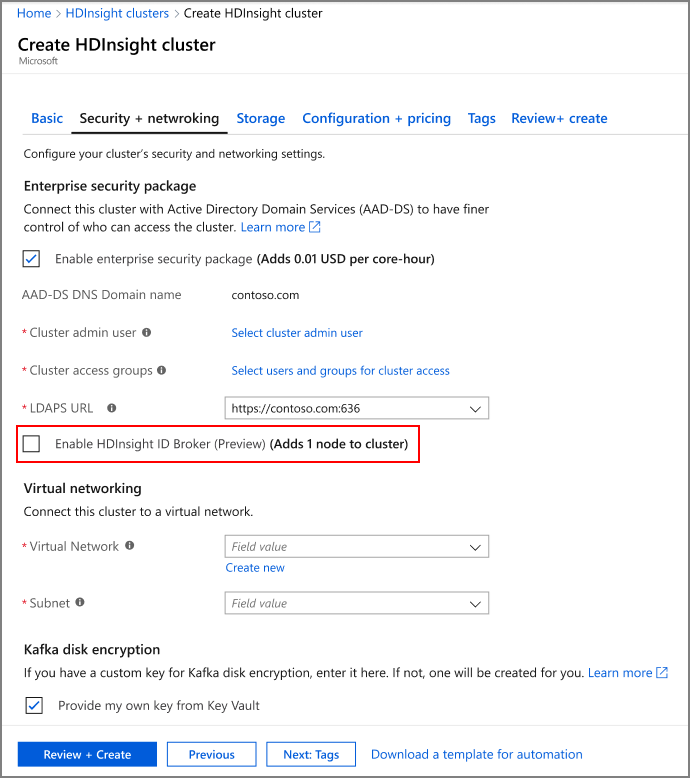

# HDInsight Identity Broker (HIB) - Preview

This article describes how to setup and use the HDInsight Identity Broker (HIB). This feature allows you to sign in to Apache Ambari using Multi-Factor Authentication (MFA) and get the required Kerberos tickets without needing password hashes in Azure Active Directory Domain Services (AAD-DS).

## Overview

HDInsight ID Broker (HIB) is intended to simplify complex authentication setups in the following scenarios:

* Your organization relies on federation to authenticate users for accessing cloud resources. Previously, to use HDInsight ESP clusters, you would have to enable password hash sync from your on-premises environment to Azure AD. This requirement may be difficult or undesirable for some organizations.

* You need to integrate with technologies that rely on Kerberos for authentication (such as Apache Hadoop and Apache Ranger) as well as technologies that use OAuth (such as Azure Data Lake Storage (ADLS)).

HIB provides a unified authentication infrastructure and removes the requirement of providing password hashes to Azure AD. HIB consists of components running on a Windows Server VM (HIB Server), and cluster gateway nodes. After enabling HIB, the authentication flow for all users, including federated users, is shown in the following diagram:

If you use HIB with Enterprise Security Package (ESP) clusters, you can login using MFA and without providing any passwords. If have already logged in to other Azure services such as Azure portal, you can login to your HDInsight cluster with a Single Sign-On (SSO) experience.

## Enable HDInsight ID Broker

To create an ESP cluster with ID Broker enabled, do the following:

1. Login to the [Azure portal](https://portal.azure.com).
1. Follow the basic creation steps for an ESP cluster. This includes checking the box **Enable enterprise security package**.
1. Check **Enable HDInsight ID Broker**.

This will add one extra VM to the cluster which includes HIB server components. HIB server will also be domain joined to the AAD-DS domain.

## Tools Integration

HDInsight IntelliJ plugin is updated to support OAuth. You can use this plugin to connect to the cluster.

## SSH access without password hash in Azure AD

Even with HIB enabled, you will still need a password hash stored in Azure AD to SSH to the cluster. To SSH to a domain joined VM (or to run `kinit` command), you need to provide a password and therefore the hash should be available in the domain (i.e. AAD-DS). If you would like to use ssh for administrative scenarios, you can create one cloud-only account and use that to SSH to the cluster. Other users can still use Ambari or HDInsight tools (such as IntelliJ plugin) to access the cluster.

## Next steps

[Configure a HDInsight cluster with Enterprise Security Package by using Azure Active Directory Domain Services](apache-domain-joined-configure-using-azure-adds.md)

[Synchronize Azure Active Directory users to an HDInsight cluster](../hdinsight-sync-aad-users-to-cluster.md)

[Monitor cluster performance](../hdinsight-key-scenarios-to-monitor.md)
