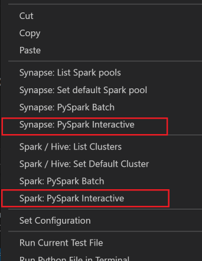
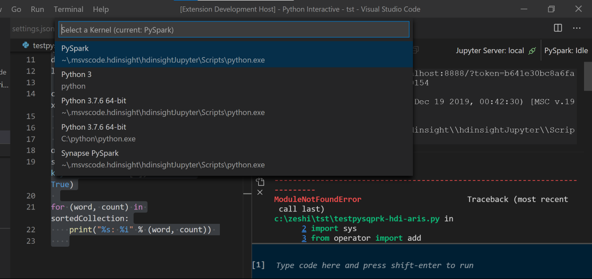
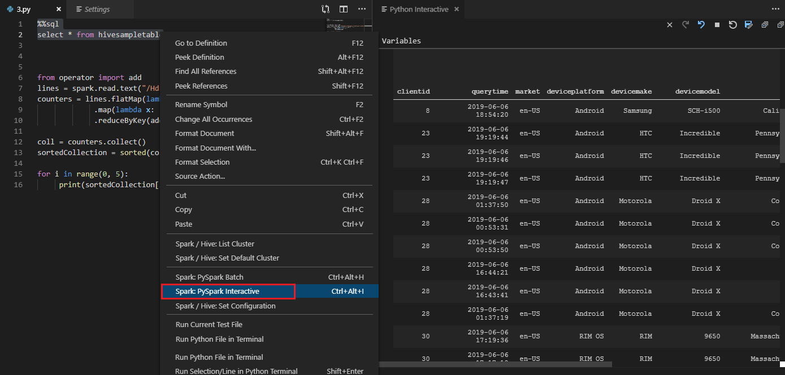
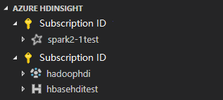
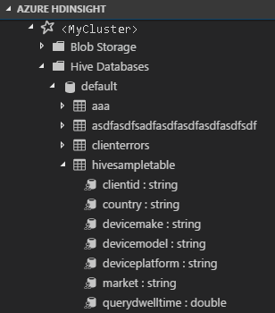
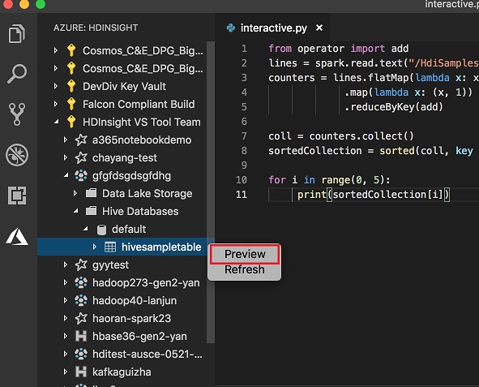
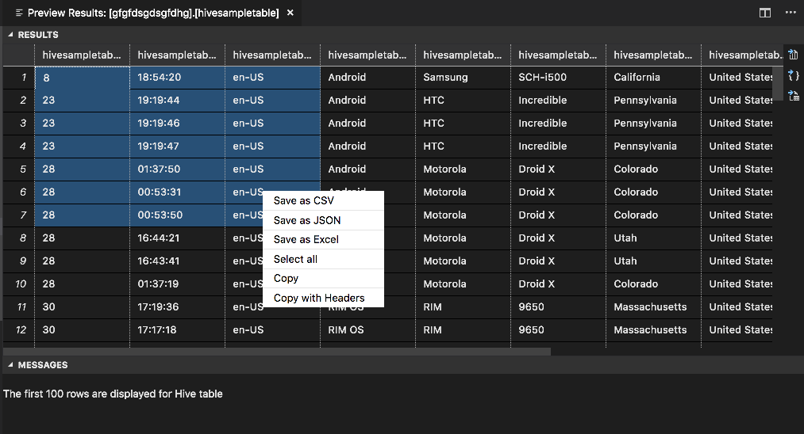
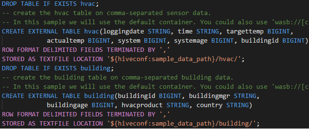
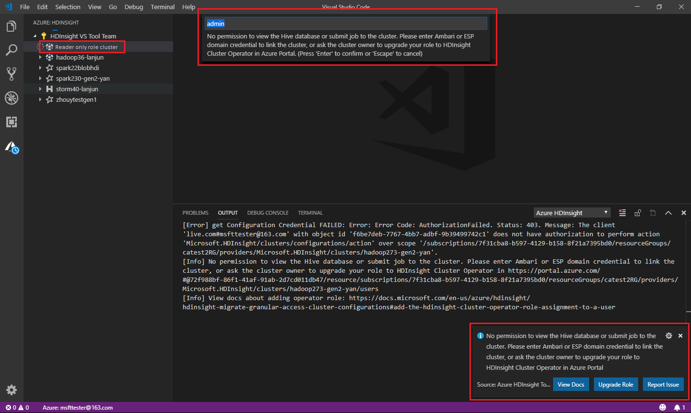

# Use Spark & Hive Tools for Visual Studio Code

Learn how to use Spark & Hive Tools for Visual Studio Code to create and submit Apache Hive batch jobs, interactive Hive queries, and PySpark scripts for Apache Spark. First we'll describe how to install the Spark & Hive tools in Visual Studio Code, and then we'll walk through how to submit jobs to Spark & Hive.  

Spark & Hive Tools can be installed on platforms that are supported by Visual Studio Code, which include Windows, Linux, and macOS. What follows are the prerequisites for different platforms.


## Prerequisites

The following items are required for completing the steps in this article:

- An HDInsight cluster. To create a cluster, see [Get started with HDInsight](hadoop/apache-hadoop-linux-create-cluster-get-started-portal.md). Or a Spark / Hive cluster supporting an Apache Livy endpoint.
- [Visual Studio Code](https://code.visualstudio.com/).
- [Mono](https://www.mono-project.com/docs/getting-started/install/). Mono is required only for Linux and macOS.
- [A PySpark interactive environment for Visual Studio Code](set-up-pyspark-interactive-environment.md).
- A local directory named **HDexample**.  This article uses  **C:\HD\HDexample**.

## Install Spark & Hive Tools

After you meet the prerequisites, you can install Spark & Hive Tools for Visual Studio Code by following these steps:

1. Open Visual Studio Code.

2. From the menu bar, go to **View** > **Extensions**.

3. In the search box, enter **Spark & Hive**.

4. Select **Spark & Hive Tools** from the search results, and then select **Install**:

   

5. Select **Reload** when necessary.


## Open a work folder

To open a work folder and to create a file in Visual Studio Code, follow these steps:

1. From the menu bar, go to **File** > **Open Folder** > **C:\HD\HDexample**, and then select the **Select Folder** button. The folder appears in the **Explorer** view on the left.

2. In **Explorer** view, select the **HDexample** folder, and then select the **New File** icon next to the work folder:

   

3. Name the new file by using either the `.hql` (Hive queries) or the `.py` (Spark script) file extension. This example uses **HelloWorld.hql**.

## Set the Azure environment

For a national cloud user, follow these steps to set the Azure environment first, and then use the **Azure: Sign In** command to sign into Azure:
   
1. Select **File\Preferences\Settings**.
2. Search on **Azure: Cloud**.
3. Select the national cloud from the list.

   

## Connect to an Azure account

Before you can submit scripts to your clusters from Visual Studio Code, you must either connect to your Azure account or link a cluster (using Apache Ambari username and password credentials or a domain-joined account). Follow these steps to connect to Azure:

1. From the menu bar, go to **View** > **Command Palette**, and enter **Azure: Sign In**:

    

2. Follow the sign-in instructions to sign in to Azure. After you're connected, your Azure account name is shown on the status bar at the bottom of the Visual Studio Code window.  
  

## Link a cluster

### Link: Azure HDInsight

You can link a normal cluster by using an [Apache Ambari](https://ambari.apache.org/)-managed username, or you can link an Enterprise Security Pack secure Hadoop cluster by using a domain username (such as: `user1@contoso.com`).

1. From the menu bar, go to **View** > **Command Palette**, and enter **Spark / Hive: Link a Cluster**.

   

2. Select linked cluster type **Azure HDInsight**.

3. Enter the HDInsight cluster URL.

4. Enter your Ambari username; the default is **admin**.

5. Enter your Ambari password.

6. Select the cluster type.

7. Set the display name of the cluster (optional).

8. Review **OUTPUT** view for verification.

   > [!NOTE]  
   > The linked username and password are used if the cluster both logged in to the Azure subscription and linked a cluster.  


### Link: Generic Livy endpoint

1. From the menu bar, go to **View** > **Command Palette**, and enter **Spark / Hive: Link a Cluster**.

2. Select linked cluster type **Generic Livy Endpoint**.

3. Enter the generic Livy endpoint. For example: http\://10.172.41.42:18080.

4. Select authorization type **Basic** or **None**.  If you select **Basic**:  
    &emsp;a. Enter your Ambari username; the default is **admin**.  
    &emsp;b. Enter your Ambari password.

5. Review **OUTPUT** view for verification.

## List clusters

1. From the menu bar, go to **View** > **Command Palette**, and enter **Spark / Hive: List Cluster**.

2. Select the subscription that you want.

3. Review the **OUTPUT** view. This view shows your linked cluster (or clusters) and all the clusters under your Azure subscription:

    

## Set the default cluster

1. Reopen the **HDexample** folder that was discussed [earlier](#open-a-work-folder), if closed.  

2. Select the **HelloWorld.hql** file that was created [earlier](#open-a-work-folder). It opens in the script editor.

3. Right-click the script editor, and then select **Spark / Hive: Set Default Cluster**.  

4. [Connect](#connect-to-an-azure-account) to your Azure account, or link a cluster if you haven't yet done so.

5. Select a cluster as the default cluster for the current script file. The tools automatically update the **.VSCode\settings.json** configuration file:

   


## Submit interactive Hive queries and Hive batch scripts

With Spark & Hive Tools for Visual Studio Code, you can submit interactive Hive queries and Hive batch scripts to your clusters.

1. Reopen the **HDexample** folder that was discussed [earlier](#open-a-work-folder), if closed.  

2. Select the **HelloWorld.hql** file that was discussed [earlier](#open-a-work-folder). It opens in the script editor.


3. Copy and paste the following code into your Hive file, and then save it:

    ```hiveql
    SELECT * FROM hivesampletable;
    ```

4. [Connect](#connect-to-an-azure-account) to your Azure account, or link a cluster if you haven't yet done so.

5. Right-click the script editor, select **Hive: Interactive** to submit the query, or use the Ctrl+Alt+I keyboard shortcut.  Select **Hive: Batch** to submit the script, or use the Ctrl+Alt+H keyboard shortcut.  

6. If you haven't specified a default cluster, select a cluster. The tools also let you submit a block of code instead of the whole script file by using the context menu. After a few moments, the query results appear in a new tab:

   

    - **RESULTS** panel: You can save the whole result as a CSV, JSON, or Excel file to a local path or just select multiple lines.

    - **MESSAGES** panel: When you select a **Line** number, it jumps to the first line of the running script.

## Submit interactive PySpark queries

To submit interactive PySpark queries, follow these steps:

1. Reopen the **HDexample** folder that was discussed [earlier](#open-a-work-folder), if closed.  

2. Create a new **HelloWorld.py** file, following the [earlier](#open-a-work-folder) steps.

3. Copy and paste the following code into the script file:
   ```python
   from operator import add
   lines = spark.read.text("/HdiSamples/HdiSamples/FoodInspectionData/README").rdd.map(lambda r: r[0])
   counters = lines.flatMap(lambda x: x.split(' ')) \
                .map(lambda x: (x, 1)) \
                .reduceByKey(add)

   coll = counters.collect()
   sortedCollection = sorted(coll, key = lambda r: r[1], reverse = True)

   for i in range(0, 5):
        print(sortedCollection[i])
   ```

4. [Connect](#connect-to-an-azure-account) to your Azure account, or link a cluster if you haven't yet done so.

5. Select all the code, right-click the script editor, and select **Spark: PySpark Interactive** to submit the query. Or, use the Ctrl+Alt+I shortcut.

   

6. Select the cluster, if you haven't specified a default cluster. After a few moments, the **Python Interactive** results appear in a new tab. The tools also let you submit a block of code instead of the whole script file by using the context menu:

    

7. Enter **%%info**, and then press Shift+Enter to view the job information (optional):

   

8. The tool also supports the **Spark SQL** query:

   

   The submission status appears on the left of the lower status bar when you're running queries. Don't submit other queries when the status is **PySpark Kernel (busy)**.  

   > [!NOTE] 
   >
   > When **Python Extension Enabled** is cleared in the settings (it's selected by default), the submitted pyspark interaction results will use the old window:
   >
   > 


## Submit PySpark batch job

1. Reopen the **HDexample** folder that you discussed [earlier](#open-a-work-folder), if closed.  

2. Create a new **BatchFile.py** file by following the [earlier](#open-a-work-folder) steps.

3. Copy and paste the following code into the script file:

    ```python
    from __future__ import print_function
    import sys
    from operator import add
    from pyspark.sql import SparkSession
    if __name__ == "__main__":
        spark = SparkSession\
            .builder\
            .appName("PythonWordCount")\
            .getOrCreate()
    
        lines = spark.read.text('/HdiSamples/HdiSamples/SensorSampleData/hvac/HVAC.csv').rdd.map(lambda r: r[0])
        counts = lines.flatMap(lambda x: x.split(' '))\
                    .map(lambda x: (x, 1))\
                    .reduceByKey(add)
        output = counts.collect()
        for (word, count) in output:
            print("%s: %i" % (word, count))
        spark.stop()
    ```

4. [Connect](#connect-to-an-azure-account) to your Azure account, or link a cluster if you haven't yet done so.

5. Right-click the script editor, and then select **Spark: PySpark Batch**, or use the Ctrl+Alt+H keyboard shortcut. 

6. Select a cluster to submit your PySpark job to:

    

After you submit a Python job, submission logs appear in the **OUTPUT** window in Visual Studio Code. The Spark UI URL and Yarn UI URL are also shown. You can open the URL in a web browser to track the job status.

## Apache Livy configuration

[Apache Livy](https://livy.incubator.apache.org/) configuration is supported. You can configure it in the **.VSCode\settings.json** file in the workspace folder. Currently, Livy configuration only supports Python script. For more details, see [Livy README](https://github.com/cloudera/livy/blob/master/README.rst ).

<a id="triggerlivyconf"></a>**How to trigger Livy configuration**

Method 1  
1. From the menu bar, go to **File** > **Preferences** > **Settings**.  
2. In the **Search settings** box, enter **HDInsight Job Sumission: Livy Conf**.  
3. Select **Edit in settings.json** for the relevant search result.

Method 2   
Submit a file, and notice that the .vscode folder is automatically added to the work folder. You can see the Livy configuration by selecting **.vscode\settings.json**.

+ The project settings:

    

>[!NOTE]
>For the **driverMomory** and **executorMomry** settings, set the value and unit. For example: 1g or 1024m.

+ Supported Livy configurations:   

    **POST /batches**   
    Request Body

    | name | description | type | 
    | :- | :- | :- | 
    | file | File containing the application to execute | path (required) | 
    | proxyUser | User to impersonate when running the job | string | 
    | className | Application Java/Spark main class | string |
    | args | Command-line arguments for the application | list of strings | 
    | jars | Jars to be used in this session | List of string | 
    | pyFiles | Python files to be used in this session | List of string |
    | files | Files to be used in this session | List of string |
    | driverMemory | Amount of memory to use for the driver process | string |
    | driverCores | Number of cores to use for the driver process | int |
    | executorMemory | Amount of memory to use per executor process | string |
    | executorCores | Number of cores to use for each executor | int |
    | numExecutors | Number of executors to launch for this session | int |
    | archives | Archives to be used in this session | List of string |
    | queue | Name of the YARN queue to be submitted to| string |
    | name | Name of this session | string |
    | conf | Spark configuration properties | Map of key=val |

    Response Body   
    The created Batch object.

    | name | description | type | 
    | :- | :- | :- | 
    | id | Session id | int | 
    | appId | Application id of this session | 	String |
    | appInfo | Detailed application info | Map of key=val |
    | log | Log lines | list of strings |
    | state |Batch state | string |

>[!NOTE]
>The assigned Livy config is displayed in the output pane when you submit the script.

## Integrate with Azure HDInsight from Explorer

**Azure HDInsight** has been added to Explorer view. You can browse and manage your clusters directly through **Azure HDInsight**.

1. [Connect](#connect-to-an-azure-account) to your Azure account, or link a cluster if you haven't yet done so.

2. From the menu bar, go to **View** > **Explorer**.

3. From the left pane, expand **AZURE HDINSIGHT**.  The available subscriptions and clusters (Spark, Hadoop, and HBase are supported) are listed:

   

4. Expand the cluster to view hive metadata database and table schema:

   


## Preview Hive Table
You can preview Hive Table in your clusters directly through the **Azure HDInsight** explorer:
1. [Connect](#connect-to-an-azure-account) to your Azure account if you haven't yet done so.

2. Select the **Azure** icon from leftmost column.

3. From the left pane, expand **AZURE HDINSIGHT**. The available subscriptions and clusters are listed.

4. Expand the cluster to view the Hive metadata database and table schema.

5. Right-click the Hive table. For example: **hivesampletable**. Select **Preview**. 

   

6. The **Preview Results** window opens:

   
   
- RESULTS panel

   You can save the whole result as a CSV, JSON, or Excel file to a local path, or just select multiple lines.

- MESSAGES panel
   1. When the number of rows in the table is greater than 100, you see the following message: "The first 100 rows are displayed for Hive table."
   2. When the number of rows in the table is less than or equal to 100, you see a message like the following: "60 rows are displayed for Hive table."
   3. When there's no content in the table, you see the following message: "0 rows are displayed for Hive table."

>[!NOTE]
>
>In Linux, install xclip to enable copy-table data.
>
>
## Additional features

Spark & Hive for Visual Studio Code also supports the following features:

- **IntelliSense autocomplete**. Suggestions pop up for keywords, methods, variables, and so on. Different icons represent different types of objects:

    
- **IntelliSense error marker**. The language service underlines editing errors in the Hive script.     
- **Syntax highlights**. The language service uses different colors to differentiate variables, keywords, data type, functions, and so on:

    

## Reader-only role

Users who are assigned the reader-only role for the cluster can no longer submit jobs to the HDInsight cluster, nor can they view the Hive database. Contact the cluster administrator to upgrade your role to [**HDInsight Cluster Operator**](https://docs.microsoft.com/azure/hdinsight/hdinsight-migrate-granular-access-cluster-configurations#add-the-hdinsight-cluster-operator-role-assignment-to-a-user) in the [Azure portal](https://ms.portal.azure.com/). If you have valid Ambari credentials, you can manually link the cluster by using the following guidance.

### Browse HDInsight Cluster  

When you select the Azure HDInsight explorer to expand an HDInsight cluster, you're prompted to link the cluster if you have the reader-only role for the cluster. Use the following method to link to the cluster by using your Ambari credentials. 

### Submit job to HDInsight cluster

When submitting job to an HDInsight cluster, you're prompted to link the cluster if you're in the reader-only role for the cluster. Use the following steps to link to the cluster by using Ambari credentials.

### Link to cluster

1.	Enter a valid Ambari username.
2.	Enter a valid password.

   

   

> [!NOTE]
>
>You can use `Spark / Hive: List Cluster` to check the linked cluster:
>
>

## Azure Data Lake Storage Gen2 (ADLS Gen2)

### Browse an ADLS Gen2 account

When you select the Azure HDInsight explorer to expand an ADLS Gen2 account, you're prompted to enter the storage access key if your Azure account has no access to Gen2 storage. After the access key is validated, the ADLS Gen2 account is auto-expanded.

### Submit jobs to HDInsight cluster with ADLS Gen2

When you submit a job to an HDInsight cluster by using ADLS Gen2, you're prompted to enter the storage access key if your Azure account has no write access to Gen2 storage. After the access key is validated, the job will be successfully submitted.

   

> [!NOTE]
> 
>You can get the access key for the storage account from the Azure portal. For more information, see [View and copy access keys](https://docs.microsoft.com/azure/storage/common/storage-account-manage#access-keys).

## Unlink cluster

1. From the menu bar, go to **View** > **Command Palette**, and then enter **Spark / Hive: Unlink a Cluster**.  

2. Select a cluster to unlink.  

3. See the **OUTPUT** view for verification.  

## Sign out  

From the menu bar, gp to **View** > **Command Palette**, and then enter **Azure: Sign Out**.


## Next steps
For a video that demonstrates using Spark & Hive for Visual Studio Code, see [Spark & Hive for Visual Studio Code](https://go.microsoft.com/fwlink/?linkid=858706).
