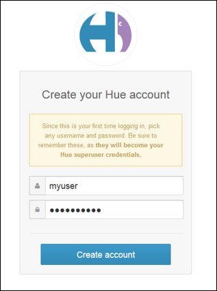
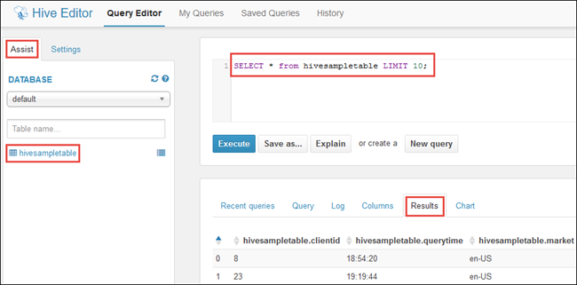

# Install and use Hue on HDInsight Hadoop clusters

Learn how to install Hue on HDInsight clusters and use tunneling to route the requests to Hue.

## What is Hue?

Hue is a set of Web applications used to interact with an Apache Hadoop cluster. You can use Hue to browse the storage associated with a Hadoop cluster (WASB, in the case of HDInsight clusters), run Hive jobs and Pig scripts, and so on. The following components are available with Hue installations on an HDInsight Hadoop cluster.

* Beeswax Hive Editor
* Apache Pig
* Metastore manager
* Apache Oozie
* FileBrowser (which talks to WASB default container)
* Job Browser

> [!WARNING]  
> Components provided with the HDInsight cluster are fully supported and Microsoft Support will help to isolate and resolve issues related to these components.
>
> Custom components receive commercially reasonable support to help you to further troubleshoot the issue. This might result in resolving the issue OR asking you to engage available channels for the open source technologies where deep expertise for that technology is found. For example, there are many community sites that can be used, like: [MSDN forum for HDInsight](https://social.msdn.microsoft.com/Forums/azure/en-US/home?forum=hdinsight), [https://stackoverflow.com](https://stackoverflow.com). Also Apache projects have project sites on [https://apache.org](https://apache.org), for example: [Hadoop](https://hadoop.apache.org/).

## Install Hue using Script Actions

Use the information in the table below for your Script Action. See [Customize HDInsight clusters with Script Actions](hdinsight-hadoop-customize-cluster-linux.md) for specific instructions on using Script Actions.

> [!NOTE]  
> To install Hue on HDInsight clusters, the recommended headnode size is at least A4 (8 cores, 14 GB memory).

|Property |Value |
|---|---|
|Script type:|- Custom|
|Name|Install Hue|
|Bash script URI|`https://hdiconfigactions.blob.core.windows.net/linuxhueconfigactionv02/install-hue-uber-v02.sh`|
|Node type(s):|Head|

## Use Hue with HDInsight clusters

You can only have one user account with Hue, as a workaround, you can use Ranger on an [Enterprise Security Package](./domain-joined/hdinsight-security-overview.md) cluster. SSH Tunneling is the only way to access Hue on the cluster once it's running. Tunneling via SSH allows the traffic to go directly to the headnode of the cluster where Hue is running. After the cluster has finished provisioning, use the following steps to use Hue on an HDInsight cluster.

> [!NOTE]  
> We recommend using Firefox web browser to follow the instructions below.

1. Use the information in [Use SSH Tunneling to access Apache Ambari web UI, ResourceManager, JobHistory, NameNode, Oozie, and other web UI's](hdinsight-linux-ambari-ssh-tunnel.md) to create an SSH tunnel from your client system to the HDInsight cluster, and then configure your Web browser to use the SSH tunnel as a proxy.

1. Use [ssh command](./hdinsight-hadoop-linux-use-ssh-unix.md) to connect to your cluster. Edit the command below by replacing CLUSTERNAME with the name of your cluster, and then enter the command:

    ```cmd
    ssh sshuser@CLUSTERNAME-ssh.azurehdinsight.net
    ```

1. Once connected, use the following command to obtain the fully qualified domain name of the primary headnode:

    ```bash
    hostname -f
    ```

    This will return a name similar to the following:

        myhdi-nfebtpfdv1nubcidphpap2eq2b.ex.internal.cloudapp.net

    This is the hostname of the primary headnode where the Hue website is located.

1. Use the browser to open the Hue portal at `http://HOSTNAME:8888`. Replace HOSTNAME with the name you obtained in the previous step.

   > [!NOTE]  
   > When you log in for the first time, you will be prompted to create an account to log in to the Hue portal. The credentials you specify here will be limited to the portal and are not related to the admin or SSH user credentials you specified while provision the cluster.

    

### Run a Hive query

1. From the Hue portal, select **Query Editors**, and then select **Hive** to open the Hive editor.

    

2. On the **Assist** tab, under **Database**, you should see **hivesampletable**. This is a sample table that is shipped with all Hadoop clusters on HDInsight. Enter a sample query in the right pane and see the output on the **Results** tab in the pane below, as shown in the screen capture.

    

    You can also use the **Chart** tab to see a visual representation of the result.

### Browse the cluster storage

1. From the Hue portal, select **File Browser** in the top-right corner of the menu bar.
2. By default the file browser opens at the **/user/myuser** directory. Select the forward slash right before the user directory in the path to go to the root of the Azure storage container associated with the cluster.

    

3. Right-click on a file or folder to see the available operations. Use the **Upload** button in the right corner to upload files to the current directory. Use the **New** button to create new files or directories.

> [!NOTE]  
> The Hue file browser can only show the contents of the default container associated with the HDInsight cluster. Any additional storage accounts/containers that you might have associated with the cluster will not be accessible using the file browser. However, the additional containers associated with the cluster will always be accessible for the Hive jobs. For example, if you enter the command `dfs -ls wasbs://newcontainer@mystore.blob.core.windows.net` in the Hive editor, you can see the contents of additional containers as well. In this command, **newcontainer** is not the default container associated with a cluster.

## Important considerations

1. The script used to install Hue installs it only on the primary headnode of the cluster.

1. During installation, multiple Hadoop services (HDFS, YARN, MR2, Oozie) are restarted for updating the configuration. After the script finishes installing Hue, it might take some time for other Hadoop services to start up. This might affect Hue's performance initially. Once all services start up, Hue will be fully functional.

1. Hue doesn't understand Apache Tez jobs, which is the current default for Hive. If you want to use MapReduce as the Hive execution engine, update the script to use the following command in your script:

         set hive.execution.engine=mr;

1. With Linux clusters, you can have a scenario where your services are running on the primary headnode while the Resource Manager could be running on the secondary. Such a scenario might result in errors (shown below) when using Hue to view details of RUNNING jobs on the cluster. However, you can view the job details when the job has completed.

   

   This is due to a known issue. As a workaround, modify Ambari so that the active Resource Manager also runs on the primary headnode.

1. Hue understands WebHDFS while HDInsight clusters use Azure Storage using `wasbs://`. So, the custom script used with script action installs WebWasb, which is a WebHDFS-compatible service for talking to WASB. So, even though the Hue portal says HDFS in places (like when you move your mouse over the **File Browser**), it should be interpreted as WASB.

## Next steps

[Install R on HDInsight clusters](hdinsight-hadoop-r-scripts-linux.md). Use cluster customization to install R on HDInsight Hadoop clusters. R is an open-source language and environment for statistical computing. It provides hundreds of built-in statistical functions and its own programming language that combines aspects of functional and object-oriented programming. It also provides extensive graphical capabilities.
