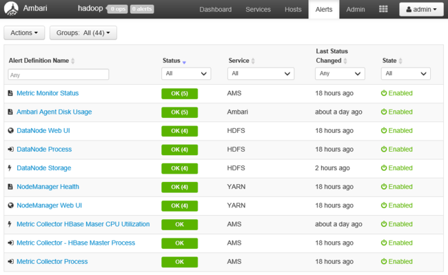
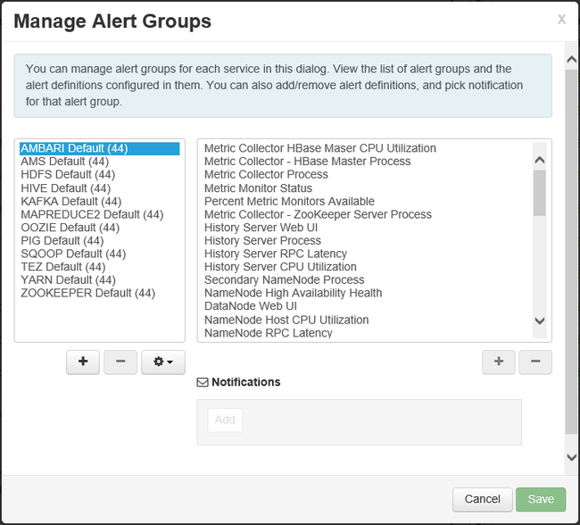
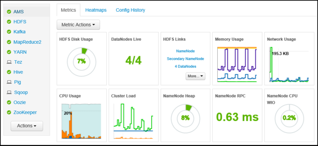
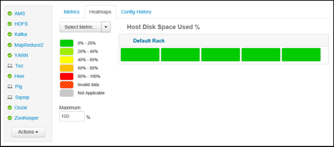
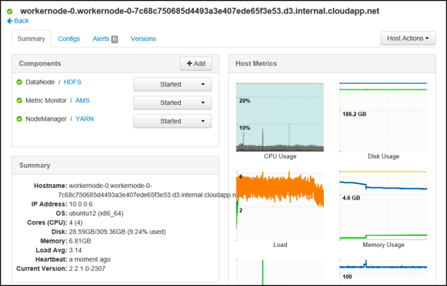
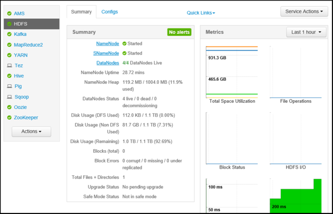
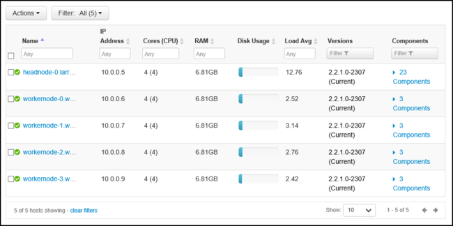
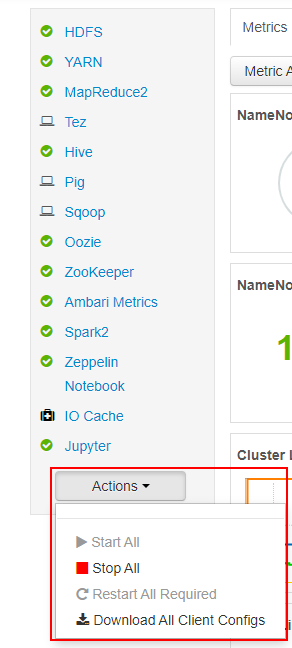
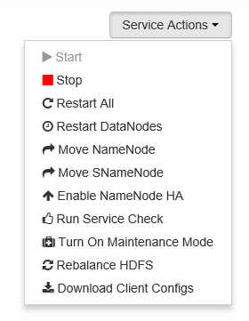
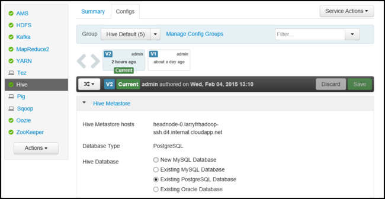

# Manage HDInsight clusters by using the Apache Ambari Web UI

[!INCLUDE [ambari-selector](../../includes/hdinsight-ambari-selector.md)]

Apache Ambari simplifies the management and monitoring of an Apache Hadoop cluster by providing an easy to use web UI and REST API. Ambari is included on HDInsight clusters, and is used to monitor the cluster and make configuration changes.

In this document, you learn how to use the Ambari Web UI with an HDInsight cluster.

## What is Apache Ambari?

[Apache Ambari](https://ambari.apache.org) simplifies Hadoop management by providing an easy-to-use web UI. You can use Ambari to manage and monitor Hadoop clusters. Developers can integrate these capabilities into their applications by using the [Ambari REST APIs](https://github.com/apache/ambari/blob/trunk/ambari-server/docs/api/v1/index.md).

## Connectivity

The Ambari Web UI is available on your HDInsight cluster at `https://CLUSTERNAME.azurehdinsight.net`, where `CLUSTERNAME` is the name of your cluster.

> [!IMPORTANT]  
> Connecting to Ambari on HDInsight requires HTTPS. When prompted for authentication, use the admin account name and password you provided when the cluster was created. If you are not prompted for credentials, check your network settings to confirm there is no connectivity issue between the client and the Azure HDInsight Clusters.

## SSH tunnel (proxy)

While Ambari for your cluster is accessible directly over the Internet, some links from the Ambari Web UI (such as to the JobTracker) aren't exposed on the internet. To access these services, you must create an SSH tunnel. For more information, see [Use SSH Tunneling with HDInsight](hdinsight-linux-ambari-ssh-tunnel.md).

## Ambari Web UI

> [!WARNING]  
> Not all features of the Ambari Web UI are supported on HDInsight. For more information, see the [Unsupported operations](#unsupported-operations) section of this document.

When connecting to the Ambari Web UI, you're prompted to authenticate to the page. Use the cluster admin user (default Admin) and password you used during cluster creation.

When the page opens, note the bar at the top. This bar contains the following information and controls:

|Item |Description |
|---|---|
|Ambari logo|Opens the dashboard, which can be used to monitor the cluster.|
|Cluster name # ops|Displays the number of ongoing Ambari operations. Selecting the cluster name or **# ops** displays a list of background operations.|
|# alerts|Displays warnings or critical alerts, if any, for the cluster.|
|Dashboard|Displays the dashboard.|
|Services|Information and configuration settings for the services in the cluster.|
|Hosts|Information and configuration settings for the nodes in the cluster.|
|Alerts|A log of information, warnings, and critical alerts.|
|Admin|Software stack/services that are installed on the cluster, service account information, and Kerberos security.|
|Admin button|Ambari management, user settings, and sign out.|

## Monitoring

### Alerts

The following list contains the common alert statuses used by Ambari:

* **OK**
* **Warning**
* **CRITICAL**
* **UNKNOWN**

Alerts other than **OK** cause the **# alerts** entry at the top of the page to display the number of alerts. Selecting this entry displays the alerts and their status.

Alerts are organized into several default groups, which can be viewed from the **Alerts** page.

You can manage the groups by using the **Actions** menu and selecting **Manage Alert Groups**.

You can also manage alerting methods, and create alert notifications from the **Actions** menu by selecting __Manage Notifications__. Any current notifications are displayed. You can also create notifications from here. Notifications can be sent via **EMAIL** or **SNMP** when specific alert/severity combinations occur. For example, you can send an email message when any of the alerts in the **YARN Default** group is set to **Critical**.

Finally, selecting __Manage Alert Settings__ from the __Actions__ menu allows you to set the number of times an alert must occur before a notification is sent. This setting can be used to prevent notifications for transient errors.

For a tutorial of an alert notification using a free [SendGrid account](https://docs.microsoft.com/azure/sendgrid-dotnet-how-to-send-email), see [Configure Apache Ambari email notifications in Azure HDInsight](./apache-ambari-email.md).

### Cluster

The **Metrics** tab of the dashboard contains a series of widgets that make it easy to monitor the status of your cluster at a glance. Several widgets, such as **CPU Usage**, provide additional information when clicked.

The **Heatmaps** tab displays metrics as colored heatmaps, going from green to red.

For more information on the nodes within the cluster, select **Hosts**. Then select the specific node you're interested in.

### Services

The **Services** sidebar on the dashboard provides quick insight into the status of the services running on the cluster. Various icons are used to indicate status or actions that should be taken. For example, a yellow recycle symbol is displayed if a service needs to be recycled.

> [!NOTE]  
> The services displayed differ between HDInsight cluster types and versions. The services displayed here may be different than the services displayed for your cluster.

Selecting a service displays more detailed information on the service.

#### Quick links

Some services display a **Quick Links** link at the top of the page. This can be used to access service-specific web UIs, such as:

* **Job History** - MapReduce job history.
* **Resource Manager** - YARN ResourceManager UI.
* **NameNode** - Hadoop Distributed File System (HDFS) NameNode UI.
* **Oozie Web UI** - Oozie UI.

Selecting any of these links opens a new tab in your browser, which displays the selected page.

> [!NOTE]  
> Selecting the **Quick Links** entry for a service may return a "server not found" error. If you encounter this error, you must use an SSH tunnel when using the **Quick Links** entry for this service. For information, see [Use SSH Tunneling with HDInsight](hdinsight-linux-ambari-ssh-tunnel.md)

## Management

### Ambari users, groups, and permissions

Working with users, groups, and permissions is supported. For local administration, see [Authorize users for Apache Ambari Views](./hdinsight-authorize-users-to-ambari.md). For domain-joined clusters, see [Manage domain-joined HDInsight clusters](./domain-joined/hdinsight-security-overview.md).

> [!WARNING]  
> Do not change the password of the Ambari watchdog (hdinsightwatchdog) on your Linux-based HDInsight cluster. Changing the password breaks the ability to use script actions or perform scaling operations with your cluster.

### Hosts

The **Hosts** page lists all hosts in the cluster. To manage hosts, follow these steps.

> [!NOTE]  
> Adding, decommissioning, and recommissioning a host should not be used with HDInsight clusters.

1. Select the host that you wish to manage.

2. Use the **Actions** menu to select the action that you wish to perform:

    |Item |Description |
    |---|---|
    |Start all components|Start all components on the host.|
    |Stop all components|Stop all components on the host.|
    |Restart all components|Stop and start all components on the host.|
    |Turn on maintenance mode|Suppresses alerts for the host. This mode should be enabled if you're performing actions that generate alerts. For example, stopping and starting a service.|
    |Turn off maintenance mode|Returns the host to normal alerting.|
    |Stop|Stops DataNode or NodeManagers on the host.|
    |Start|Starts DataNode or NodeManagers on the host.|
    |Restart|Stops and starts DataNode or NodeManagers on the host.|
    |Decommission|Removes a host from the cluster. **Do not use this action on HDInsight clusters.**|
    |Recommission|Adds a previously decommissioned host to the cluster. **Do not use this action on HDInsight clusters.**|

### Services

From the **Dashboard** or **Services** page, use the **Actions** button at the bottom of the list of services to stop and start all services.

> [!WARNING]  
> While **Add Service** is listed in this menu, it should not be used to add services to the HDInsight cluster. New services should be added using a Script Action during cluster provisioning. For more information on using Script Actions, see [Customize HDInsight clusters using Script Actions](hdinsight-hadoop-customize-cluster-linux.md).

While the **Actions** button can restart all services, often you want to start, stop, or restart a specific service. Use the following steps to perform actions on an individual service:

1. From the **Dashboard** or **Services** page, select a service.

2. From the top of the **Summary** tab, use the **Service Actions** button and select the action to take. This restarts the service on all nodes.

    

   > [!NOTE]  
   > Restarting some services while the cluster is running may generate alerts. To avoid alerts, you can use the **Service Actions** button to enable **Maintenance mode** for the service before performing the restart.

3. Once an action has been selected, the **# op** entry at the top of the page increments to show that a background operation is occurring. If configured to display, the list of background operations is displayed.

   > [!NOTE]  
   > If you enabled **Maintenance mode** for the service, remember to disable it by using the **Service Actions** button once the operation has finished.

To configure a service, use the following steps:

1. From the **Dashboard** or **Services** page, select a service.

2. Select the **Configs** tab. The current configuration is displayed. A list of previous configurations is also displayed.

    

3. Use the fields displayed to modify the configuration, and then select **Save**. Or select a previous configuration and then select **Make current** to roll back to the previous settings.

## Ambari views

Ambari Views allow developers to plug UI elements into the Ambari Web UI using the [Apache Ambari Views Framework](https://cwiki.apache.org/confluence/display/AMBARI/Views). HDInsight provides the following views with Hadoop cluster types:

* Hive View: The Hive View allows you to run Hive queries directly from your web browser. You can save queries, view results, save results to the cluster storage, or download results to your local system. For more information on using Hive Views, see [Use Apache Hive Views with HDInsight](hadoop/apache-hadoop-use-hive-ambari-view.md).

* Tez View: The Tez View allows you to better understand and optimize jobs. You can view information on how Tez jobs are executed and what resources are used.

## Unsupported operations

The following Ambari operations are not supported on HDInsight:

* __Moving the Metrics Collector service__. When viewing information on the Metrics Collector service, one of the actions available from the Service Actions menu is __Move Metrics collector__. This is not supported with HDInsight.

## Next steps

Learn how to use the [Apache Ambari REST API](hdinsight-hadoop-manage-ambari-rest-api.md) with HDInsight.
