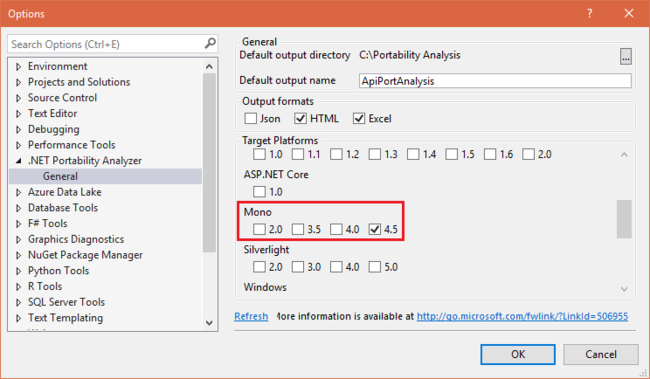

# Migrate .NET solutions for Windows-based HDInsight to Linux-based HDInsight

Linux-based HDInsight clusters use [Mono (https://mono-project.com)](https://mono-project.com) to run .NET applications. Mono allows you to use .NET components such as MapReduce applications with Linux-based HDInsight. In this document, learn how to migrate .NET solutions created for Windows-based HDInsight clusters to work with Mono on Linux-based HDInsight.

## Mono compatibility with .NET

Mono version 4.2.1 is included with HDInsight version 3.6. For more information on the version of Mono included with HDInsight, see [HDInsight component versions](hdinsight-component-versioning.md). To install a specific version of Mono, see the [Install or update Mono](hdinsight-hadoop-install-mono.md) document.

For more information on compatibility between Mono and .NET, see the [Mono compatibility (http://www.mono-project.com/docs/about-mono/compatibility/)](http://www.mono-project.com/docs/about-mono/compatibility/) document.

> [!IMPORTANT]
> The SCP.NET framework is compatible with Mono. For more information on using SCP.NET with Mono, see [Use Visual Studio to develop C# topologies for Apache Storm on HDInsight](storm/apache-storm-develop-csharp-visual-studio-topology.md).

## Automated portability analysis

The [.NET Portability Analyzer](https://marketplace.visualstudio.com/items?itemName=ConnieYau.NETPortabilityAnalyzer) can be used to generate a report of incompatibilities between your application and Mono. Use the following steps to configure the analyzer to check your application for Mono portability:

1. Install the [.NET Portability Analyzer](https://marketplace.visualstudio.com/items?itemName=ConnieYau.NETPortabilityAnalyzer). During installation, select the version of Visual Studio to use.

2. From Visual Studio 2015, select __Analyze__ > __Portability Analyzer Settings__, and make sure that __4.5__ is checked in the __Mono__ section.

    

    Select __OK__ to save the configuration.

3. Select __Analyze__ > __Analyze Assembly Portability__. Select the assembly that contains your solution, and then select __Open__ to begin analysis.

4. Once analysis is complete, select __Analyze__ > __View analysis reports__. In __Portability Analysis Results__, select __Open report__ to open a report.

    

> [!IMPORTANT]
> The analyzer cannot catch every problem with your solution. For example, a file path of `c:\temp\file.txt` is considered OK if Mono is running on Windows. The same path is not valid on a Linux platform.

## Manual portability analysis

Perform a manual audit of your code using the information in the [Application Portability (http://www.mono-project.com/docs/getting-started/application-portability/)](http://www.mono-project.com/docs/getting-started/application-portability/) document.

## Modify and build

You can continue to use Visual Studio to build your .NET solutions for HDInsight. However, you must ensure that the project is configured to use .NET Framework 4.5.

## Deploy and test

Once you have modified your solution using the recommendations from the .NET Portability Analyzer or from a manual analysis, you must test it with HDInsight. Testing the solution on a Linux-based HDInsight cluster may reveal subtle problems that need to be corrected. We recommend that you enable additional logging in your application while testing it.

For more information on accessing logs, see the following documents:

* [Access YARN application logs on Linux-based HDInsight](hdinsight-hadoop-access-yarn-app-logs-linux.md)

## Next steps

* [Use C# with MapReduce on HDInsight](hadoop/apache-hadoop-dotnet-csharp-mapreduce-streaming.md)

* [Use C# user-defined functions with Hive and Pig](hadoop/apache-hadoop-hive-pig-udf-dotnet-csharp.md)

* [Develop C# topologies for Storm on HDInsight](storm/apache-storm-develop-csharp-visual-studio-topology.md)
