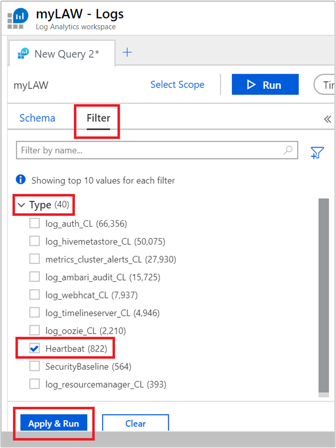

# Query Azure Log Analytics to monitor HDInsight clusters 

In this article you will look at some scenarios on how to use Azure Log Analytics with Azure HDInsight clusters. Three most common scenarios are:

* Analyze HDInsight cluster metrics in OMS
* Look for specific log messages for HDInsight clusters
* Create alerts based on events ocurring in the clusters

## Prerequisites

* You must have configured an HDInsight cluster to use Azure Log Analytics. For instructions see [Use Azure Log Analytics with HDInsight clusters](hdinsight-hadoop-oms-log-analytics-tutorial.md).

* You must have add the HDInsight cluster-specific management solutions to the OMS workspace as described in [Add HDInsight cluster management solutions to Log Analytics](hdinsight-hadoop-oms-log-analytics-management-solutions.md).

## Analyze HDInsight cluster metrics in OMS

In this section we walk through the steps you should take to look for specific metrics for your HDInsight cluster.

1. Open the OMS dashboard. In the Azure portal, open the HDInsight cluster blade that you associated with Azure Log Analytics, click the Monitoring tab, and the click **Open OMS Dashboard**.

    

2. In the OMS dashboard, from the home screen, click **Log Search**.

    

3. In the Log Search window, in the **Begin search here** text box, type `*` to search for all metrics for all available metrics for all HDInsight clusters configured to use Azure Log Analytics. Press ENTER.

    

4. You should see an output like the following.

    

5. From the left pane, under **Type** category, search a metric that you want to dig deep into. For this tutorial, let's pick `metrics_resourcemanager_queue_root_default_CL`. Select the checkbox corresponding to the metric, and then click **Apply**.

    > [!NOTE]
    > You might need to click the **[+]More** button to find the metric you are looking for. Also, the **Apply** button is at the bottom of the list so you must scroll down to see it.
    > 
    >    
    Notice that the query in the text box now changes to this.

    

6. You can now dig deeper into this specific metrics. For example, you can now refine the existing output based on the average of resources used in a 10 minute interval, categorized by cluster name. Type the following query in the query text box.

        * (Type=metrics_resourcemanager_queue_root_default_CL) | measure avg(UsedAMResourceMB_d) by ClusterName_s interval 10minute

    

7. Instead of refining based on the average of resources used, you can use the following query to refine the results based on when the maximum resources were used (as well as 90th and 95th percentile) in a 10 minute window.

        * (Type=metrics_resourcemanager_queue_root_default_CL) | measure max(UsedAMResourceMB_d) , pct95(UsedAMResourceMB_d), pct90(UsedAMResourceMB_d)  by ClusterName_s interval 10minute

    

## Configure HDInsight cluster to use Azure Log Analytics

In this section, you configure an existing HDInsight Hadoop cluster to use an Azure Log Analytics workspace to monitor jobs, debug logs, etc.

1. In the Azure Portal, from the left pane, click **HDInsight clusters**, and then click the name of the cluster you want to configure with Azure Log Analytics.

2. In the cluster blade, from the left pane, click **Monitoring**.

3. In the right pane, click **Enable**, and then select an existing Log Analytics workspace. Click **Save**.

    

4. Once the cluster is configured to use Log Analytics for monitoring, you will see an **Open OMS Dashboard** option at the top of the tab. Click the button.

    

5. Enter your Azure credentials if prompted. You will be directed to the Microsoft OMS dashboard.

    

## Next steps
* [Add HDInsight cluster management solutions to Log Analytics](hdinsight-hadoop-oms-log-analytics-management-solutions.md)
