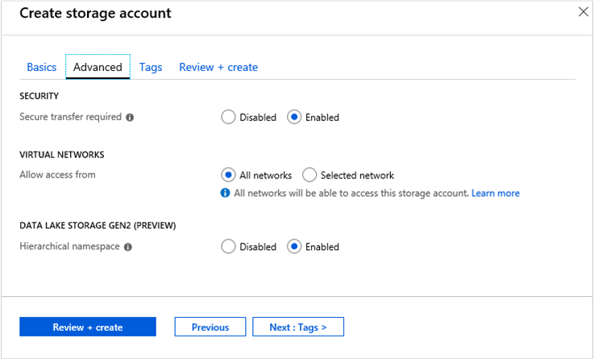
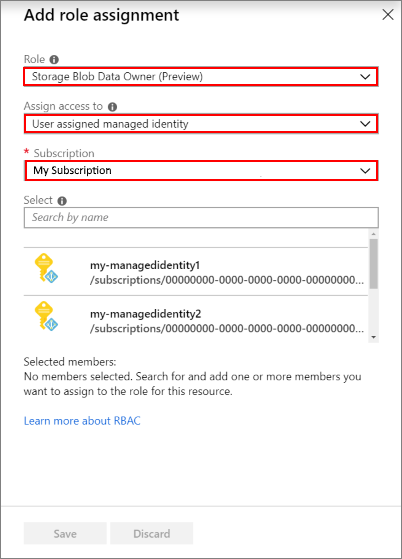

# Use Azure Data Lake Storage Gen2 with Azure HDInsight clusters

Azure Data Lake Storage Gen2 is a cloud storage service dedicated to big data analytics, built on Azure Blob storage. Data Lake Storage Gen2 combines the capabilities of Azure Blob storage and Azure Data Lake Storage Gen1. The resulting service offers features from Azure Data Lake Storage Gen1, such as file system semantics, directory-level and file-level security, and scalability, along with the low-cost, tiered storage, high availability, and disaster-recovery capabilities from Azure Blob storage.

## Data Lake Storage Gen2 availability

Data Lake Storage Gen2 is available as a storage option for almost all Azure HDInsight cluster types as both a default and an additional storage account. HBase, however, can have only one Data Lake Storage Gen2 account.

> [!Note] 
> After you select Data Lake Storage Gen2 as your **primary storage type**, you cannot select a Data Lake Storage Gen1 account as additional storage.

## Create a cluster with Data Lake Storage Gen2 through the Azure portal

### Create a user managed identity

To create an HDInsight cluster that uses Data Lake Storage Gen2 for storage, follow these steps to configure a Data Lake Storage Gen2 account.

1. Create a user-assigned managed identity, if you don’t already have one. See [Create, list, delete or assign a role to a user-assigned managed identity using the Azure portal](../active-directory/managed-identities-azure-resources/how-to-manage-ua-identity-portal.md#create-a-user-assigned-managed-identity). For more information on how managed identities work in Azure HDInsight, see [Managed identities in Azure HDInsight](hdinsight-managed-identities.md).

    

### Create a Data Lake Storage Gen2 account

1. Create an Azure Data Lake Storage Gen2 storage account. Make sure that the **Hierarchical namespace** option is enabled. For more information, see [Quickstart: Create an Azure Data Lake Storage Gen2 storage account](../storage/blobs/data-lake-storage-quickstart-create-account.md).

    

### Setup permissions for the managed identity on the Data Lake Storage Gen2 account

1. Assign the managed identity to the **Storage Blob Data Owner (Preview)** role on the storage account. For more information, see [Manage access rights to Azure Blob and Queue data with RBAC (Preview)](../storage/common/storage-auth-aad-rbac.md).

    1. In the [Azure portal](https://portal.azure.com), go to your storage account.
    1. Select your storage account, then select **Access control (IAM)** to display the access control settings for the account. Select the **Role assignments** tab to see the list of role assignments.
    
        
    
    1. Select the **+ Add role assignment** button to add a new role.
    1. In the **Add role assignment** window, select the **Storage Blob Data Owner (Preview)** role. Then, select the subscription that has the managed identity and storage account. Next, search to locate the user-assigned managed identity that you created previously. Finally, select the managed identity, and it will be listed under **Selected members**.
    
        
    
    1. Select **Save**. The user-assigned identity that you selected is now listed under the **Contributor** role.

    1. After this initial setup is complete, you can create a cluster through the portal. The cluster must be in the same Azure region as the storage account. In the **Storage** section of the cluster creation menu, select the following options:
        
        * For **Primary storage type**, select **Azure Data Lake Storage Gen2**.
        * Under **Select a Storage account**, search for and select the newly created Data Lake Storage Gen2 storage account.
        
            
        
        * Under **Identity**, select the correct subscription and the newly created user-assigned managed identity.
        
            

## Create a cluster with Data Lake Storage Gen2 through the Azure CLI

You can [download a sample template file](https://github.com/Azure-Samples/hdinsight-data-lake-storage-gen2-templates/blob/master/hdinsight-adls-gen2-template.json) and [download a sample parameters file](https://github.com/Azure-Samples/hdinsight-data-lake-storage-gen2-templates/blob/master/parameters.json). Before using the template, replace the string `<SUBSCRIPTION_ID>` with your actual Azure subscription ID. Also, replace the string `<PASSWORD>` with your chosen password to set both the password that you'll use to log in to your cluster and the SSH password.

The code snippet below does the following initial steps:

1. Logs in to your Azure account.
1. Sets the active subscription where the create operations will be done.
1. Creates a new resource group for the new deployment activities named `hdinsight-deployment-rg`.
1. Creates a user-assigned managed identity named `test-hdinsight-msi`.
1. Adds an extension to the Azure CLI to use features for Data Lake Storage Gen2.
1. Creates a new Data Lake Storage Gen2 account named `hdinsightadlsgen2`, by using the `--hierarchical-namespace true` flag.

```azurecli
az login
az account set --subscription <subscription_id>

# Create resource group
az group create --name hdinsight-deployment-rg --location eastus

# Create managed identity
az identity create -g hdinsight-deployment-rg -n test-hdinsight-msi

az extension add --name storage-preview

az storage account create --name hdinsightadlsgen2 \
    --resource-group hdinsight-deployment-rg \
    --location eastus --sku Standard_LRS \
    --kind StorageV2 --hierarchical-namespace true
```

Next, log in to the portal. Add the new user-assigned managed identity to the **Storage Blob Data Contributor (Preview)** role on the storage account, as described in step 3 under [Using the Azure portal](hdinsight-hadoop-use-data-lake-storage-gen2.md).

After you've assigned the role for the user-assigned managed identity, deploy the template by using the following code snippet.

```azurecli
az group deployment create --name HDInsightADLSGen2Deployment \
    --resource-group hdinsight-deployment-rg \
    --template-file hdinsight-adls-gen2-template.json \
    --parameters parameters.json
```

## Access control for Data Lake Storage Gen2 in HDInsight

### What kinds of permissions does Data Lake Storage Gen2 support?

Data Lake Storage Gen2 uses an access control model that supports both role-based access control (RBAC) and POSIX-like access control lists (ACLs). Data Lake Storage Gen1 supports access control lists only for controlling access to data.

RBAC uses role assignments to effectively apply sets of permissions to users, groups, and service principals for Azure resources. Typically, those Azure resources are constrained to top-level resources (for example, Azure storage accounts). For Azure Storage, and also Data Lake Storage Gen2, this mechanism has been extended to the file system resource.

 For more information about file permissions with RBAC, see [Azure role-based access control (RBAC)](../storage/blobs/data-lake-storage-access-control.md#azure-role-based-access-control-rbac).

For more information about file permissions with ACLs, see [Access control lists on files and directories](../storage/blobs/data-lake-storage-access-control.md#access-control-lists-on-files-and-directories).

### How do I control access to my data in Data Lake Storage Gen2?

Your HDInsight cluster's ability to access files in Data Lake Storage Gen2 is controlled through managed identities. A managed identity is an identity registered in Azure Active Directory (Azure AD) whose credentials are managed by Azure. With managed identities, you don't need to register service principals in Azure AD or maintain credentials such as certificates.

Azure services have two types of managed identities: system-assigned and user-assigned. HDInsight uses user-assigned managed identities to access Data Lake Storage Gen2. A user-assigned managed identity is created as a standalone Azure resource. Through a create process, Azure creates an identity in the Azure AD tenant that's trusted by the subscription in use. After the identity is created, the identity can be assigned to one or more Azure service instances.

The lifecycle of a user-assigned identity is managed separately from the lifecycle of the Azure service instances to which it's assigned. For more information about managed identities, see [How do the managed identities for Azure resources work?](../active-directory/managed-identities-azure-resources/overview.md#how-does-the-managed-identities-for-azure-resources-work).

### How do I set permissions for Azure AD users to query data in Data Lake Storage Gen2 by using Hive or other services?

To set permissions for users to query data, use Azure AD security groups as the assigned principal in ACLs. Don't directly assign file-access permissions to individual users or service principals. When you use Azure AD security groups to control the flow of permissions, you can add and remove users or service principals without reapplying ACLs to an entire directory structure. You only have to add or remove the users from the appropriate Azure AD security group. ACLs aren't inherited, so reapplying ACLs requires updating the ACL on every file and subdirectory.

## Next steps

* [Use Azure Data Lake Storage Gen2 Preview with Azure HDInsight clusters](../storage/blobs/data-lake-storage-use-hdi-cluster.md)
* [Azure HDInsight integration with Data Lake Storage Gen2 preview - ACL and security update](https://azure.microsoft.com/blog/azure-hdinsight-integration-with-data-lake-storage-gen-2-preview-acl-and-security-update/)
* [Introduction to Azure Data Lake Storage Gen2 Preview](../storage/blobs/data-lake-storage-introduction.md)
