# Install published application - Datameer on Azure HDInsight

In this article, you will learn how to install the [Datameer](https://www.datameer.com/) published Hadoop application on Azure HDInsight. Read [Install third-party Hadoop applications](hdinsight-apps-install-applications.md) for a list of available Independent Software Vendor (ISV) applications, as well as an overview of the HDInsight application platform. For instructions on installing your own application, see [Install custom HDInsight applications](../hdinsight-apps-install-custom-applications.md).

## About Datameer

Sitting natively on the powerful Hadoop platform, Datameer extends existing Azure HDInsight capabilities by facilitating quick integration, preparation and analysis of all structured and unstructured data. Datameer makes it easy to ingest and integrate data with more than 70 sources and formats: structured, semi-structured, and unstructured. You can directly upload data, or use their unique data links to pull data on demand. Datameer’s self-service functionality and familiar spreadsheet interface reduces the complexity of big data technology and dramatically accelerates time to insight. The spreadsheet interface provides a simple mechanism for entering declarative spreadsheet formulas that are translated to fully optimized Hadoop jobs. If you have BI or Excel skills, you can use Hadoop in the cloud quickly.

[Datameer documentation](http://www.datameer.com/documentation/display/DAS50/Home?ls=Partners&lsd=Microsoft&c=Partners&cd=Microsoft)

## Installing the Datameer published application

For step-by-step instructions on installing this and other available ISV applications, please read [Install third-party Hadoop applications](hdinsight-apps-install-applications.md#how-to-install-a-published-application).

## Prerequisites

When creating a new HDInsight cluster, or to install on an existing one, you must have the following configuration to install this app:

* Cluster tier: Standard
* Cluster type: Hadoop
* Cluster version: 3.4

## Launching Datameer for the first time

After installation, you can launch Datameer from your cluster in Azure portal by going to the **Settings** blade, then clicking **Applications** under the **General** category. The Installed Apps blade lists all the installed applications.

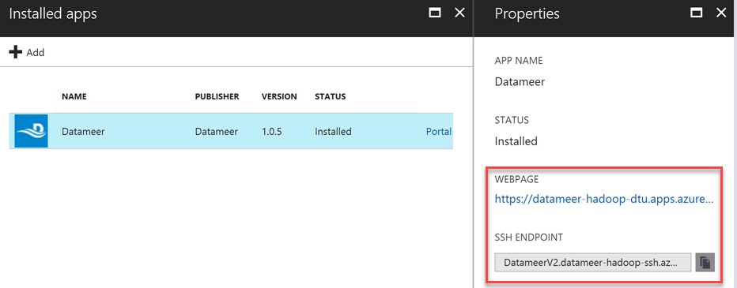

When you select Datameer, you'll see a link to the web page, as well as the SSH endpoint path. Select the WEBPAGE link.

On first launch, you'll be presented with two license options: a free 14-day trial, or the ability to activate an existing license.

After completing your selected license option, you'll be presented with a login form. Enter the default credentials displayed prior to the login form. After logging in, accept the software agreement to continue.

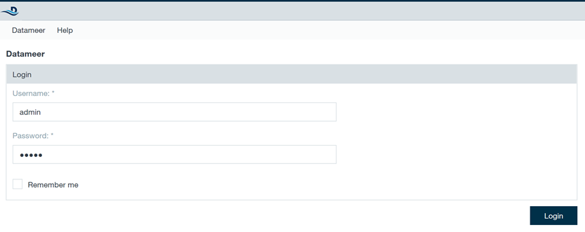

Now that you've logged into Datameer, please follow these steps for a "Hello World" demonstration:

* [Download the sample CSV](https://datameer.box.com/s/wzzw27za3agic4yjj8zrn6vfrph0ppnf).
* Click the **+** sign on top of the Datameer dashboard, and click **File Upload**.

    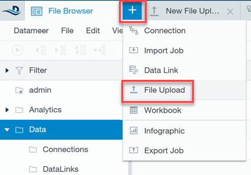

* In the upload dialog, browse and select the **Hello World.csv** file you just downloaded. Make sure the **File Type** is set to CSV / TSV. Click **Next**. Keep clicking **Next** until you reach the end of the wizard.

    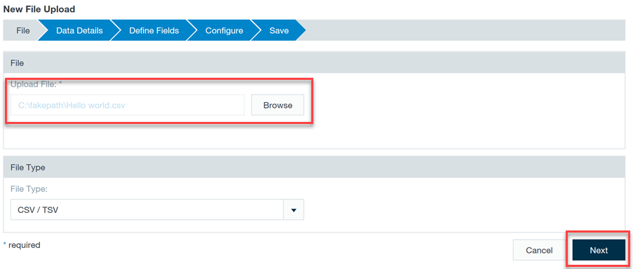

* Name the file **Hello World** underneath a New Folder. You may rename the new folder as "Demo", or similar. Click **Save**.

    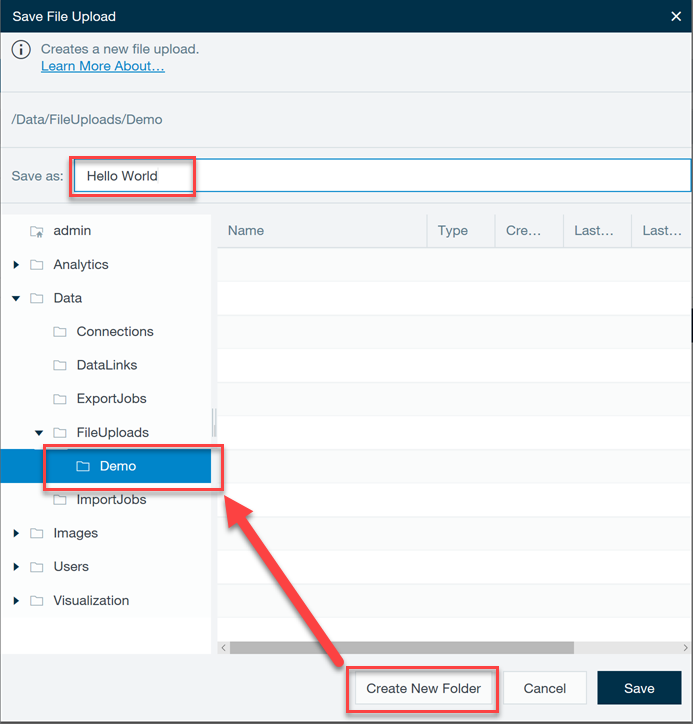

* Click the **+** sign once more and select **Workbook** to create a new Workbook for our data.

    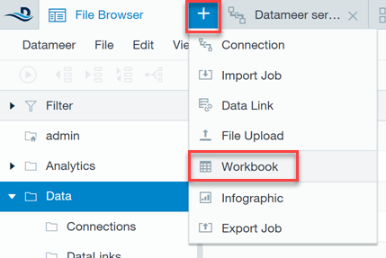

* Expand the **Data** folder, **FileUploads**, then the **Demo** folder you created when saving the "Hello World" file. Select **Hello World** form the list of files, then click **Add Data**.

    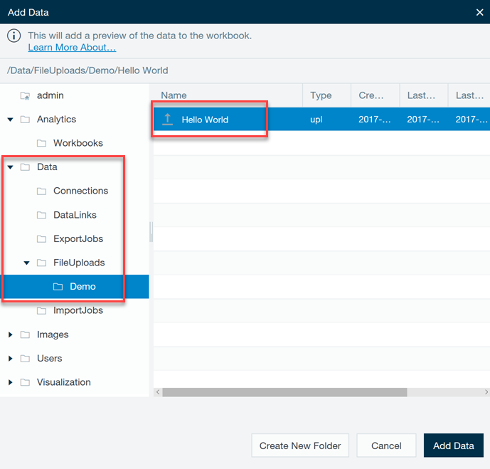

* You will now see the data loaded in a familiar spreadsheet interface. Click the **Filter** button in the toolbar to select a subset of the data.

    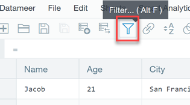

* In the Apply Filter dialog, select the **City** column, **equals** operator, and type **Chicago** in the filter text box. Check the **Create filter in new sheet** checkbox, then click **Create Filter**.

    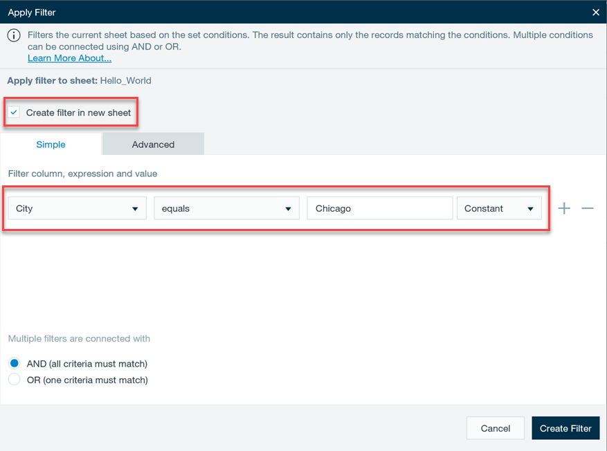

* Save the Workbook by clicking **File**, then **Save**. Supply a name, such as "Hello World Workbook".

* After entering your file name and clicking Save, you'll be presented with options for how and when to run the Workbook. For now, leave all of the options at their default values, then check the **Start calculation process immediately after save**, and click **Save**.

    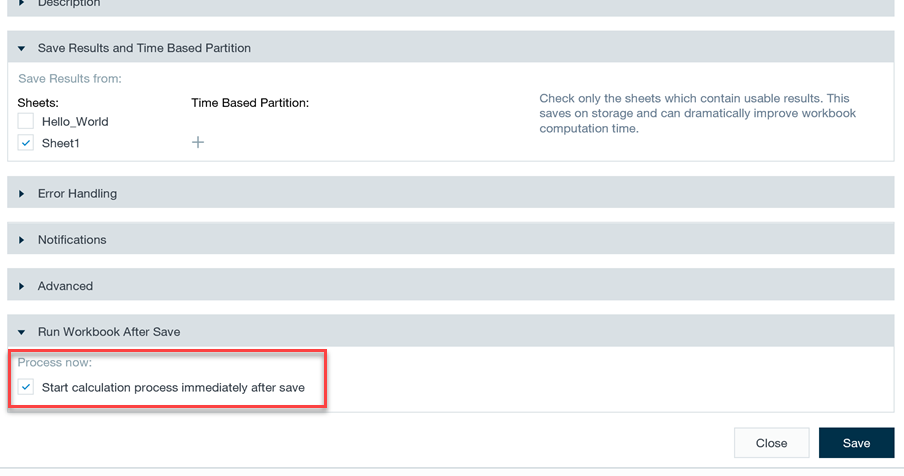

* Datameer provides powerful visualization tools. To display our data, we'll create an Infographic. Once again, click the **+** sign on top of the dashboard, then select **Infographic**.

    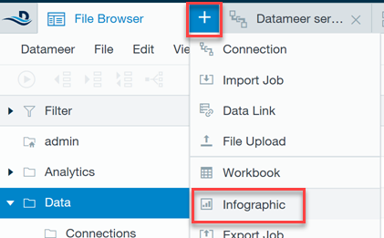

* Drag a Bar Chart widget from the list of widgets on the left (step 1). Next, navigate through the Data folder under the data browser on the right, expand your Workbook, then your worksheet you added with the filter (step 2). Drag the **Name** column over top of the bar chart. Drop it into the **Label** target to set the Workbook's Name column as the chart's label field.

    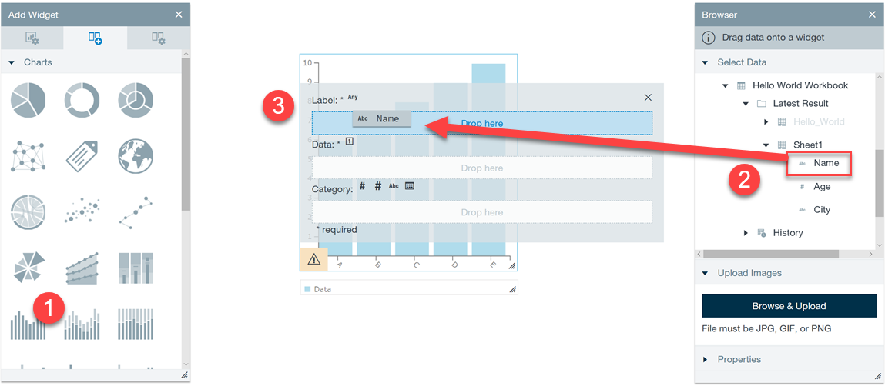

* Now drag the **Age** column into the chart's **Data* field, thus setting Age as the chart's Y axis.

    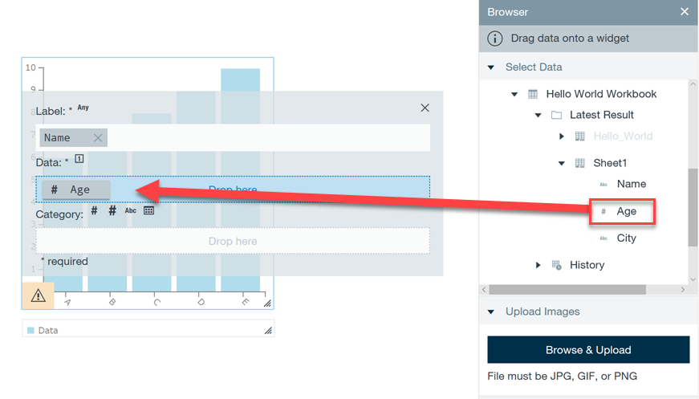

Congratulations! At this point, you've created a nice visualization of your data without writing any code. Feel free to add text over top of your chart, change colors, and adding additional visualizations to discover the great options at your disposal.

## Next steps
* Read the Datameer [documentation](http://www.datameer.com/documentation/display/DAS50/Home?ls=Partners&lsd=Microsoft&c=Partners&cd=Microsoft)
* [Install custom HDInsight applications](../hdinsight-apps-install-custom-applications.md): learn how to deploy an un-published HDInsight application to HDInsight.
* [Publish HDInsight applications](../hdinsight-apps-publish-applications.md): Learn how to publish your custom HDInsight applications to Azure Marketplace.
* [MSDN: Install an HDInsight application](https://msdn.microsoft.com/library/mt706515.aspx): Learn how to define HDInsight applications.
* [Customize Linux-based HDInsight clusters using Script Action](hdinsight-hadoop-customize-cluster-linux.md): learn how to use Script Action to install additional applications.
* [Use empty edge nodes in HDInsight](../hdinsight-apps-use-edge-node.md): learn how to use an empty edge node for accessing HDInsight cluster, testing HDInsight applications, and hosting HDInsight applications.

