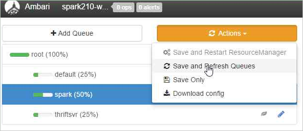

# Yarn troubleshooting

This article describes the top issues for working with Yarn payloads in Apache Ambari and their resolutions.

## How do I create a new Yarn queue on a cluster


### Resolution steps 

Use the following steps in Ambari to create a new Yarn queue and balance the capacity allocation among all the queues. 

In this example, two existing queues (**default** and **thriftsvr**) are both changed from 50% capacity to 25% capacity, which enables the new queue (Spark) to have 50% capacity.
| Queue | Capacity | Maximum capacity |
| --- | --- | --- | --- |
| default | 25% | 50% |
| thrftsvr | 25% | 50% |
| spark | 50% | 50% |

1. Select the Abari Views icon, and then the grid pattern. Next, select **Yarn Queue Manager**.

    
1. Select the **default** queue.

    
2. Change the **capacity** from 50% to 25% for the **default** queue, and then change it to 25% for the **thriftsvr** queue.

    
3. To create a new queue, select **Add Queue**.

    

4. Name the new queue.

      

5. Leave the **capacity** values at 50%, and then select the **Actions** button.

      
1. Choose **Save and Refresh Queues**.

      

These changes are visible immediately on the Yarn Scheduler UI.

### Additional reading

- [Yarn capacity scheduler](https://hadoop.apache.org/docs/r2.7.2/hadoop-yarn/hadoop-yarn-site/CapacityScheduler.html)


## How do I download Yarn logs from a cluster


### Resolution steps 

1. Connect to the HDInsight cluster with a Secure Shell (SSH) client. (For more information, see the **Additional reading** section).

2. With the following command, list all the application IDs of the currently running Yarn applications:

```apache
yarn top
```
The IDs are listed in the `APPLICATIONID` column, which has logs  that you can download.

```apache
YARN top - 18:00:07, up 19d, 0:14, 0 active users, queue(s): root
NodeManager(s): 4 total, 4 active, 0 unhealthy, 0 decommissioned, 0 lost, 0 rebooted
Queue(s) Applications: 2 running, 10 submitted, 0 pending, 8 completed, 0 killed, 0 failed
Queue(s) Mem(GB): 97 available, 3 allocated, 0 pending, 0 reserved
Queue(s) VCores: 58 available, 2 allocated, 0 pending, 0 reserved
Queue(s) Containers: 2 allocated, 0 pending, 0 reserved

                  APPLICATIONID USER             TYPE      QUEUE   #CONT  #RCONT  VCORES RVCORES     MEM    RMEM  VCORESECS    MEMSECS %PROGR       TIME NAME
 application_1490377567345_0007 hive            spark  thriftsvr       1       0       1       0      1G      0G    1628407    2442611  10.00   18:20:20 Thrift JDBC/ODBC Server
 application_1490377567345_0006 hive            spark  thriftsvr       1       0       1       0      1G      0G    1628430    2442645  10.00   18:20:20 Thrift JDBC/ODBC Server
```


- Use the following command to download Yarn container logs for all application masters:
   
    ```apache
    yarn logs -applicationIdn logs -applicationId <application_id> -am ALL > amlogs.txt
    ```

    This command creates a log file named `amlogs.txt` in text format. 

- Use the following command to download Yarn container logs for only the latest application master:

    ```apache
    yarn logs -applicationIdn logs -applicationId <application_id> -am -1 > latestamlogs.txt
    ```

    This command creates a log file named `latestamlogs.txt` in text format. 

- Use the following command to download Yarn container logs for the first two application masters:

    ```apache
    yarn logs -applicationIdn logs -applicationId <application_id> -am 1,2 > first2amlogs.txt 
    ```

    This command creates a log file named `first2amlogs.txt` in text format. 

- Use the following command to download all Yarn container logs:

    ```apache
    yarn logs -applicationIdn logs -applicationId <application_id> > logs.txt
    ```

    This command creates a log file named `logs.txt` in text format. 

- Download the yarn container log for a particular container with the following command:

    ```apache
    yarn logs -applicationIdn logs -applicationId <application_id> -containerId <container_id> > containerlogs.txt 
    ```

    This command creates a log file named `containerlogs.txt` in text format.

#### Additional reading

- [Connect to HDInsight (Hadoop) using SSH](https://docs.microsoft.com/en-us/azure/hdinsight/hdinsight-hadoop-linux-use-ssh-unix)
- [Apache Hadoop Yarn concepts and applications](https://hortonworks.com/blog/apache-hadoop-yarn-concepts-and-applications/)


