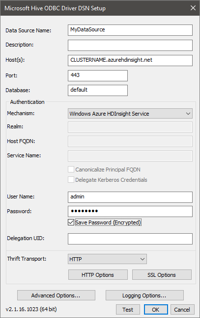
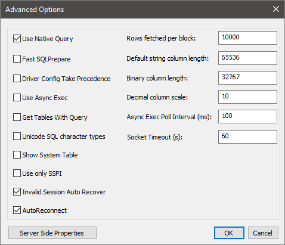

# Tutorial: Query Apache Hive with ODBC and Powershell

Microsoft ODBC drivers provide a flexible way to interact with a variety of data sources, including Apache Hive. You can write code in scripting languages like Powershell that use the ODBC drivers to open a connection to your Hive cluster, pass a query of your choosing and display the results.

In this tutorial, you will do the following:

> [!div class="checklist"]
> * Download and install the Microsoft Hive ODBC driver
> * Create an Apache Hive ODBC data source linked to your cluster
> * Query sample information from your cluster using Powershell

If you don’t have an Azure subscription, create a [free account](https://azure.microsoft.com/free/?WT.mc_id=A261C142F) before you begin.

## Prerequisites

Before you begin this article, you must have the following items:

* An Interactive Query cluster on HDInsight. To create one, see [Get started with Azure HDInsight](hdinsight-hadoop-provision-linux-clusters.md). Select **Interactive Query** as the cluster type.

## Install Microsoft Hive ODBC driver

Download and install the [Microsoft Hive ODBC Driver](https://go.microsoft.com/fwlink/?LinkID=286698).

## Create Apache Hive ODBC data source

The following steps show you how to create an Apache Hive ODBC data source.

1. From Windows, navigate to Start > Windows Administrative Tools > ODBC Data Sources (32-bit)/(64-bit).  This opens the **ODBC Data Source Administrator** window.

    

1. From the **User DSN** tab, select **Add** to open the **Create New Data Source** window.

1. Select **Microsoft Hive ODBC Driver**, and then select **Finish** to open the **Microsoft Hive ODBC Driver DSN Setup** window.

1. Type or select the following values:

   | Property | Description |
   | --- | --- |
   |  Data Source Name |Give a name to your data source |
   |  Host(s) |Enter `CLUSTERNAME.azurehdinsight.net`. For example, `myHDICluster.azurehdinsight.net` |
   |  Port |Use **443**.|
   |  Database |Use **default**. |
   |  Mechanism |Select **Windows Azure HDInsight Service** |
   |  User Name |Enter HDInsight cluster HTTP user username. The default username is **admin**. |
   |  Password |Enter HDInsight cluster user password. Select the checkbox **Save Password (Encrypted)**.|

1. Optional: Select **Advanced Options...**  

   | Parameter | Description |
   | --- | --- |
   |  Use Native Query |When it is selected, the ODBC driver does NOT try to convert TSQL into HiveQL. You shall use it only if you are 100% sure you are submitting pure HiveQL statements. When connecting to SQL Server or Azure SQL Database, you should leave it unchecked. |
   |  Rows fetched per block |When fetching a large number of records, tuning this parameter may be required to ensure optimal performances. |
   |  Default string column length, Binary column length, Decimal column scale |The data type lengths and precisions may affect how data is returned. They cause incorrect information to be returned due to loss of precision and/or truncation. |

    

1. Select **Test** to test the data source. When the data source is configured correctly, the test result shows **SUCCESS!**.  

1. Select **OK** to close the Test window.  

1. Select **OK** to close the **Microsoft Hive ODBC Driver DSN Setup** window.  

1. Select **OK** to close the **ODBC Data Source Administrator** window.  

## Query data with Powershell

The following powershell script is a function that ODBC to query a Hive cluster.

```powershell
function Get-ODBC-Data {

   param(
   [string]$query=$(throw 'query is required.'),
   [string]$dsn,  
   [PSCredential] $cred = (Get-Credential)  
   )

   $conn = New-Object System.Data.Odbc.OdbcConnection
   $uname = $cred.UserName

   $pswd = (New-Object System.Net.NetworkCredential -ArgumentList "", $cred.Password).Password
   $conn.ConnectionString = "DSN=$dsn;Uid=$uname;Pwd=$pswd;"
   $conn.open()
   $cmd = New-object System.Data.Odbc.OdbcCommand($query,$conn)

   $ds = New-Object system.Data.DataSet

   (New-Object system.Data.odbc.odbcDataAdapter($cmd)).fill($ds) #| out-null
   $conn.close()
   $ds.Tables
}
```

The following code snippet uses the function above to execute a query on the Interactive Query cluster that you created at the beginning of the tutorial. Replace `DATASOURCENAME` with the **Data Source Name** that you specified on the **Microsoft Hive ODBC Driver DSN Setup** screen. When prompted for credentials enter the uesrname and password that you entered under **Cluster login username** and **Cluster login password** when you created the cluster.

```powershell

$dsn = "DATASOURCENAME"

$query = "select count(distinct clientid) AS total_clients from hivesampletable"

Get-ODBC-Data -query $query -dsn $dsn
```

## Clean up resources

When no longer needed, delete the resource group, HDInsight cluster, and storage account. To do so, select the resource group where the cluster resides and click **Delete**.

## Next steps

In this tutorial, you learned how to use the Microsoft Hive ODBC driver and Powershell to retrieve data from your Azure HDInsight Interactive Query cluster.

> [!div class="nextstepaction"]
> [Connect Excel to Apache Hive using ODBC](../hadoop/apache-hadoop-connect-excel-hive-odbc-driver.md)