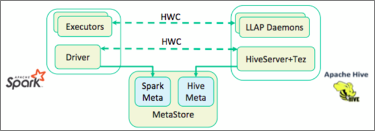
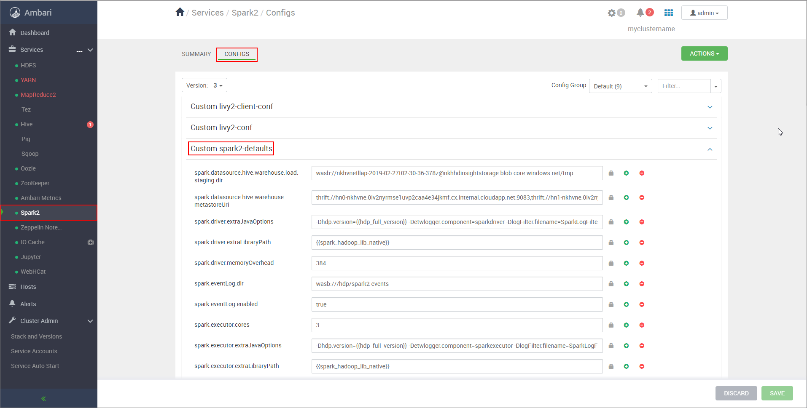

# Integrate Apache Spark and Apache Hive with the Hive Warehouse Connector

The Apache Hive Warehouse Connector (HWC) is a library that allows you to work more easily with Apache Spark and Apache Hive by supporting tasks such as moving data between Spark DataFrames and Hive tables, and also directing Spark streaming data into Hive tables. Hive Warehouse Connector works like a bridge between Spark and Hive. It supports Scala, Java, and Python for development.

The Hive Warehouse Connector allows you to take advantage of the unique features of Hive and Spark to build powerful big-data applications.

Apache Hive offers support for database transactions that are Atomic, Consistent, Isolated, and Durable (ACID). For more information on ACID and transactions in Hive, see [Hive Transactions](https://cwiki.apache.org/confluence/display/Hive/Hive+Transactions). Hive also offers detailed security controls through Apache Ranger and Low Latency Analytical Processing not available in Apache Spark.

Apache Spark, has a Structured Streaming API that gives streaming capabilities not available in Apache Hive. Beginning with HDInsight 4.0, Apache Spark 2.3.1 and Apache Hive 3.1.0 have separate metastores, which can make interoperability difficult. The Hive Warehouse Connector makes it easier to use Spark and Hive together. The HWC library loads data from LLAP daemons to Spark executors in parallel, making it  more efficient and scalable than using a standard JDBC connection from Spark to Hive.



Some of the operations supported by the Hive Warehouse Connector are:

* Describing a table
* Creating a table for ORC-formatted data
* Selecting Hive data and retrieving a DataFrame
* Writing a DataFrame to Hive in batch
* Executing a Hive update statement
* Reading table data from Hive, transforming it in Spark, and writing it to a new Hive table
* Writing a DataFrame or Spark stream to Hive using HiveStreaming

## Hive Warehouse Connector setup

Hive Warehouse Connector needs separate clusters for Spark and Interactive Query workloads. Please follow these steps to set up these clusters in Azure HDInsight:

### Create clusters

1. Create an HDInsight Spark **4.0** cluster with a storage account and a custom Azure virtual network. For information on creating a cluster in an Azure virtual network, see [Add HDInsight to an existing virtual network](../../hdinsight/hdinsight-plan-virtual-network-deployment.md#existingvnet).

1. Create an HDInsight Interactive Query (LLAP) **4.0** cluster with the same storage account and Azure virtual network as the Spark cluster.

### Configure HWC settings

* From Ambari web UI of Spark cluster, navigate to **Spark2** > **CONFIGS** > **Custom spark2-defaults**.



* Select **Add Property...** as needed to add/update the following.

| Configuration | Value |
|----|----|
|`spark.sql.hive.hiveserver2.jdbc.url`|`jdbc:hive2://LLAPCLUSTERNAME.azurehdinsight.net:443/;user=admin;password=PWD;ssl=true;transportMode=http;httpPath=/hive2`. Set it to the HiveServer2 JDBC connection string of the Interactive Query cluster. REPLACE `LLAPCLUSTERNAME` with the name of your Interactive Query cluster. |
|`spark.datasource.hive.warehouse.load.staging.dir`|`wasbs://STORAGE_CONTAINER_NAME@STORAGE_ACCOUNT_NAME.blob.core.windows.net/tmp`. Set to a suitable HDFS-compatible staging directory. If you have two different clusters, the staging directory should be a folder in the staging directory of the LLAP cluster's storage account so that HiveServer2 has access to it.  Replace `STORAGE_ACCOUNT_NAME` with the name of the storage account being used by the cluster, and `STORAGE_CONTAINER_NAME` with the name of the storage container. |
|`spark.datasource.hive.warehouse.metastoreUri`| The value of **hive.metastore.uris** Interactive Query cluster |
|`spark.security.credentials.hiveserver2.enabled`|`true` for YARN cluster mode and `false` for YARN client mode |
|`spark.hadoop.hive.zookeeper.quorum`| The value of **hive.zookeeper.quorum** of Interactive Query cluster |

* Save changes and restart components as needed.

### Configure HWC for Enterprise Security Package (ESP) clusters

The Enterprise Security Package (ESP) provides enterprise-grade capabilities like Active Directory-based authentication, multi-user support, and role-based access control for Apache Hadoop clusters in Azure HDInsight. For more information on ESP, see [Use Enterprise Security Package in HDInsight](../domain-joined/apache-domain-joined-architecture.md).

Apart from the configurations mentioned in the previous section, add the following configuration to use HWC on the ESP clusters.

* From Ambari web UI of Spark cluster, navigate to **Spark2** > **CONFIGS** > **Custom spark2-defaults**.

* Update the following property.

| Configuration | Value |
|----|----|
| `spark.sql.hive.hiveserver2.jdbc.url.principal`    | `hive/<headnode-FQDN>@<AAD-Domain>` |

* Replace `<headnode-FQDN>` with the Fully Qualified Domain Name of the head node of the Interactive Query cluster. Replace `<AAD-DOMAIN>` with the name of the Azure Active Directory (AAD) that the cluster is joined to. Use an uppercase string for the `<AAD-DOMAIN>` value, otherwise the credential won't be found. Check /etc/krb5.conf for the realm names if needed.

* Save changes and restart components as needed.

## Using the Hive Warehouse Connector

### Connecting and running queries

You can choose between a few different methods to connect to your Interactive Query cluster and execute queries using the Hive Warehouse Connector. Supported methods include the following tools:

* [Spark-shell / PySpark](../spark/apache-spark-shell.md)
* [Spark-submit](#Spark-submit)
* [Zeppelin](../spark/apache-spark-zeppelin-notebook.md)


Below are some examples to connect to HWC from Spark.

Firstly, SSH into the headnode of the Apache Spark cluster. For more information about connecting to your cluster with SSH, see [Connect to HDInsight (Apache Hadoop) using SSH](../../hdinsight/hdinsight-hadoop-linux-use-ssh-unix.md).

#### Spark-shell

* Execute the below command to initiate the spark-shell.

    ```bash
    spark-shell --master yarn \
    --jars /usr/hdp/current/hive_warehouse_connector/hive-warehouse-connector-assembly-<STACK_VERSION>.jar \
    --conf spark.security.credentials.hiveserver2.enabled=false
    ```

* After starting the spark-shell, a Hive Warehouse Connector instance can be started using the following commands:

    ```scala
    import com.hortonworks.hwc.HiveWarehouseSession
    val hive = HiveWarehouseSession.session(spark).build()
    ```

#### Spark-submit

* Once you build the scala/java code along with the dependencies into an assembly jar, use the below command to launch a Spark application.

    YARN Client mode
    
    ```scala
    spark-submit \
    --class myHwcApp \
    --master yarn \
    --deploy-mode client \
    --jars /usr/hdp/current/hive_warehouse_connector/hive-warehouse-connector-assembly-<STACK_VERSION>.jar \
    --conf spark.security.credentials.hiveserver2.enabled=false
    /<APP_JAR_PATH>/myHwcAppProject.jar
    ```

    YARN Cluster mode
    ```scala
    spark-submit \
    --class myHwcApp \
    --master yarn \
    --deploy-mode cluster \
    --jars /usr/hdp/current/hive_warehouse_connector/hive-warehouse-connector-assembly-<STACK_VERSION>.jar \
    --conf spark.security.credentials.hiveserver2.enabled=true
    /<APP_JAR_PATH>/myHwcAppProject.jar
    ```

* For Python, add the following configuration as well. 

    ```python
    --py-files /usr/hdp/current/hive_warehouse_connector/pyspark_hwc-<STACK_VERSION>.zip
    ```

To learn about the spark operations supported by HWC, please follow this [document](./apache-hive-warehouse-connector-supported-spark-operations.md).


#### Run queries on Enterprise Security Package (ESP) clusters

* Before initiating the spark-shell or spark-submit, execute the following command.

    ```bash
    kinit <username>
    ```
* Replace `<username>` with the name of an account on the domain with permissions to access the cluster.


### Securing data on Spark ESP clusters

1. Create a table `demo` with some sample data by entering the following commands:

    ```scala
    create table demo (name string);
    INSERT INTO demo VALUES ('HDinsight');
    INSERT INTO demo VALUES ('Microsoft');
    INSERT INTO demo VALUES ('InteractiveQuery');
    ```

1. View the table's contents with the following command. Before applying the policy, the `demo` table shows the full column.

    ```scala
    hive.executeQuery("SELECT * FROM demo").show()
    ```

    

1. Apply a column masking policy that only shows the last four characters of the column.  
    1. Go to the Ranger Admin UI at `https://LLAPCLUSTERNAME.azurehdinsight.net/ranger/`.
    1. Click on the Hive service for your cluster under **Hive**.
        
    1. Click on the **Masking** tab and then **Add New Policy**

        

    1. Provide a desired policy name. Select database: **Default**, Hive table: **demo**, Hive column: **name**, User: **rsadmin2**, Access Types: **select**, and **Partial mask: show last 4** from the **Select Masking Option** menu. Click **Add**.
                
1. View the table's contents again. After applying the ranger policy, we can see only the last four characters of the column.

    

## Next steps

* [Spark Operations Supported By Hive Warehouse Connector](./apache-hive-warehouse-connector-supported-spark-operations.md)
* [Use Interactive Query with HDInsight](https://docs.microsoft.com/azure/hdinsight/interactive-query/apache-interactive-query-get-started)
* [Use Apache Zeppelin with Hive Warehouse Connector on Azure HDInsight](./apache-hive-warehouse-connector-Zeppelin-Livy-Setup.md)
* [Examples of interacting with Hive Warehouse Connector using Zeppelin, Livy, spark-submit, and pyspark](https://community.hortonworks.com/articles/223626/integrating-apache-hive-with-apache-spark-hive-war.html)

If you didn't see your problem or are unable to solve your issue, visit one of the following channels for more support:

* Get answers from Azure experts through [Azure Community Support](https://azure.microsoft.com/support/community/).

* Connect with [@AzureSupport](https://twitter.com/azuresupport) - the official Microsoft Azure account for improving customer experience by connecting the Azure community to the right resources: answers, support, and experts.

* If you need more help, you can submit a support request from the [Azure portal](https://portal.azure.com/?#blade/Microsoft_Azure_Support/HelpAndSupportBlade/). Select **Support** from the menu bar or open the **Help + support** hub. For more detailed information, please review [How to create an Azure support request](https://docs.microsoft.com/azure/azure-portal/supportability/how-to-create-azure-support-request). Access to Subscription Management and billing support is included with your Microsoft Azure subscription, and Technical Support is provided through one of the [Azure Support Plans](https://azure.microsoft.com/support/plans/).