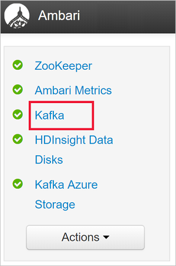
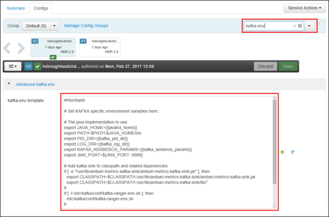
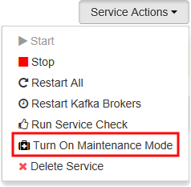

# Introducing Apache Kafka on HDInsight (preview)

Learn how to use a Kafka client hosted in Azure Container Service (AKS) to read and write data from a Kafka on HDInsight cluster.

[Apache Kafka](https://kafka.apache.org) is an open-source distributed streaming platform that can be used to build real-time streaming data pipelines and applications. Azure Container Service manages your hosted Kubernetes environment, and makes it quick and easy to deploy containerized applications.

## Architecture

### Network topology

Both HDInsight and AKS use an Azure Virtual Network as a container for compute resources. To enable communication between HDInsight and AKS, you must enable communication between their networks. The steps in this document use Virtual Network Peering to the networks. For more information on peering, see the [Virtual network peering](../../virtual-network/virtual-network-peering-overview.md) document.

The following diagram illustrates the network topology used in this document:
[tbd]

### Name resolution

Name resolution is not enabled between the peered networks, so IP addressing is used. By default, Kafka on HDInsight is configured to return host names instead of IP addresses when clients connect. The steps in this document modify Kafka to use IP advertising instead.

## Create an Azure Container Service (AKS)

If you do not already have an AKS cluster, use one of the following documents to learn how to create one:

* [Deploy an Azure Container Service (AKS) cluster - Portal](../../aks/kubernetes-walkthrough-portal.md)
* [Deploy an Azure Container Service (AKS) cluster - CLI](../../aks/kubernetes-walkthrough.md)

## Configure the virtual networks

1. From the [Azure portal](https://portal.azure.com), select __Resource groups__, and then find the resource group that contains the virtual network for your AKS cluster. The resource group name is `MC_<resourcegroup>_<akscluster>_<location>`, where `resourcegroup` and `akscluster` are the name of the resource group you created the cluster in and the name of the cluster. The `location` is the location that the cluster was created in.

2. In the resource group, select the __Virtual network__ resource.

3. Select __Address space__. Note the address space listed.

4. To create a virtual network for HDInsight, select __+ Create a resource__, __Networking__, and then __Virtual network__.

    > [!IMPORTANT]
    > When entering the values for the new virtual network, you must use an address space that does not overlap the one used by the AKS cluster network.

    Use the same __Location__ for the virtual network that you used for the AKS cluster.

    Wait until the virtual network has been created before going to the next step.

5. To configure the peering between the HDInsight network and the AKS cluster network, select the virtual network and then select __Peerings__. Select __+ Add__ and use the following values to populate the form:

    * __Name__: Enter a unique name for this peering configuration.
    * __Virtual network__: Use this field to select the virtual network for the **AKS cluster**.

    Leave all other fields at the default value, then select __OK__ to configure the peering.

6. To configure the peering between the AKS cluster network and the HDInsight network, select the __AKS cluster virtual network__, and then select __Peerings__. Select __+ Add__ and use the following values to populate the form:

    * __Name__: Enter a unique name for this peering configuration.
    * __Virtual network__: Use this field to select the virtual network for the __HDInsight cluster__.

    Leave all other fields at the default value, then select __OK__ to configure the peering.

## Install Kafka on HDInsight

[tbd - install notes that don't re-invent the wheel]

## Configure Kafka IP Advertising

[tbd - revisit as these to be sure the screenshots are accurate]

Use the following steps to configure Kafka to advertise IP addresses instead of domain names:

1. Using a web browser, go to https://CLUSTERNAME.azurehdinsight.net. Replace __CLUSTERNAME__ with the name of the Kafka on HDInsight cluster.

    When prompted, use the HTTPS user name and password for the cluster. The Ambari Web UI for the cluster is displayed.

2. To view information on Kafka, select __Kafka__ from the list on the left.

    

3. To view Kafka configuration, select __Configs__ from the top middle.

    

4. To find the __kafka-env__ configuration, enter `kafka-env` in the __Filter__ field on the upper right.

    

5. To configure Kafka to advertise IP addresses, add the following text to the bottom of the __kafka-env-template__ field:

    ```
    # Configure Kafka to advertise IP addresses instead of FQDN
    IP_ADDRESS=$(hostname -i)
    echo advertised.listeners=$IP_ADDRESS
    sed -i.bak -e '/advertised/{/advertised@/!d;}' /usr/hdp/current/kafka-broker/conf/server.properties
    echo "advertised.listeners=PLAINTEXT://$IP_ADDRESS:9092" >> /usr/hdp/current/kafka-broker/conf/server.properties
    ```

6. To configure the interface that Kafka listens on, enter `listeners` in the __Filter__ field on the upper right.

7. To configure Kafka to listen on all network interfaces, change the value in the __listeners__ field to `PLAINTEXT://0.0.0.0:9092`.

8. To save the configuration changes, use the __Save__ button. Enter a text message describing the changes. Select __OK__ once the changes have been saved.

    

9. To prevent errors when restarting Kafka, use the __Service Actions__ button and select __Turn On Maintenance Mode__. Select OK to complete this operation.

    

10. To restart Kafka, use the __Restart__ button and select __Restart All Affected__. Confirm the restart, and then use the __OK__ button after the operation has completed.

    

11. To disable maintenance mode, use the __Service Actions__ button and select __Turn Off Maintenance Mode__. Select **OK** to complete this operation.

## Create Kafka topics

## Next steps

Use the following links to learn how to use Apache Kafka on HDInsight:

* [Get started with Kafka on HDInsight](hdinsight-apache-kafka-get-started.md)

* [Use MirrorMaker to create a replica of Kafka on HDInsight](hdinsight-apache-kafka-mirroring.md)

* [Use Apache Storm with Kafka on HDInsight](hdinsight-apache-storm-with-kafka.md)

* [Use Apache Spark with Kafka on HDInsight](hdinsight-apache-spark-with-kafka.md)

* [Connect to Kafka through an Azure Virtual Network](hdinsight-apache-kafka-connect-vpn-gateway.md)