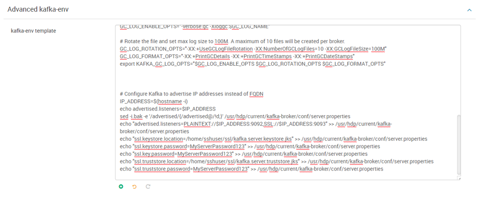
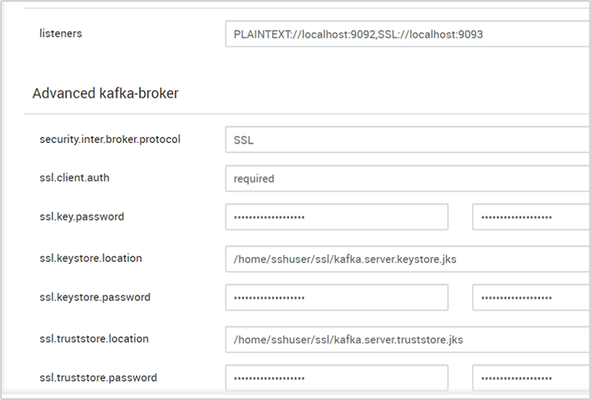

# Set up TLS encryption and authentication for Apache Kafka in Azure HDInsight

This article shows you how to set up Transport Layer Security (TLS) encryption, previously known as Secure Sockets Layer (SSL) encryption, between Apache Kafka clients and Apache Kafka brokers. It also shows you how to set up authentication of clients (sometimes referred to as two-way TLS).

> [!Important]
> There are two clients which you can use for Kafka applications: a Java client and a console client. Only the Java client `ProducerConsumer.java` can use TLS for both producing and consuming. The console producer client `console-producer.sh` does not work with TLS.

> [!Note] 
> HDInsight Kafka console producer with version 1.1 does not support SSL.
## Apache Kafka broker setup

The Kafka TLS broker setup will use four HDInsight cluster VMs in the following way:

* headnode 0 - Certificate Authority (CA)
* worker node 0, 1, and 2 - brokers

> [!Note] 
> This guide will use self-signed certificates, but the most secure solution is to use certificates issued by trusted CAs.

The summary of the broker setup process is as follows:

1. The following steps are repeated on each of the three worker nodes:

    1. Generate a certificate.
    1. Create a cert signing request.
    1. Send the cert signing request to the Certificate Authority (CA).
    1. Sign in to the CA and sign the request.
    1. SCP the signed certificate back to the worker node.
    1. SCP the public certificate of the CA to the worker node.

1. Once you have all of the certificates, put the certs into the cert store.
1. Go to Ambari and change the configurations.

Use the following detailed instructions to complete the broker setup:

> [!Important]
> In the following code snippets wnX is an abbreviation for one of the three worker nodes and should be substituted with `wn0`, `wn1` or `wn2` as appropriate. `WorkerNode0_Name` and `HeadNode0_Name` should be substituted with the names of the respective machines.

1. Perform initial setup on head node 0, which for HDInsight will fill the role of the Certificate Authority (CA).

    ```bash
    # Create a new directory 'ssl' and change into it
    mkdir ssl
    cd ssl
    ```

1. Perform the same initial setup on each of the brokers (worker nodes 0, 1 and 2).

    ```bash
    # Create a new directory 'ssl' and change into it
    mkdir ssl
    cd ssl
    ```

1. On each of the worker nodes, execute the following steps using the code snippet below.
    1. Create a keystore and populate it with a new private certificate.
    1. Create a certificate signing request.
    1. SCP the certificate signing request to the CA (headnode0)

    ```bash
    keytool -genkey -keystore kafka.server.keystore.jks -validity 365 -storepass "MyServerPassword123" -keypass "MyServerPassword123" -dname "CN=FQDN_WORKER_NODE" -storetype pkcs12
    keytool -keystore kafka.server.keystore.jks -certreq -file cert-file -storepass "MyServerPassword123" -keypass "MyServerPassword123"
    scp cert-file sshuser@HeadNode0_Name:~/ssl/wnX-cert-sign-request
    ```

1. On the CA machine run the following command to create ca-cert and ca-key files:

    ```bash
    openssl req -new -newkey rsa:4096 -days 365 -x509 -subj "/CN=Kafka-Security-CA" -keyout ca-key -out ca-cert -nodes
    ```

1. Change to the CA machine and sign all of the received cert signing requests:

    ```bash
    openssl x509 -req -CA ca-cert -CAkey ca-key -in wn0-cert-sign-request -out wn0-cert-signed -days 365 -CAcreateserial -passin pass:"MyServerPassword123"
    openssl x509 -req -CA ca-cert -CAkey ca-key -in wn1-cert-sign-request -out wn1-cert-signed -days 365 -CAcreateserial -passin pass:"MyServerPassword123"
    openssl x509 -req -CA ca-cert -CAkey ca-key -in wn2-cert-sign-request -out wn2-cert-signed -days 365 -CAcreateserial -passin pass:"MyServerPassword123"
    ```

1. Send the signed certificates back to the worker nodes from the CA (headnode0).

    ```bash
    scp wn0-cert-signed sshuser@WorkerNode0_Name:~/ssl/cert-signed
    scp wn1-cert-signed sshuser@WorkerNode1_Name:~/ssl/cert-signed
    scp wn2-cert-signed sshuser@WorkerNode2_Name:~/ssl/cert-signed
    ```

1. Send the public certificate of the CA to each worker node.

    ```bash
    scp ca-cert sshuser@WorkerNode0_Name:~/ssl/ca-cert
    scp ca-cert sshuser@WorkerNode1_Name:~/ssl/ca-cert
    scp ca-cert sshuser@WorkerNode2_Name:~/ssl/ca-cert
    ```

1. On each worker node, add the CAs public certificate to the truststore and keystore. Then add the worker node's own signed certificate to the keystore

    ```bash
    keytool -keystore kafka.server.truststore.jks -alias CARoot -import -file ca-cert -storepass "MyServerPassword123" -keypass "MyServerPassword123" -noprompt
    keytool -keystore kafka.server.keystore.jks -alias CARoot -import -file ca-cert -storepass "MyServerPassword123" -keypass "MyServerPassword123" -noprompt
    keytool -keystore kafka.server.keystore.jks -import -file cert-signed -storepass "MyServerPassword123" -keypass "MyServerPassword123" -noprompt

    ```

## Update Kafka configuration to use TLS and restart brokers

You have now set up each Kafka broker with a keystore and truststore, and imported the correct certificates. Next, modify related Kafka configuration properties using Ambari and then restart the Kafka brokers.

To complete the configuration modification, do the following steps:

1. Sign in to the Azure portal and select your Azure HDInsight Apache Kafka cluster.
1. Go to the Ambari UI by clicking **Ambari home** under **Cluster dashboards**.
1. Under **Kafka Broker** set the **listeners** property to `PLAINTEXT://localhost:9092,SSL://localhost:9093`
1. Under **Advanced kafka-broker** set the **security.inter.broker.protocol** property to `SSL`

    

1. Under **Custom kafka-broker** set the **ssl.client.auth** property to `required`. This step is only required if you are setting up authentication and encryption.

    

1. Add new configuration properties to the server.properties file.

    ```bash
    # Configure Kafka to advertise IP addresses instead of FQDN
    IP_ADDRESS=$(hostname -i)
    echo advertised.listeners=$IP_ADDRESS
    sed -i.bak -e '/advertised/{/advertised@/!d;}' /usr/hdp/current/kafka-broker/conf/server.properties
    echo "advertised.listeners=PLAINTEXT://$IP_ADDRESS:9092,SSL://$IP_ADDRESS:9093" >> /usr/hdp/current/kafka-broker/conf/server.properties
    echo "ssl.keystore.location=/home/sshuser/ssl/kafka.server.keystore.jks" >> /usr/hdp/current/kafka-broker/conf/server.properties
    echo "ssl.keystore.password=MyServerPassword123" >> /usr/hdp/current/kafka-broker/conf/server.properties
    echo "ssl.key.password=MyServerPassword123" >> /usr/hdp/current/kafka-broker/conf/server.properties
    echo "ssl.truststore.location=/home/sshuser/ssl/kafka.server.truststore.jks" >> /usr/hdp/current/kafka-broker/conf/server.properties
    echo "ssl.truststore.password=MyServerPassword123" >> /usr/hdp/current/kafka-broker/conf/server.properties
    ```

1. Go to Ambari configuration UI and verify that the new properties show up under **Advanced kafka-env** and the **kafka-env template** property.

    For HDI version 3.6:

    

    For HDI version 4.0:

        

1. Restart all Kafka brokers.
1. Start the admin client with producer and consumer options to verify that both producers and consumers are working on port 9093.

## Client setup (without authentication)

If you don't need authentication, the summary of the steps to set up only TLS encryption are:

1. Sign in to the CA (active head node).
1. Copy the CA cert to client machine from the CA machine (wn0).
1. Sign in to the client machine (hn1) and navigate to the `~/ssl` folder.
1. Import the CA cert to the truststore.
1. Import the CA cert to the keystore.

These steps are detailed in the following code snippets.

1. Sign in to the CA node.

    ```bash
    ssh sshuser@HeadNode0_Name
    cd ssl
    ```

1. Copy the ca-cert to the client machine

    ```bash
    scp ca-cert sshuser@HeadNode1_Name:~/ssl/ca-cert
    ```

1. Sign in to the client machine (standby head node).

    ```bash
    ssh sshuser@HeadNode1_Name
    cd ssl
    ```

1. Import the CA certificate to the truststore.

    ```bash
    keytool -keystore kafka.client.truststore.jks -alias CARoot -import -file ca-cert -storepass "MyClientPassword123" -keypass "MyClientPassword123" -noprompt
    ```

1. Import the CA cert to keystore.
    
    ```bash
    keytool -keystore kafka.client.keystore.jks -alias CARoot -import -file ca-cert -storepass "MyClientPassword123" -keypass "MyClientPassword123" -noprompt
    ```

1. Create the file `client-ssl-auth.properties`. It should have the following lines:

    ```config
    security.protocol=SSL
    ssl.truststore.location=/home/sshuser/ssl/kafka.client.truststore.jks
    ssl.truststore.password=MyClientPassword123
    ```

## Client setup (with authentication)

> [!Note]
> The following steps are required only if you are setting up both TLS encryption **and** authentication. If you are only setting up encryption, then see [Client setup without authentication](apache-kafka-ssl-encryption-authentication.md#client-setup-without-authentication).

The following four steps summarize the tasks needed to complete the client setup:

1. Sign in to the client machine (standby head node).
1. Create a java keystore and get a signed certificate for the broker. Then copy the certificate to the VM where the CA is running.
1. Switch to the CA machine (active head node) to sign the client certificate.
1. Go to the client machine (standby head node) and navigate to the `~/ssl` folder. Copy the signed cert to client machine.

The details of each step are given below.

1. Sign in to the client machine (standby head node).

    ```bash
    ssh sshuser@HeadNode1_Name
    ```

1. Remove any existing ssl directory.

    ```bash
    rm -R ~/ssl
    mkdir ssl
    cd ssl
    ```

1. Create a java keystore and create a certificate signing request. 

    ```bash
    keytool -genkey -keystore kafka.client.keystore.jks -validity 365 -storepass "MyClientPassword123" -keypass "MyClientPassword123" -dname "CN=HEADNODE1_FQDN" -storetype pkcs12
    
    keytool -keystore kafka.client.keystore.jks -certreq -file client-cert-sign-request -storepass "MyClientPassword123" -keypass "MyClientPassword123"
    ```

1. Copy the certificate signing request to the CA

    ```bash
    scp client-cert-sign-request sshuser@HeadNode0_Name:~/ssl/client-cert-sign-request
    ```

1. Switch to the CA machine (active head node) and sign the client certificate.

    ```bash
    ssh sshuser@HeadNode0_Name
    cd ssl
    openssl x509 -req -CA ca-cert -CAkey ca-key -in ~/ssl/client-cert-sign-request -out ~/ssl/client-cert-signed -days 365 -CAcreateserial -passin pass:MyClientPassword123
    ```

1. Copy signed client cert from the CA (active head node) to client machine.

    ```bash
    scp client-cert-signed sshuser@HeadNode1_Name:~/ssl/client-signed-cert
    ```

1. Copy the ca-cert to the client machine

    ```bash
    scp ca-cert sshuser@HeadNode1_Name:~/ssl/ca-cert
    ```

1. Create client store with signed cert, and import ca cert into the keystore and truststore:

    ```bash
    keytool -keystore kafka.client.keystore.jks -import -file client-cert-signed -storepass MyClientPassword123 -keypass MyClientPassword123 -noprompt
    
    keytool -keystore kafka.client.keystore.jks -alias CARoot -import -file ca-cert -storepass MyClientPassword123 -keypass MyClientPassword123 -noprompt
    
    keytool -keystore kafka.client.truststore.jks -alias CARoot -import -file ca-cert -storepass MyClientPassword123 -keypass MyClientPassword123 -noprompt
    ```

1. Create a file `client-ssl-auth.properties`. It should have the following lines:

    ```bash
    security.protocol=SSL
    ssl.truststore.location=/home/sshuser/ssl/kafka.client.truststore.jks
    ssl.truststore.password=MyClientPassword123
    ssl.keystore.location=/home/sshuser/ssl/kafka.client.keystore.jks
    ssl.keystore.password=MyClientPassword123
    ssl.key.password=MyClientPassword123
    ```

## Verification

> [!Note]
> If HDInsight 4.0 and Kafka 2.1 is installed, you can use the console producer/consumers to verify your setup. If not, run the Kafka producer on port 9092 and send messages to the topic, and then use the Kafka consumer on port 9093 which uses TLS.

### Kafka 2.1 or above

1. Create a topic if it doesn't exist already.

    ```bash
    /usr/hdp/current/kafka-broker/bin/kafka-topics.sh --zookeeper <ZOOKEEPER_NODE>:2181 --create --topic topic1 --partitions 2 --replication-factor 2
    ```

1.    Start console producer and provide the path to `client-ssl-auth.properties` as a configuration file for the producer.

    ```bash
    /usr/hdp/current/kafka-broker/bin/kafka-console-producer.sh --broker-list <FQDN_WORKER_NODE>:9093 --topic topic1 --producer.config ~/ssl/client-ssl-auth.properties
    ```

1.    Open another ssh connection to client machine and  start console consumer and provide the path to `client-ssl-auth.properties` as a configuration file for the consumer.

    ```bash
    /usr/hdp/current/kafka-broker/bin/kafka-console-consumer.sh --bootstrap-server <FQDN_WORKER_NODE>:9093 --topic topic1 --consumer.config ~/ssl/client-ssl-auth.properties --from-beginning
    ```

### Kafka 1.1

1. Create a topic if it doesn't exist already.

    ```bash
    /usr/hdp/current/kafka-broker/bin/kafka-topics.sh --zookeeper <ZOOKEEPER_NODE_0>:2181 --create --topic topic1 --partitions 2 --replication-factor 2
    ```

1.    Start console producer and provide the path to client-ssl-auth.properties as a configuration file for the producer.

    ```bash
    /usr/hdp/current/kafka-broker/bin/kafka-console-producer.sh --broker-list <FQDN_WORKER_NODE>:9092 --topic topic1 
    ```

3.    Open another ssh connection to client machine and  start console consumer and provide the path to `client-ssl-auth.properties` as a configuration file for the consumer.

    ```bash
    $ /usr/hdp/current/kafka-broker/bin/kafka-console-consumer.sh --bootstrap-server <FQDN_WORKER_NODE>:9093 --topic topic1 --consumer.config ~/ssl/client-ssl-auth.properties --from-beginning
    ```

## Next steps

* [What is Apache Kafka on HDInsight?](apache-kafka-introduction.md)
