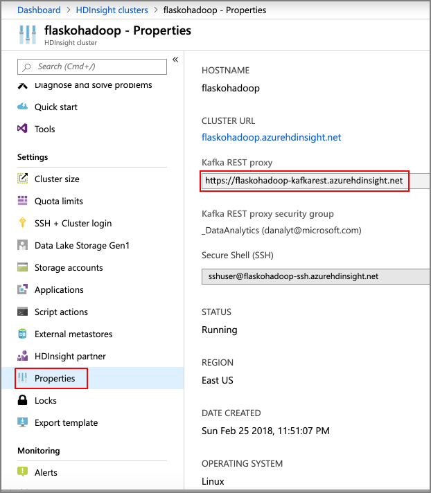

# Interact with Apache Kafka clusters in Azure HDInsight using a REST proxy

The Kafka REST Proxy enables you to interact with your Kafka cluster via a REST API over HTTP. This means that your Kafka clients can be outside of the virtual network. Additionally, clients can make simple HTTP calls to send and receive messages to the Kafka cluster, instead of relying on Kafka libraries.  

## Background

### Architecture

Without a REST proxy, Kafka clients need to be in the same VNet as the Kafka cluster or a peered VNet. The REST proxy enables you to connect data producers or consumers located anywhere. Deploying the REST proxy creates a new public endpoint for your cluster, which you can find in your portal settings.

For the full specification of operations supported by the API, please see [Apache Kafka REST Proxy API](https://docs.microsoft.com/rest/api/hdinsight-kafka-rest-proxy).

### Security

Access to the Kafka REST proxy is managed with Azure Active Directory security groups. See [Manage app and resource access using Azure Active Directory groups](https://docs.microsoft.com/azure/active-directory/fundamentals/active-directory-manage-groups), for more information.

When creating the Kafka cluster with the REST proxy enabled, you will provide the AAD security group that should have access to the REST endpoint. The Kafka clients (applications) that need access to the REST proxy should be registered to this group by the group owner. The group owner can do this via the Portal or via Powershell.

Before making requests to the REST proxy endpoint, the client application should get an OAuth token to verify membership of the right security group. For more information on how OAuth tokens work, see [Authorize access to Azure Active Directory web applications using the OAuth 2.0 code grant flow](../../active-directory/azuread-dev/v1-protocols-oauth-code.md). For an example of fetching an OAuth token in python, see [Client application sample](#client-application-sample)

Once the client application has the OAuth token, they must pass that token in the HTTP request made to the REST proxy.

## Prerequisites

1. Register an application with Azure AD. The client applications that you write to interact with the Kafka REST proxy will use this application's ID and secret to authenticate to Azure.
1. Create an Azure AD security group and add the application that you have registered with Azure AD to the security group. This security group will be used to control which applications are allowed to interact with the REST proxy. For more information on creating Azure AD groups, see [Create a basic group and add members using Azure Active Directory](../../active-directory/fundamentals/active-directory-groups-create-azure-portal.md).

## Create a Kafka cluster with REST proxy enabled

1. During the Kafka cluster creation workflow, in the “Security + networking” tab, check the “Enable Kafka REST proxy” option.

     

1. Click **Select Security Group**. From the list of security groups, select the security group that you want to have access to the REST proxy. You can use the search box to find the appropriate security group. Click the **Select** button at the bottom.

     

1. Complete the remaining steps to create your cluster as described in [Create Apache Kafka cluster in Azure HDInsight using Azure portal](https://docs.microsoft.com/azure/hdinsight/kafka/apache-kafka-get-started).

1. Once the cluster is created, go to the cluster properties to record the Kafka REST proxy URL.

     

## Client application sample

You can use the python code below to interact with the REST proxy on your Kafka cluster. This code does the following:

1. Fetches an OAuth token from Azure AD
1. Creates the topic specified
1. Sends messages to that topic
1. Consumes messages from that topic

For more information on getting OAuth tokens in python, see [Python AuthenticationContext class](https://docs.microsoft.com/python/api/adal/adal.authentication_context.authenticationcontext?view=azure-python). You might see a delay while topics that are not created or deleted through the Kafka REST proxy are reflected there. This delay is due to cache refresh.

```python
#Required python packages
#pip3 install adal
#pip install msrestazure

import adal
from msrestazure.azure_active_directory import AdalAuthentication
from msrestazure.azure_cloud import AZURE_PUBLIC_CLOUD
import requests

#--------------------------Configure these properties-------------------------------#
# Tenant ID for your Azure Subscription
tenant_id = 'ABCDEFGH-1234-1234-1234-ABCDEFGHIJKL'
# Your Client Application Id
client_id = 'XYZABCDE-1234-1234-1234-ABCDEFGHIJKL'
# Your Client Credentials
client_secret = 'password'
# kafka rest proxy -endpoint
kafkarest_endpoint = "https://<clustername>-kafkarest.azurehdinsight.net"
#--------------------------Configure these properties-------------------------------#

#getting token
login_endpoint = AZURE_PUBLIC_CLOUD.endpoints.active_directory
resource = "https://hib.azurehdinsight.net"
context = adal.AuthenticationContext(login_endpoint + '/' + tenant_id)

token = context.acquire_token_with_client_credentials(
    resource,
    client_id,
    client_secret)

accessToken = 'Bearer ' + token['accessToken']

print(accessToken)

# relative url
getstatus = "/v1/metadata/topics"
request_url = kafkarest_endpoint + getstatus

# sending get request and saving the response as response object
response = requests.get(request_url, headers={'Authorization': accessToken})
print(response.content)
```

To use the code sample, follow these steps:

1. Save the sample code on a machine with Python installed.
1. Install required python dependencies by executing `pip3 install adal` and `pip install msrestazure`.
1. Modify the code and update the following properties for your environment:
    1.	*Tenant ID* – The Azure tenant where your subscription is.
    1.	*Client ID* – The ID for the application that you registered in the security group.
    1.	*Client Secret* – The secret for the application that you registered in the security group
    1.	*Kafkarest_endpoint* – get this value from the “properties” tab in the cluster overview as described in the [deployment section](#create-a-kafka-cluster-with-rest-proxy-enabled). It should be in the following format – `https://<clustername>-kafkarest.azurehdinsight.net`
3. From the command line, execute the python file by executing `python <filename.py>`

## Next steps

* [Kafka REST proxy API reference documents](https://docs.microsoft.com/rest/api/hdinsight-kafka-rest-proxy/)
* [Tutorial: Use the Apache Kafka Producer and Consumer APIs](apache-kafka-producer-consumer-api.md)