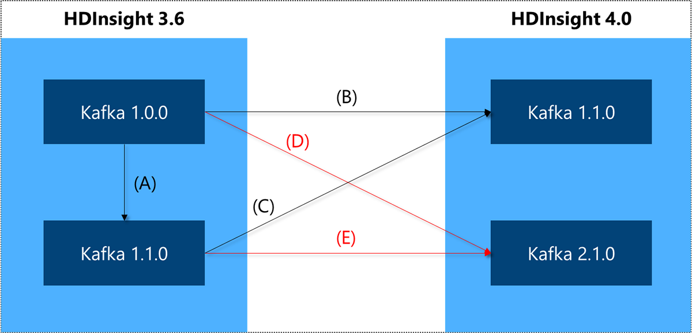
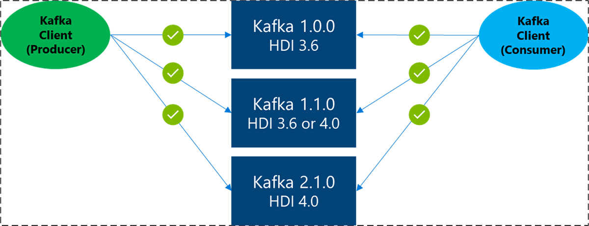
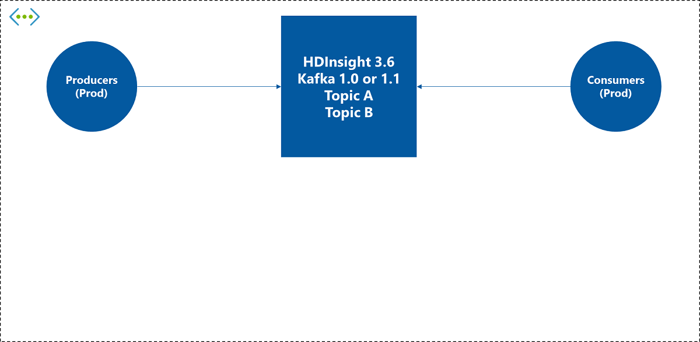
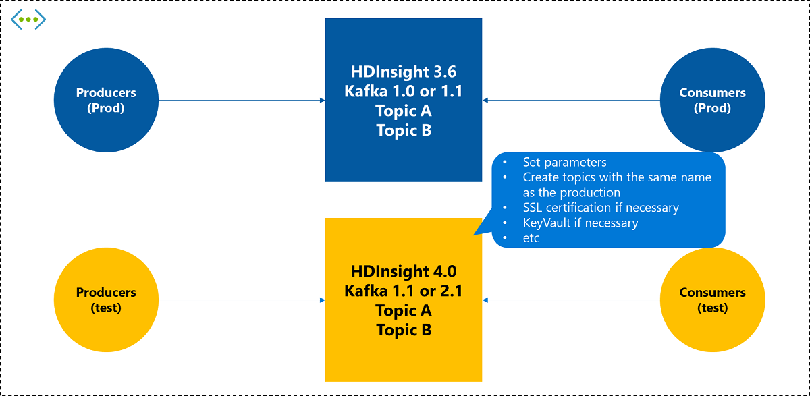
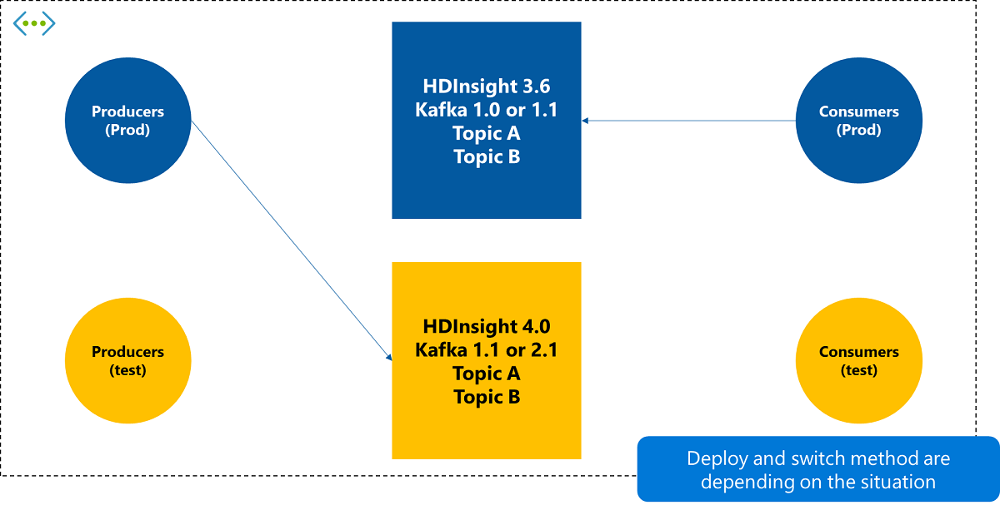
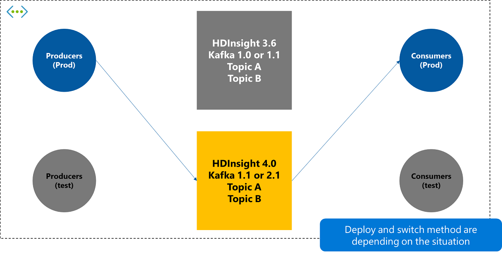

# Upgrade Apache Kafka workloads from Azure HDInsight 3.6 to 4.0

Azure HDInsight 4.0 offers the latest open-source components with significant enhancements in performance, connectivity, and security. This document explains how to migrate Apache Kafka workloads on HDInsight 3.6 to HDInsight 4.0. After migrating your workloads to HDInsight 4.0, you can use many of the new features that aren't available on HDInsight 3.6.

## HDInsight 3.6 Kafka upgrade paths

HDInsight 3.6 supports two versions of Kafka: 1.0.0 and 1.1.0. HDInsight 4.0 supports 1.1.0 and 2.1.0. Depending on which version of Kafka and which version of HDInsight you would like to run, there are multiple supported migration paths. These paths are explained below and illustrated in the following diagram.

* Run both Kafka and HDInsight on latest versions (recommended): Migrate an HDInsight 3.6 and Kafka 1.0.0 or 1.1.0 application to HDInsight 4.0 with Kafka 2.1.0 (paths D and E below). 
* Run HDInsight on latest version, but Kafka only on a more recent version: Migrate an HDInsight 3.6 and Kafka 1.0.0 application to HDInsight 4.0 with Kafka 1.1.0 (path B below).
* Run HDInsight on latest version, retain Kafka version: Migrate an HDInsight 3.6 and Kafka 1.1.0 application to HDInsight 4.0 with Kafka 1.1.0 (path C below).
* Run Kafka on a more recent version, retain HDInsight version: Migrate a Kafka 1.0.0 application to 1.1.0 and stay on HDInsight 3.6 (path A below). Note that this option will still require deploying a new cluster, as in-place upgrades are not supported. After you create a cluster with the version you want, migrate your Kafka clients to use the new cluster.

## Apache Kafka versions

### Kafka 1.1.0

**Apache Kafka 1.1.0 - Released March 28, 2018 (HDInsight 3.6, 4.0)**  
Kafka 1.1 comes with several new features, improvements, and bug fixes. Improvements to the Kafka controller will speed up controlled shutdown, so you can restart brokers and recover from issues faster. Improvements in the [FetchRequests logic](https://issues.apache.org/jira/browse/KAFKA-6254) enables you to have more partitions (and hence more topics) on the cluster. Kafka Connect now supports [record headers](https://issues.apache.org/jira/browse/KAFKA-5142) and [regular expressions](https://issues.apache.org/jira/browse/KAFKA-3073) for topics.

**Apache Kafka 1.1.0 Release notes**  
https://archive.apache.org/dist/kafka/1.1.0/RELEASE_NOTES.html

### Kafka 2.1.0

**Apache Kafka 2.1.0 - Released November 20, 2018 (HDInsight 4.0)**  
By switching to Kafka 2.1 from the previous version (1.1) on HDInsight, customers will get better broker resiliency due to an improved replication protocol; new functionality in the KafkaAdminClient api; configurable quota management; and support for Zstandard compression. For a complete list of updates, check out the release notes of [Kafka 2.0](https://archive.apache.org/dist/kafka/2.0.0/RELEASE_NOTES.html) and [Kafka 2.1](https://archive.apache.org/dist/kafka/2.1.0/RELEASE_NOTES.html).

**Apache Kafka 2.1.0 Release notes**  
https://archive.apache.org/dist/kafka/2.1.0/RELEASE_NOTES.html

## Kafka client compatibility

New Kafka brokers support older clients. [KIP-35 - Retrieving protocol version](https://cwiki.apache.org/confluence/display/KAFKA/KIP-35+-+Retrieving+protocol+version) introduced a mechanism for dynamically determining the functionality of a Kafka broker and [KIP-97: Improved Kafka Client RPC Compatibility Policy](https://cwiki.apache.org/confluence/display/KAFKA/KIP-97%3A+Improved+Kafka+Client+RPC+Compatibility+Policy) introduced a new compatibility policy and guarantees for the Java client. Previously, a Kafka client had to interact with a broker of the same version or a newer version. Now, newer versions of the Java clients and other clients that support KIP-35 such as librdkafka are able to fall back to older request types or throw appropriate errors if functionality isn't available.

Note that it does not mean that the client supports older brokers.  For more information, see [Compatibility Matrix](https://cwiki.apache.org/confluence/display/KAFKA/Compatibility+Matrix.)

## General upgrade flow

Presumed current environment:

* A single virtual network,
* HDInsight 3.6 Kafka broker has some topics and used by producers and consumers.

    

1. Deploy a new HDInsight 4.0 cluster and clients for test.

    Deploy a new HDInsight 4.0 Kafka cluster. If multiple Kafka cluster versions can be selected, it's recommended to select the latest version. After deployment, set some parameters as needed and create a topic with the same as your existing environment. Also, set SSL and BYOD encryption as needed. Then check if it works correctly with the new cluster.

    

1. Switch the cluster for the producer application, and wait until all the queue data is consumed by the current consumers.

    When the new HDInsight 4.0 Kafka cluster is ready, switch the existing Producer destination to the new cluster. Leave it as it is until the existing Consumer app has consumed all the data from the existing cluster.

    

1. Switch the cluster on the consumer application.

    After confirming that the existing consumer application has finished consuming all data from the existing cluster, switch the connection to the new cluster.

    

1. Remove the old cluster and test applications as needed.

   Once the switch is complete and working properly, remove the old HDInsight 3.6 Kafka cluster and the producers and consumers used in the test as needed.

    

## Next steps

For more information Kafka versions and compatibility, see the following documents:

* [Kafka 1.1.x documentation](https://kafka.apache.org/11/documentation.html)
* [Kafka 2.1.x documentation](https://kafka.apache.org/21/documentation.html)
* [Kafka compatibility matrix](https://cwiki.apache.org/confluence/display/KAFKA/Compatibility+Matrix)
* [Azure HDInsight release notes](../hdinsight-version-release.md)
