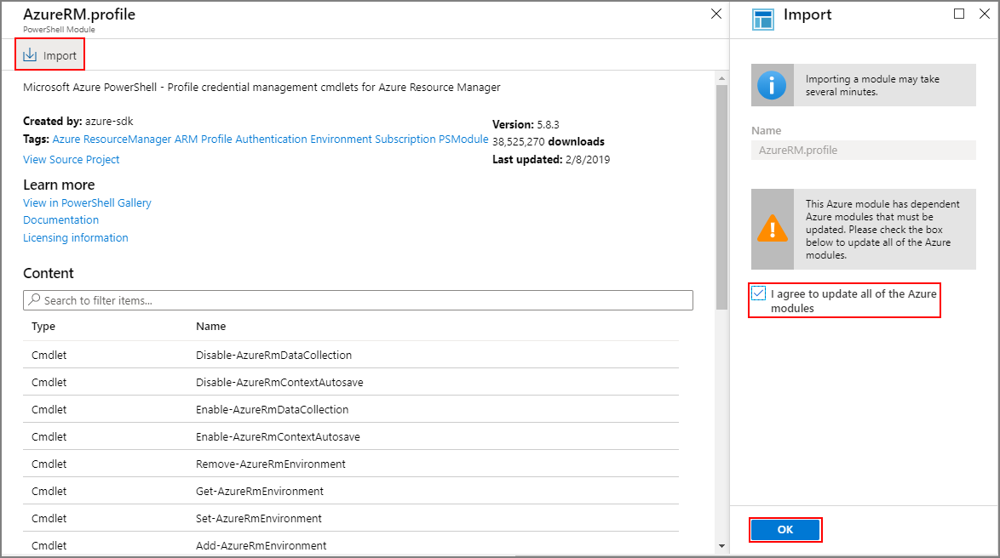
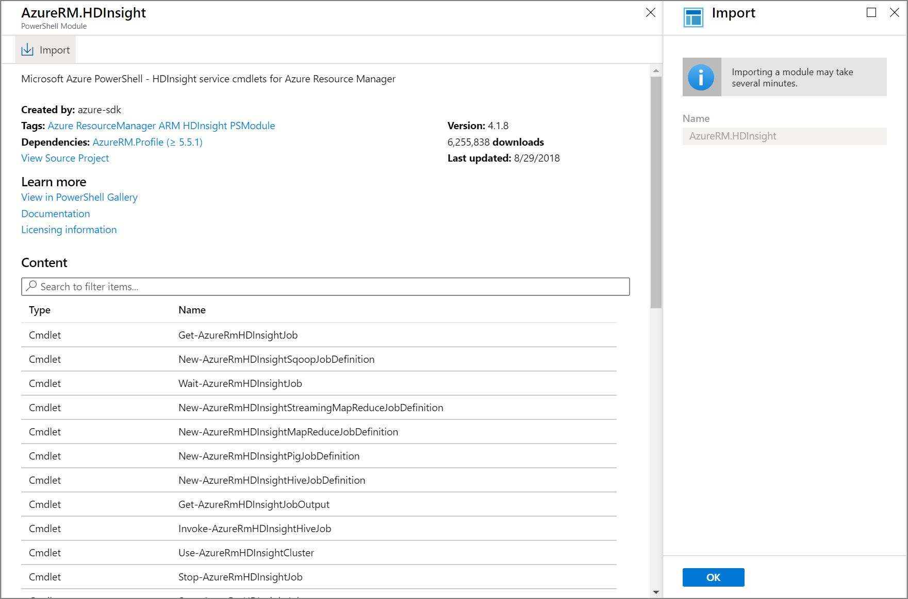
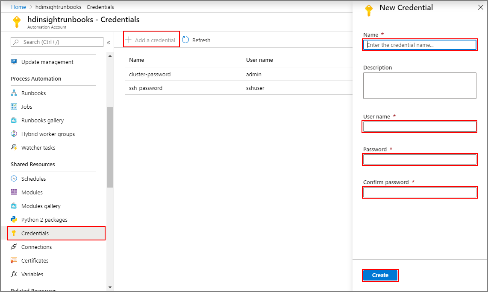
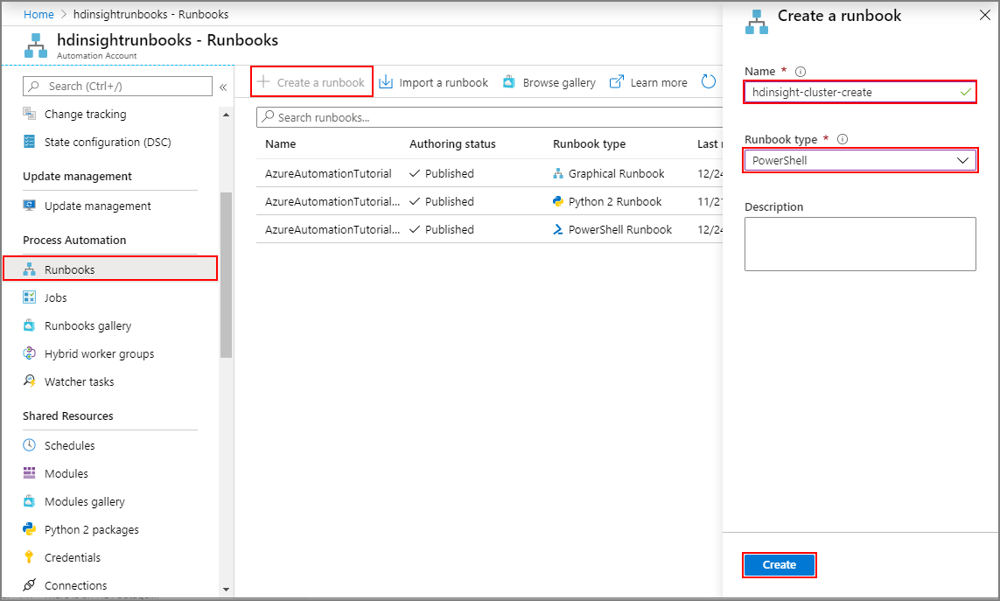
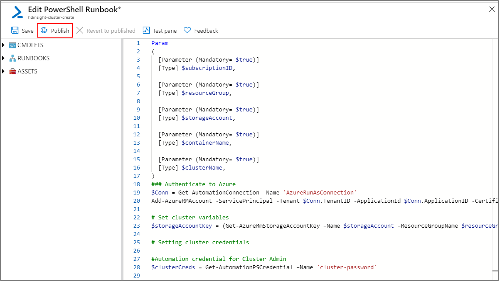

# Tutorial: Manage HDInsight clusters with Azure Automation

Azure Automation allows you to create scripts to automatically manage Azure resources. This article will describe how to create a PowerShell Runbook to create and delete HDInsight clusters.

In this tutorial, you learn how to:

> [!div class="checklist"]
> * Install modules necessary for interacting with HDInsight.
> * Create and store credentials needed during cluster creation.
> * Create a new Azure Automation runbook to create an HDInsight cluster.

If you don’t have an Azure subscription, create a [free account](https://azure.microsoft.com/free/?WT.mc_id=A261C142F) before you begin.

## Prerequisites

1. An existing Azure Automation account.
1. An existing Azure storage account which will be used as cluster storage.

## Install HDInsight modules

1. Click **Modules gallery** under **Shared Resources**.
1. Type **AzureRM.Profile** in the box and hit enter to search. Select the available search result.
1. On the **AzureRM.profile** screen click **Import**. Check the box to update Azure modules and then click **OK**.



1. Return to the modules gallery by clicking **Modules gallery** under **Shared Resources**.
1. Type **HDInsight**. Click **AzureRM.HDInsight**.


1. On the **AzureRM.HDInsight** panel, click **Import** and **OK**.



## Create credentials

1. Under **Shared Resources** click **Credentials**.
1. Click **Add a credential**.
1. Enter the required information on the **New Credential** panel. This credential is to store the cluster password which will enable you to login to Ambari.

| Property | Value |
| --- | --- |
| Name | `cluster-password` |
| User name | `admin` |
| Password | `SECURE_PASSWORD` |
| Confirm password | `SECURE_PASSWORD` |

1. Click **Create**
1. Repeat the same process for a new credential `ssh-password` with username `sshuser` and a password of your choice. Click **Create**. This credential is to store the SSH password for your cluster.



## Create a Runbook

1. Click **Runbooks** under **Process Automation**.
1. Click **Create a runbook**.
1. On the **Create a runbook** panel, enter a name for the runbook and select **Powershell** from the **Runbook type** dropdown.
1. Click **Create**.



Enter the following code on the **Edit PowerShell Runbook** screen and click **Publish**:



```powershell
Param
(
  [Parameter (Mandatory= $true)]
  [String] $subscriptionID,

  [Parameter (Mandatory= $true)]
  [String] $resourceGroup,

  [Parameter (Mandatory= $true)]
  [String] $storageAccount,

  [Parameter (Mandatory= $true)]
  [String] $containerName,

  [Parameter (Mandatory= $true)]
  [String] $clusterName
)
### Authenticate to Azure 
$Conn = Get-AutomationConnection -Name 'AzureRunAsConnection'
Add-AzureRMAccount -ServicePrincipal -Tenant $Conn.TenantID -ApplicationId $Conn.ApplicationID -CertificateThumbprint $Conn.CertificateThumbprint

# Set cluster variables
$storageAccountKey = (Get-AzureRmStorageAccountKey –Name $storageAccount –ResourceGroupName $resourceGroup)[0].value 

# Setting cluster credentials

#Automation credential for Cluster Admin
$clusterCreds = Get-AutomationPSCredential –Name 'cluster-password'

#Automation credential for user to SSH into cluster
$sshCreds = Get-AutomationPSCredential –Name 'ssh-password' 

$clusterType = "Hadoop" #Use any supported cluster type (Hadoop, HBase, Storm, etc.)
$clusterOS = "Linux"
$clusterWorkerNodes = 3
$clusterNodeSize = "Standard_D3_v2"
$location = Get-AzureRmStorageAccount –StorageAccountName $storageAccount –ResourceGroupName $resourceGroup | %{$_.Location}

### Provision HDInsight cluster
New-AzureRmHDInsightCluster –ClusterName $clusterName –ResourceGroupName $resourceGroup –Location $location –DefaultStorageAccountName "$storageAccount.blob.core.windows.net" –DefaultStorageAccountKey $storageAccountKey -DefaultStorageContainer $containerName –ClusterType $clusterType –OSType $clusterOS –Version “3.6” –HttpCredential $clusterCreds –SshCredential $sshCreds –ClusterSizeInNodes $clusterWorkerNodes –HeadNodeSize $clusterNodeSize –WorkerNodeSize $clusterNodeSize
```
## Clean up resources

When no longer needed, delete the cluster that was created to avoid unintended charges. To do so, select the resource group that you specified in the Runbook and click **Delete**.

## Next steps

> [!div class="nextstepaction"]
> [Manage Apache Hadoop clusters in HDInsight by using Azure PowerShell](hdinsight-administer-use-powershell.md)