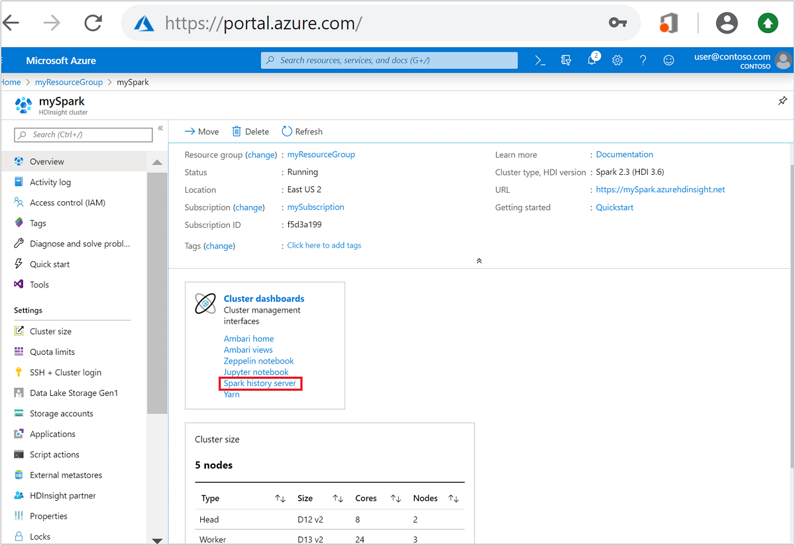
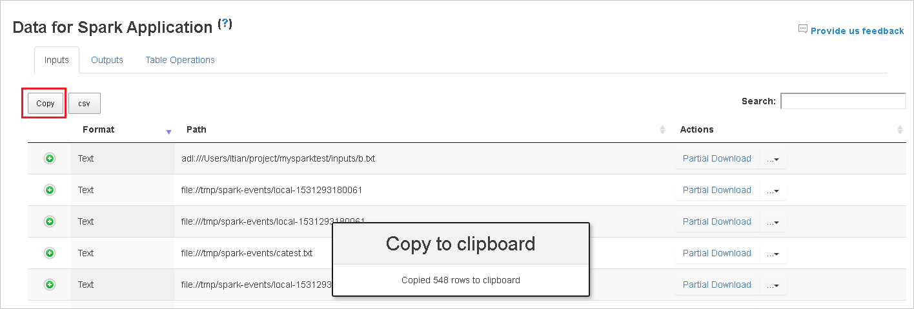
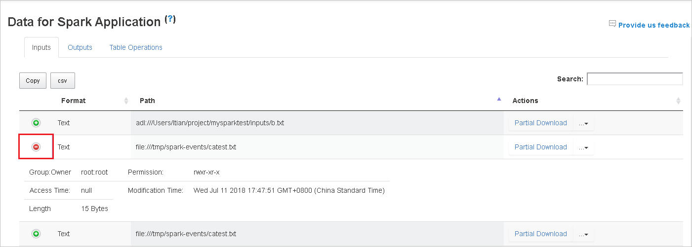
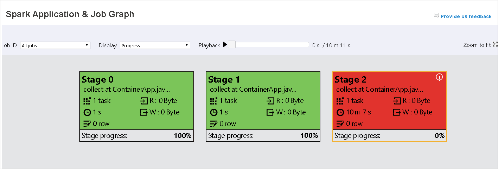
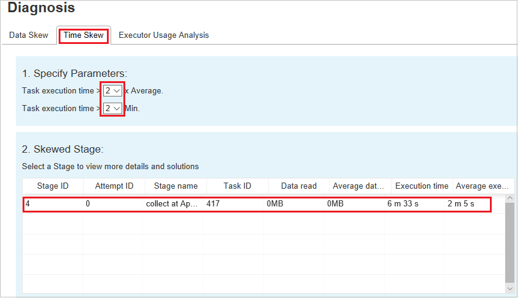
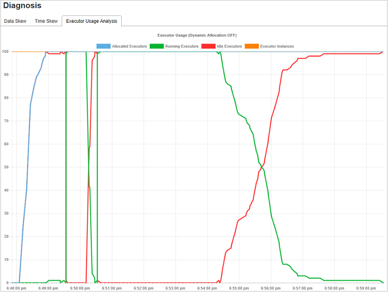
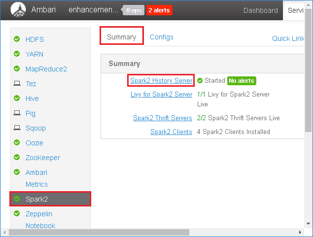
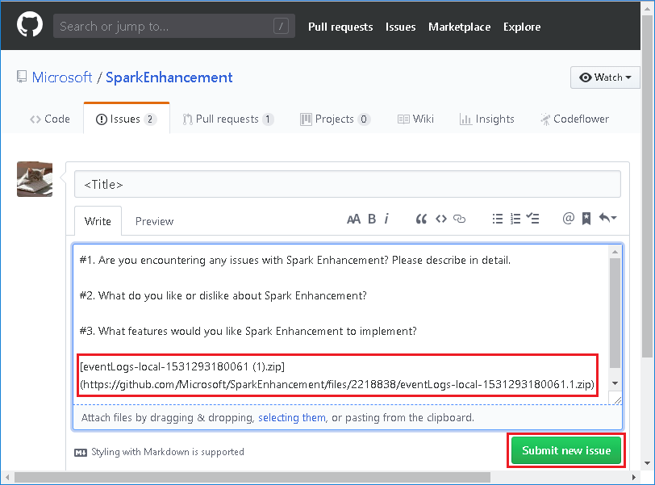
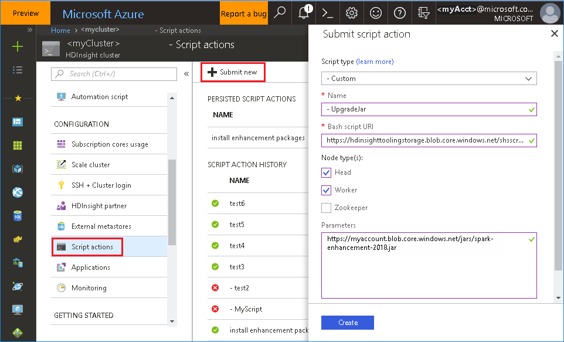

# Use the extended features of the Apache Spark History Server to debug and diagnose Spark applications

This article shows you how to use the extended features of the Apache Spark History Server to debug and diagnose completed or running Spark applications. The extension includes a **Data** tab, a **Graph** tab, and a **Diagnosis** tab. On the **Data** tab, you can check the input and output data of the Spark job. On the **Graph** tab, you can check the data flow and replay the job graph. On the **Diagnosis** tab, you can refer to the **Data Skew**, **Time Skew**, and **Executor Usage Analysis** features.

## Get access to the Spark History Server

The Spark History Server is the web UI for completed and running Spark applications. You can open it either from the Azure portal or from a URL.

### Open the Spark History Server web UI from the Azure portal

1. From the [Azure portal](https://portal.azure.com/), open the Spark cluster. For more information, see [List and show clusters](../hdinsight-administer-use-portal-linux.md#showClusters).
2. From **Cluster dashboards**, select  **Spark history server**. When prompted, enter the admin credentials for the Spark cluster.

    

### Open the Spark History Server web UI by URL

Open the Spark History Server by browsing to `https://CLUSTERNAME.azurehdinsight.net/sparkhistory`, where **CLUSTERNAME** is the name of your Spark cluster.

The Spark History Server web UI may look similar to this image:


## Use the Data tab in the Spark History Server

Select the job ID, and then select **Data** on the tool menu to see the data view.

+ Review **Inputs**, **Outputs**, and **Table Operations** by selecting the individual tabs.

    

+ Copy all rows by selecting the **Copy** button.

    

+ Save all the data as a .CSV file by selecting the **csv** button.

    

+ Search the data by entering keywords in the **Search** field. The search results will display immediately.

    

+ Select the column header to sort the table. Select the plus sign to expand a row to show more details. Select the minus sign to collapse a row.

    

+ Download a single file by selecting the **Partial Download** button on the right. The selected file will download locally. If the file doesn't exist anymore, this will open a new tab to show the error messages.

    

+ Copy a full path or a relative path by selecting either the **Copy Full Path** or **Copy Relative Path** option, which expand from the download menu. For Azure Data Lake Storage files, select **Open in Azure Storage Explorer** to launch Azure Storage Explorer and locate the folder after sign-in.

    

+ If there are too many rows to display on a single page, select the page numbers at the bottom of the table to navigate.

    

+ For more information, hover over or select the question mark next to **Data for Spark Application** to show the tooltip.

    

+  To send feedback on issues, select **Provide us feedback**.

    

## Use the Graph tab in the Spark History Server

+ Select the job ID, and then select **Graph** on the tool menu to see the job graph. By default, the graph will show all of the jobs. Filter the results by using the **Job ID** drop-down menu.

    

+ **Progress** is selected by default. Check the data flow by selecting **Read** or **Written** in the **Display** drop-down menu.

    

+ The background color of each task corresponds to a heat map.

   


    |Color |Description |
    |---|---|
    |Green|The job has completed successfully.|
    |Orange|The task failed, but this doesn't affect the final result of the job. These tasks have duplicate or retry instances that may succeed later.|
    |Blue|The task is running.|
    |White|The task is waiting to run, or the stage has skipped.|
    |Red|The task has failed.|

     

     The skipped stages display in white.
    

    

     > [!NOTE]  
     > Playback is available for completed jobs. Select the **Playback** button to play the job back. Stop the job at any time by selecting the stop button. When a job is played back, each task will display its status by color. Playback is not supported for incomplete jobs.

+ Scroll to zoom in or out on the job graph, or select **Zoom to fit** to make it fit to the screen.

    

+ When tasks fail, hover over the graph node to see the tooltip, and then select the stage to open it in a new page.

    

+ On the Spark Application & Job Graph page, the stages will display tooltips and small icons if the tasks meet these conditions:
  + Data skew: Data read size > average data read size of all tasks inside this stage * 2 *and* data read size > 10 MB.
  + Time skew: Execution time > average execution time of all tasks inside this stage * 2 *and* execution time > 2 mins.

    

+ The job graph node will display the following information about each stage:
  + ID
  + Name or description
  + Total task number
  + Data read: the sum of input size and shuffle read size
  + Data write: the sum of output size and shuffle write size
  + Execution time: the time between start time of the first attempt and completion time of the last attempt
  + Row count: the sum of input records, output records, shuffle read records, and shuffle write records
  + Progress

    > [!NOTE]  
    > By default, the job graph node will display information from last attempt of each stage (except for stage execution time). But during playback, the job graph node will show information about each attempt.

    > [!NOTE]  
    > For data read and data write sizes, we use 1MB = 1000 KB = 1000 * 1000 bytes.

+ Send feedback about issues by selecting **Provide us feedback**.

    

## Use the Diagnosis tab in the Spark History Server

Select the job ID, and then select **Diagnosis** on the tool menu to see the job diagnosis view. The **Diagnosis** tab includes **Data Skew**, **Time Skew**, and **Executor Usage Analysis**.

+ Review **Data Skew**, **Time Skew**, and **Executor Usage Analysis** by selecting the tabs respectively.

    

### Data Skew

Select the **Data Skew** tab. The corresponding skewed tasks display based on the specified parameters.

#### Specify Parameters

The **Specify Parameters** section displays the parameters, which are used to detect Data Skew. The default rule is: The task data read is greater than three times of the average task data read, and the task data read is more than 10 MB. If you want to define your own rule for skewed tasks, you can choose your parameters. The **Skewed Stage** and **Skew Chart** sections will update accordingly.

#### Skewed Stage

The **Skewed Stage** section displays stages that have skewed tasks meeting the specified criteria. If there's more than one skewed task in a stage, the **Skewed Stage** section displays only the most skewed task (that is, the largest data for data skew).


##### Skew Chart

When you select a row in the **Skew Stage** table, the **Skew Chart** displays more task distribution details based on data read and execution time. The skewed tasks are marked in red, and the normal tasks are marked in blue. For performance consideration, the chart displays up to 100 sample tasks. The task details are displayed in the lower-right panel.


### Time Skew

The **Time Skew** tab displays skewed tasks based on task execution time.

#### Specify Parameters

The **Specify Parameters** section displays the parameters, which are used to detect time skew. The default rule is: Task execution time is greater than three times of average execution time, and task execution time is greater than 30 seconds. You can change the parameters based on your needs. The **Skewed Stage** and **Skew Chart** display the corresponding stages and tasks information, just like in the **Data Skew** tab.

When you select **Time Skew**, the filtered result displays in the **Skewed Stage** section, according to the parameters set in the **Specify Parameters** section. When you select one item in the **Skewed Stage** section, the corresponding chart is drafted in the third section, and the task details display in the lower-right panel.



### Executor Usage Analysis graphs

The **Executor Usage Graph** displays the job's actual executor allocation and running status.  

When you select **Executor Usage Analysis**, four different curves about executor usage are drafted: **Allocated Executors**, **Running Executors**, **idle Executors**, and **Max Executor Instances**. Each **Executor added** or **Executor removed** event will increase or decrease the allocated executors. You can check **Event Timeline** in the **Jobs** tab for more comparisons.



Select the color icon to select or unselect the corresponding content in all drafts.

 

## FAQ

### How do I revert to the community version?

To revert to the community version, do the following steps.

1. Open the cluster in Ambari.
1. Navigate to **Spark2** > **Configs**.
1. Select **Custom spark2-defaults**.
1. Select **Add Property ...**.
1. Add **spark.ui.enhancement.enabled=false**, and then save it.
1. The property sets to **false** now.
1. Select **Save** to save the configuration.

    

1. Select **Spark2** in the left panel. Then, on the **Summary** tab, select **Spark2 History Server**.

    

1. To restart the Spark History Server, select the **Started** button to the right of **Spark2 History Server**, and then select **Restart** from the drop-down menu.

      

1. Refresh the Spark History Server web UI. It will revert to the community version.

### How do I upload a Spark History Server event to report it as an issue?

If you run into an error in Spark History Server, do the following steps to report the event.

1. Download the event by selecting **Download** in the Spark History Server web UI.

    

2. Select **Provide us feedback** from the **Spark Application & Job Graph** page.

    

3. Provide the title and a description of the error. Then, drag the .zip file to the edit field and select **Submit new issue**.

    

### How do I upgrade a .jar file in a hotfix scenario?

If you want to upgrade with a hotfix, use the following script, which will upgrade `spark-enhancement.jar*`.

**upgrade_spark_enhancement.sh**:

   ```bash
    #!/usr/bin/env bash

    # Copyright (C) Microsoft Corporation. All rights reserved.

    # Arguments:
    # $1 Enhancement jar path

    if [ "$#" -ne 1 ]; then
        >&2 echo "Please provide the upgrade jar path."
        exit 1
    fi

    install_jar() {
        tmp_jar_path="/tmp/spark-enhancement-hotfix-$( date +%s )"

        if wget -O "$tmp_jar_path" "$2"; then
            for FILE in "$1"/spark-enhancement*.jar
            do
                back_up_path="$FILE.original.$( date +%s )"
                echo "Back up $FILE to $back_up_path"
                mv "$FILE" "$back_up_path"
                echo "Copy the hotfix jar file from $tmp_jar_path   to $FILE"
                cp "$tmp_jar_path" "$FILE"

                "Hotfix done."
                break
            done
        else    
            >&2 echo "Download jar file failed."
            exit 1
        fi
    }

    jars_folder="/usr/hdp/current/spark2-client/jars"
    jar_path=$1

    if ls ${jars_folder}/spark-enhancement*.jar 1>/dev/null 2>&1;   then
        install_jar "$jars_folder" "$jar_path"
    else
        >&2 echo "There is no target jar on this node. Exit with no action."
        exit 0
    fi
   ```

#### Usage

`upgrade_spark_enhancement.sh https://${jar_path}`

#### Example

`upgrade_spark_enhancement.sh https://${account_name}.blob.core.windows.net/packages/jars/spark-enhancement-${version}.jar`

#### Use the bash file from the Azure portal

1. Launch the [Azure portal](https://ms.portal.azure.com), and then select your cluster.
2. Complete a [script action](../hdinsight-hadoop-customize-cluster-linux.md) with the following parameters.

    |Property |Value |
    |---|---|
    |Script type|- Custom|
    |Name|UpgradeJar|
    |Bash script URI|`https://hdinsighttoolingstorage.blob.core.windows.net/shsscriptactions/upgrade_spark_enhancement.sh`|
    |Node type(s)|Head, Worker|
    |Parameters|`https://${account_name}.blob.core.windows.net/packages/jars/spark-enhancement-${version}.jar`|

     

## Known issues

+ Currently, the Spark History Server only works for Spark 2.3 and 2.4.

+ Input and output data that use RDD won't display in the **Data** tab.

## Next steps

+ [Manage resources for an Apache Spark cluster on HDInsight](apache-spark-resource-manager.md)
+ [Configure Apache Spark settings](apache-spark-settings.md)

## Feedback

If you have any feedback or come across any issues when using this tool, send an email to ([hdivstool@microsoft.com](mailto:hdivstool@microsoft.com)).
