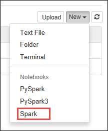

# Use HDInsight Spark cluster to read and write data to Azure SQL database

Learn how to connect an Apache Spark cluster in Azure HDInsight with an Azure SQL database and then read, write, and stream data into the SQL database. The instructions in this article use a Jupyter notebook to run the Scala code snippets. However, you can create a standalone application in Scala or Python and perform the same tasks. 

## Prerequisites

* Azure HDInsight Spark cluster.  Follow the instructions at [Create an Apache Spark cluster in HDInsight](apache-spark-jupyter-spark-sql.md).

* Azure SQL database. Follow the instructions at [Create an Azure SQL database](../../sql-database/sql-database-get-started-portal.md). Make sure you createa a database with the sample AdventureWorks schema and data. Also, make sure you create a server-level firewall rule to allow your client's IP address to access the SQL database on the server. The instructions to add the firewall rule is available in the same article.

* SQL Server Management Studio. Follow the instructions at [Use SSMS to connect and query data](../../sql-database/sql-database-connect-query-ssms.md).

## Create a Jupyter notebook

Start by creaing a Jupyter notebook associated with the Spark cluster. You use this notebook to run the code snippets used in this article. 

1. From the [Azure portal](https://portal.azure.com/), open your cluster. 

2. From the **Quick links** section, click **Cluster dashboards** to open the **Cluster dashboards** blade.  If you don't see **Quick Links**, click **Overview** from the left menu on the blade.

     

3. Click **Jupyter Notebook**. If prompted, enter the admin credentials for the cluster.

    
   
   > [!NOTE]
   > You can also access the Jupyter notebook on Spark cluster by opening the following URL in your browser. Replace **CLUSTERNAME** with the name of your cluster:
   >
   > `https://CLUSTERNAME.azurehdinsight.net/jupyter`
   > 
   > 

4. In the Jupyter notebook, from the top-right corner, click **New**, and then click **Spark** to create a Scala notebook. Jupyter notebooks on HDInsight Spark cluster also provide **PySpark** kernel for Python2 applications, and **PySpark3** kernel for Python3 applications. For this article, we create a Scala notebook.
   
    

    For more information about the kernels, see [Use Jupyter notebook kernels with Apache Spark clusters in HDInsight](apache-spark-jupyter-notebook-kernels.md).

5. This opens a new notebook with a default name, **Untitled**. Click the notebook name and enter a name of your choice.

    

You can now start creating your application.
	
## Read data from a SQL database

1. In a new Jupyter notebook, in a code cell, paste the following snippet and replace the placeholder values with the values for your Azure SQL database.

       // Declare the values for your Azure SQL database

       val jdbcUsername = "<SQL DB ADMIN USER>"
       val jdbcPassword = "<SQL DB ADMIN PWD>"
       val jdbcHostname = "<SQL SERVER NAME HOSTING SDL DB>" //typically, this is in the form or servername.database.windows.net
       val jdbcPort = <JDBC PORT>                            //typically, this value is 1433
       val jdbcDatabase ="<AZURE SQL DB NAME>"

    Press **SHIFT + ENTER** to run the code cell.  

2. Paste the following snippet in the next code cell and press **SHIFT + ENTER** to run it. This snippet builds a JDBC URL that you can pass to the Spark dataframe APIs creates an `Properties` object to hold the parameters.

       import java.util.Properties

       val jdbc_url = s"jdbc:sqlserver://${jdbcHostname}:${jdbcPort};database=${jdbcDatabase};encrypt=true;trustServerCertificate=false;hostNameInCertificate=*.database.windows.net;loginTimeout=60;"
       val connectionProperties = new Properties()
       connectionProperties.put("user", s"${jdbcUsername}")
       connectionProperties.put("password", s"${jdbcPassword}")         

3. Paste the following snippet to create a dataframe with the data from a table in your Azure SQL database. In this snippet, we use a **SalesLT.Address** table that is available as part of the **AdventureWorks** database.

       val sqlTableDF = spark.read.jdbc(jdbc_url, "SalesLT.Address", connectionProperties)

4. You can now perform operations on the dataframe, such as getting the data schema:

       sqlTableDF.printSchema
   
    You will see an output similar to the following:

    

5. You can also perform operations like, retrieve the top 10 rows.

       sqlTableDF.show(10)

6. Or, retrieve specific columns from the dataset.

       sqlTableDF.select("AddressLine1", "City").show(10)

## Next steps

* [Create a standalone Scala application to run on Apache Spark cluster](apache-spark-create-standalone-application.md)
* [Use HDInsight Tools in Azure Toolkit for IntelliJ to create Spark applications for HDInsight Spark Linux cluster](apache-spark-intellij-tool-plugin.md)
* [Use HDInsight Tools in Azure Toolkit for Eclipse to create Spark applications for HDInsight Spark Linux cluster](apache-spark-eclipse-tool-plugin.md)
