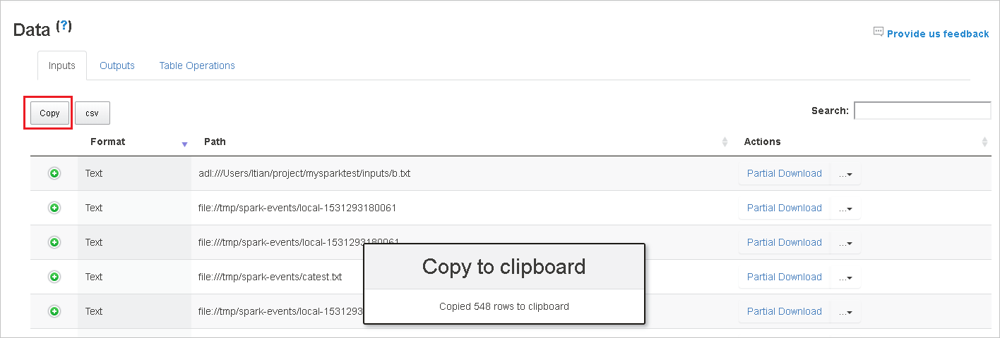
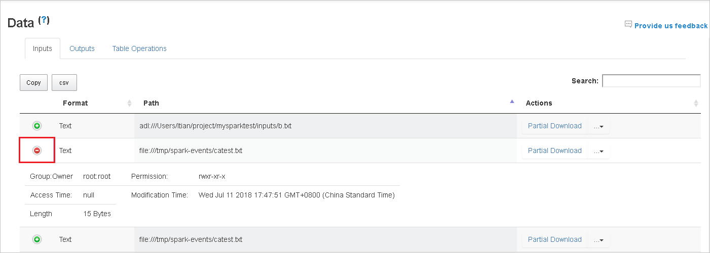
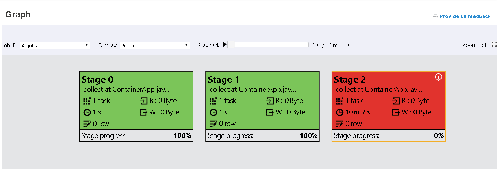

# Use Spark History Server to view Spark applications

This article provides guidance on how to use Spark History Server to view completed and running spark applications. Check the input/output data under Data tab, and check the data flow under Graph tab.

## Open the Spark History Server

Spark History Server is the web UI for completed and running Spark applications. It is an extension of Spark's Web UI.

### To open the Spark History Server Web UI from Azure portal

1. From the [Azure portal](https://portal.azure.com/), open the Spark cluster. For more information, see [List and show clusters](../hdinsight-administer-use-portal-linux.md#list-and-show-clusters).
2. From **Quick Links**, click **Cluster Dashboard**, and then click **Spark History Server**. When prompted, enter the admin credentials for the Spark cluster. 

    

### To open the Spark History Server Web UI by url
Open the Spark History Server by browsing to the following URL, replace <ClusterName> with Spark cluster name of customer.

   ```
   https://<ClusterName>.azurehdinsight.net/sparkhistory
   ```

The Spark History Server web UI looks like:


## Open the Data tab from Spark History Server
Select job ID then click **Data** on the tool menu to get the data view.

+ Check the **Inputs**, **Outputs**, and **Table Operations** by selecting the tabs separately.

    

+ Copy all rows by clicking button **Copy**.

    

+ Save all rows by clicking button **CSV**.

    

+ Search by entering keywords in field **Search**, the search result will display immediately.

    

+ Click the column header to sort table, click the plug sign to expand a row to show more details, or click the minus sign to collect a row.

    

+ Download single row by clicking button **Partition Download** that place at each row, and the selected row will download to local, otherwise, it will open a new tab to show the error messages.

    

+ Copy full path or relative path by selecting the **Copy Full Path**, **Copy Relative Path** that expands from download menu. For azure data lake storage files, **Open in Azure Storage Explorer** will launch Azure Storage Explorer, and locate to the folder when sign-in.

    

+ Click the number below the table to navigate pages when too many rows to display in one page. 

    

+ Hover on the question mark beside Data to show the tooltip, and click it to get more information.

    

+ Send feedback with issues by clicking **Provide us feedback**.

    


## Open the Graph tab from Spark History Server
Select job ID then click **Graph** on the tool menu to get the job graph view.

+ Take an overview of your job by the generated job graph. 

+ Filter by **Job ID** or check the job graph for all jobs that is default view.

    

+ Filter with data flow by selecting Read/Written in **Display** to check the data read, written, or progress that is default selection. The stage display in color that depends on the data flow.

    

+ Play back by clicking the **Playback** button and could stop anytime by clicking the stop button. The task display in color with different status when playback.
    + Successes task display in green.
    + Running task display in light blue.
    + Retried task display in orange.
    + Failed task display in red.
    + Waiting or skipped task display in white.

    
 
    
 
    > Note: Playback for each job is allowed. When a job does not have any stage or haven’t complete, playback is not supported.


+ Mouse scrolls to zoom in/out the job graph, or click **Zoom to fit** to make it fit to screen.
 
    

+ Hover on stage to see the tooltip when there are failed tasks, and click on stage to open stage page.

    

+ The job graph node will display the following information of each stage.
    + ID.
    + Name or description.
    + Total task number.
    + Data read, the sum of input size and shuffle read size.
    + Data write, the sum of output size and shuffle write size.
    + Execution time, the time between start time of the first attempt and completion time of the last attempt.
    + Row count, the sum of input records, output records, shuffle read records and shuffle write records.
    + Progress.

    >Note: By default the job graph node will display information from last attempt of each stage (except for stage execution time), but during playback stage node will show information of each attempt.

    >Note: For data size of read and write we use 1MB = 1000 KB = 1000 * 1000 Bytes.

+ Send feedback with issues by clicking **Provide us feedback**.

    


## Revert to community version

To revert to community version, follow the steps:

1. Open the cluster https://<clustername>.azurehdinsight.net/. Click **Spark2** in left panel.
2. Click **Configs** tab.
3. Expand the group **Custom spark2-defaults**.
4. Click **Add Property**, add **spark.ui.enhancement.enabled=false**, save.
5. The property sets to **false** now.
6. Click **Save** to save the configuration.

    

7. Restart server as required by clicking button **Restart**.

    

8. Refresh the Spark history server web UI, it will be reverted to community version.

## FAQ

### How to upload history server log

**upload_shs_log.sh** is used for upload history server log to the blob storage specified by us(who is working on investigating the history server issues).

   ```bash
    #!/usr/bin/env bash

    # Copyright (C) Microsoft Corporation. All rights reserved.

    # Arguments:
    # $1 Blob link with SAS token query string 
    # $2 Log path
    # $3 Max log file size in MB

    if [ "$#" -ne 3 ]; then
        >&2 echo "$@"
        >&2 echo "Please provide Azure Storage link, log path and max log size."
        exit 1
    fi

    blob_link=$1
    log_path=$2
    max_log_size=$3

    if ! [ -e "$log_path" ]; then
        >&2 echo "There is no log path $log_path on this node"
        exit 0 
    fi

    tail -c $((1024*1024*max_log_size)) \
        "$log_path" > /tmp/shs_log_for_trouble_shooting.log

    curl -T /tmp/shs_log_for_trouble_shooting.log \
        -X PUT \
        -H "x-ms-date: $(date -u)" \
        -H "x-ms-blob-type: BlockBlob" \
        "$blob_link"
   ```

**Usage**: 

`upload_shs_log.sh ${blob_link} ${log_path} ${log_max_MB_size}`

**Example**:

`upload_shs_log.sh https://${account_name}.blob.core.windows.net/${blob_container }/${log_file}?{SAS_query_string} /var/log/spark2/spark-spark-org.apache.spark.deploy.history.HistoryServer-1-{head_node_alias}-spark2.out 100`

For **head_node_alias**, it may be **hn0** or **hn1** for a cluster with two head nodes. Fill in the active head node alias.

For **SAS_query_string**, you can get it from ASE: 
1.	Right-click the container you want to use and choose **Get Shared Access Signature…**:
 
    

2.	Choose permissions with **Write** and adjust the **Start time** and **Expiry time**:

    

3.	Click **Copy** to copy the query string:

    


### How to upgrade jar file for hotfix scenario

**upgrade_spark_enhancement.sh** is used for upgrade our **spark-enhancement*.jar** for hotfix scenario.

   ```bash
    #!/usr/bin/env bash

    # Copyright (C) Microsoft Corporation. All rights reserved.

    # Arguments:
    # $1 Enhancement jar path

    if [ "$#" -ne 1 ]; then
        >&2 echo "Please provide the upgrade jar path."
        exit 1
    fi

    jar_path=$1
    jars_folder="/usr/hdp/current/spark2-client/jars"

    rm -f ${jars_folder}/spark-enhancement*
    wget -P ${jars_folder} "$jar_path" 
   ```

**Usage**: 

`upgrade_spark_enhancement.sh https://${jar_path}`

**Example**:

`upgrade_spark_enhancement.sh https://${account_name}.blob.core.windows.net/packages/jars/spark-2.3.0-bin-custom-spark-${version}.tgz` 
