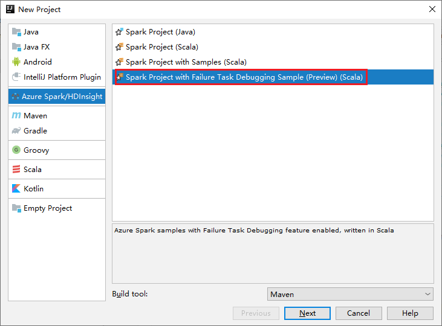
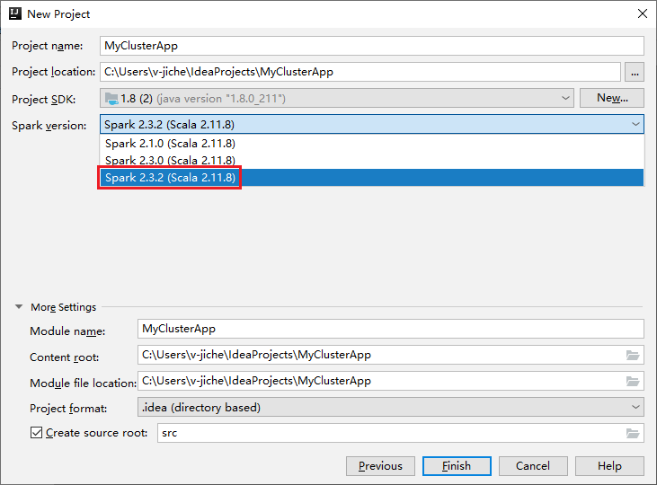
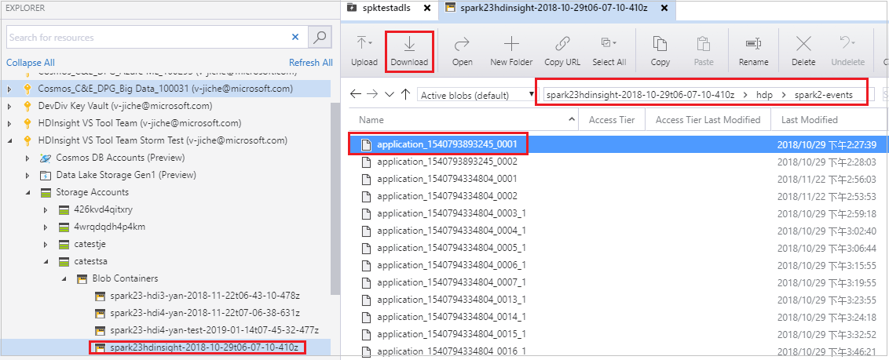

# Run Spark Failure Debug Apache Spark applications locally with Azure Toolkit for IntelliJ

This article provides step-by-step guidance on how to use HDInsight Tools in [Azure Toolkit for IntelliJ](https://docs.microsoft.com/java/azure/intellij/azure-toolkit-for-intellij?view=azure-java-stable) to run **Spark Failure Debug** applications. 

**Prerequisites**
* **[Oracle Java Development kit](https://www.oracle.com/technetwork/java/javase/downloads/jdk8-downloads-2133151.html)**. This tutorial uses Java version 8.0.202.
  
* **IntelliJ IDEA**. This article uses [IntelliJ IDEA Community ver. 2019.1.3](https://www.jetbrains.com/idea/download/#section=windows).
  
* **Azure Toolkit for IntelliJ**. See [Installing the Azure Toolkit for IntelliJ](https://docs.microsoft.com/en-us/java/azure/intellij/azure-toolkit-for-intellij-installation?view=azure-java-stable).

* **Connect to your HDInsight cluster**. See [Connect to your HDInsight cluster](apache-spark-intellij-tool-plugin.md).

* **Microsoft Azure Storage Explorer**. See [Download Microsoft Azure Storage Explorer](https://azure.microsoft.com/en-us/features/storage-explorer/).

## Scenario 1: Create a Spark Scala application 

1. Start IntelliJ IDEA, and then create a project. In the **New Project** dialog box, do the following:

   a. Select **Azure Spark/HDInsight**. 

   b. Select **Spark Project with Failure Task Debugging Sample(Preview)(Scala)**.

     

   c. Select **Next**.     
 
2. In the next **New Project** window, do the following:

   

   a. Enter a project name and project location.

   b. In the **Project SDK** drop-down list, select **Java 1.8** for **Spark 2.3.2** cluster.

   c. In the **Spark Version** drop-down list, select **Spark 2.3.2(Scala 2.11.8)**.

   d. Select **Finish**.

3. Select **src** > **main** > **scala** to open your code in the project. This example uses the **AgeMean_Div()** script.

## Scenario 2: Perform remote run

1. Click **Add Configuration** to open **Run/Debug Configurations** window.

    

2. In the **Run/Debug Configurations** dialog box, select the plus sign (**+**). Then select the **Apache Spark on HDInsight** option.

   
3. Switch to **Remotely Run in Cluster** tab. Enter information for **Name**, **Spark cluster**, and **Main class name**. Our tools support debug with **Executors**. The **numExectors**, the default value is 5, and you'd better not set higher than 3. To reduce the run time, you can add **spark.yarn.maxAppAttempts** into **job Configurations** and set the value to 1. Click **OK** button to save the configuration.

   

4. The configuration is now saved with the name you provided. To view the configuration details, select the configuration name. To make changes, select **Edit Configurations**. 

5. After you complete the configurations settings, you can run the project against the remote cluster.
   
   

6. You can check the application ID from the output window.
   
      

## Scenario 3: Download spark failure file

**Microsoft Azure Storage Explorer** can help you quickly find the  spark failure file and download it.

1.  Start **Microsoft Azure Storage Explorer**, then sign in with Microsoft account.

2. Find the subscription which the cluster belongs to. The cluster is what you submitted to before. Find the spark failure file from hdp/spark2-events/.spark-failures/application Id, then click **Download**. The **activities** window will show the download progress.

   

      

## Scenario 4: local run Spark Failure Debug configuration

1. In the **Run/Debug Configurations** dialog box, select the plus sign (**+**). Then select the **Spark Failure Debug** option.

   

2. Click the icon, select the spark failure file, then click **OK** button to save the configuration.

   

      

3. The configuration is now saved with the name you provided. To view the configuration details, select the configuration name. To make changes, select **Edit Configurations**. 

4. After you complete the configurations settings, click the icon to local run the **Spark Failure Debug** configuraion.
   
   

5. The result will show in the output window.
   
   

6. Set breakpoint as the log indicates, then click local debug button to perform debugging.

## Next steps
* [Overview: Debug Apache Spark applications](apache-spark-intellij-tool-debug-remotely-through-ssh.md)

### Demo
* Create Scala project (video): [Create Apache Spark Scala Applications](https://channel9.msdn.com/Series/AzureDataLake/Create-Spark-Applications-with-the-Azure-Toolkit-for-IntelliJ)
* Remote debug (video): [Use Azure Toolkit for IntelliJ to debug Apache Spark applications remotely on an HDInsight cluster](https://channel9.msdn.com/Series/AzureDataLake/Debug-HDInsight-Spark-Applications-with-Azure-Toolkit-for-IntelliJ)

### Scenarios
* [Apache Spark with BI: Perform interactive data analysis by using Spark in HDInsight with BI tools](apache-spark-use-bi-tools.md)
* [Apache Spark with Machine Learning: Use Spark in HDInsight to analyze building temperature using HVAC data](apache-spark-ipython-notebook-machine-learning.md)
* [Apache Spark with Machine Learning: Use Spark in HDInsight to predict food inspection results](apache-spark-machine-learning-mllib-ipython.md)
* [Website log analysis using Apache Spark in HDInsight](../hdinsight-apache-spark-custom-library-website-log-analysis.md)

### Create and run applications
* [Create a standalone application using Scala](../hdinsight-apache-spark-create-standalone-application.md)
* [Run jobs remotely on an Apache Spark cluster using Apache Livy](apache-spark-livy-rest-interface.md)

### Tools and extensions
* [Use Azure Toolkit for IntelliJ to create Apache Spark applications for an HDInsight cluster](apache-spark-intellij-tool-plugin.md)
* [Use Azure Toolkit for IntelliJ to debug Apache Spark applications remotely through VPN](apache-spark-intellij-tool-plugin-debug-jobs-remotely.md)
* [Use HDInsight Tools for IntelliJ with Hortonworks Sandbox](../hadoop/hdinsight-tools-for-intellij-with-hortonworks-sandbox.md)
* [Use HDInsight Tools in Azure Toolkit for Eclipse to create Apache Spark applications](../hdinsight-apache-spark-eclipse-tool-plugin.md)
* [Use Apache Zeppelin notebooks with an Apache Spark cluster on HDInsight](apache-spark-zeppelin-notebook.md)
* [Kernels available for Jupyter notebook in the Apache Spark cluster for HDInsight](apache-spark-jupyter-notebook-kernels.md)
* [Use external packages with Jupyter notebooks](apache-spark-jupyter-notebook-use-external-packages.md)
* [Install Jupyter on your computer and connect to an HDInsight Spark cluster](apache-spark-jupyter-notebook-install-locally.md)

### Manage resources
* [Manage resources for the Apache Spark cluster in Azure HDInsight](apache-spark-resource-manager.md)
* [Track and debug jobs running on an Apache Spark cluster in HDInsight](apache-spark-job-debugging.md)
