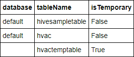
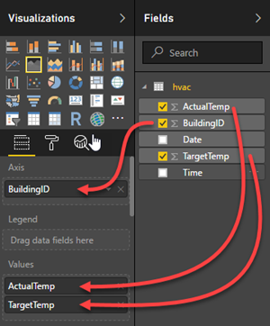
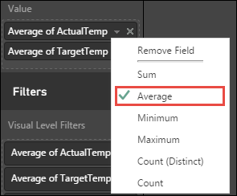
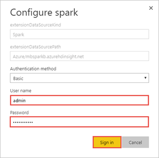
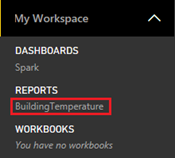
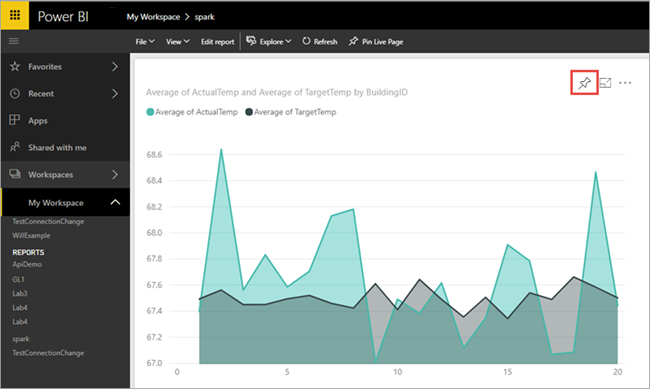
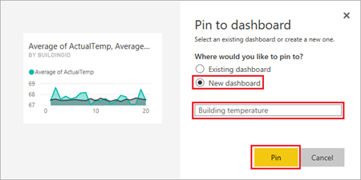

# Apache Spark BI using data visualization tools with Azure HDInsight

Learn how to use Power BI and Tableau to visualize data in an Apache Spark cluster on Azure HDInsight.

## Prerequisites

* An Apache Spark cluster on HDInsight. For instructions, see [Create Apache Spark clusters in Azure HDInsight](apache-spark-jupyter-spark-sql.md).
* Sample data in the cluster. For instructions, see [Run interactive queries on an HDInsight Spark cluster](apache-spark-load-data-run-query.md).
* Power BI: [Power BI Desktop](https://powerbi.microsoft.com/en-us/desktop/) and [Power BI trial subscription](https://app.powerbi.com/signupredirect?pbi_source=web) (optional).
* Tableau: [Tableau Desktop](http://www.tableau.com/products/desktop) and [Microsoft Spark ODBC driver](http://go.microsoft.com/fwlink/?LinkId=616229).

## Review sample data

The Jupyter notebook that you created in the [previous tutorial](apache-spark-load-data-run-query.md) includes code to create an `hvac` table. This table is based on the CSV file available on all HDInsight Spark clusters at **\HdiSamples\HdiSamples\SensorSampleData\hvac\hvac.csv**. Let's review the data in the Spark cluster before creating visualizations.

1. Verify that the expected tables exist. In an empty cell in the notebook, copy the following snippet and press **SHIFT + ENTER**.

        %%sql
        SHOW TABLES

    You see an output like the one shown below:

    

    If you closed the notebook before starting this tutorial, `hvactemptable` is cleaned up, so it's not included in the output.
    Only hive tables that are stored in the metastore (indicated by **False** under the **isTemporary** column) can be accessed from the BI tools. In this tutorial, we connect to the **hvac** table we created.

2. Verify that the table contains the expected data. In an empty cell in the notebook, copy the following snippet and press **SHIFT + ENTER**.

        %%sql
        SELECT * FROM hvac LIMIT 10

    You see an output like the one shown below:

    

3. Shut down the notebook to release the resources. To do so, from the **File** menu on the notebook, click **Close and Halt**.

## Use Power BI for Spark data visualization

Now that you've verified that the expected data exists, you can use Power BI to create visualizations, reports, and dashboards from this data. In this article, we'll show a simple example with static data, but please let us know in the comments if you'd like to see more complex streaming examples.

### Create a report in Power BI Desktop
The first steps in working with Spark are to connect to the cluster in Power BI Desktop, load data from the cluster, and create a basic visualization based on that data.

> [!NOTE]
> The connector demonstrated in this article is currently in preview, but we encourage you to use it and provide any feedback you have through the [Power BI Community](https://community.powerbi.com/) site or [Power BI Ideas](https://ideas.powerbi.com/forums/265200-power-bi-ideas).

1. In Power BI Desktop, on the **Home** tab, click **Get Data**, then **More**.

2. Search for `Spark`, select **Azure HDInsight Spark**, then click **Connect**.

    

3. Enter your cluster URL (in the form (`mysparkcluster.azurehdinsight.net`), and select **DirectQuery**. Click **OK**.

    

    > [!NOTE]
    > You can use either connectivity mode with Spark. If you use DirectQuery, changes are reflected in reports without refreshing the entire dataset. If you import data, you must refresh the data set to see changes. For more information on how and when to use DirectQuery, see [Using DirectQuery in Power BI](https://powerbi.microsoft.com/documentation/powerbi-desktop-directquery-about/). 

4. Enter a user name and password, then click **Connect**.

    

5. Select the `hvac` table, and wait to see a preview of the data. Then click **Load**.

    

    Power BI Desktop now has all the information it needs to connect to the Spark cluster and load data from the `hvac` table. The table and its columns are displayed in the **FIELDS** pane.

    

7. Build a visualization to show the variance between target temperature and actual temperature for each building: 

    1. In the **VISUALIZATIONS** pane, select **Area Chart**. Drag the **BuildingID** field to **Axis**, and drag the **ActualTemp** and **TargetTemp** fields to **Value**.

        

    2. By default the visualization shows the sum for **ActualTemp** and **TargetTemp**. For both the fields, from the drop-down, select **Average** to get an average of actual and target temperatures for both buildings.

        

    3. Your data visualization should be similar to the one in the screenshot. Move your cursor over the visualization to get tool tips with relevant data.

        

11. Click **File** then **Save**, and enter the name `spark.pbix` for the file. 

### Publish the report to the Power BI Service (optional)
You now have a fully functional report in Power BI Desktop, and you can stop there, but many people want to take advantage of the Power BI service, which makes it easy to share reports and dashboards across your organization. 

In this section, you publish the dataset and report that is contained in the Power BI Desktop file you created. You then pin the visualization from the report to a dashboard. Dashboards are typically used to focus on a subset of data in a report; you only have one visualization in your report, but it's still useful to go through the steps.

1. In Power BI Desktop, on the **Home** tab, click **Publish**.

    

2. Select a workspace to publish your dataset and report to, then click **Select**. In the following image, the default **My Workspace** is selected.

     

3. Power BI Desktop should return with a success message. Click **Open 'spark.pbix' in Power BI**.

     

4. In the Power BI service, click **Enter credentials**.

    

5. Click **Edit credentials**.

    

6. Enter a user name and password (typically the one you used in Power BI Desktop), then click **Sign in**.

    

7. In the left pane, go to **Workspaces** > **My Workspace** > **REPORTS**, then click **spark**.

    

    You should also see **spark** listed under **DATASETS**.

8. The visual you created in Power BI Desktop is now available in the service. To pin this visual to a dashboard, hover over the visual and click the pin icon.

    

9. Select "New dashboard", enter the name `SparkDemo`, then click **Pin**.

    

10. In the report, click **Go to dashboard**. 

    

Your visual is pinned to the dashboard - you can add other visuals to the report and pin them to the same dashboard. For more information about reports and dashboards, see [Reports in Power BI](https://powerbi.microsoft.com/documentation/powerbi-service-reports/)and [Dashboards in Power BI](https://powerbi.microsoft.com/documentation/powerbi-service-dashboards/).

## Use Tableau Desktop for Spark data visualization

> [!NOTE]
> This section is applicable only for Spark 1.5.2 clusters created in Azure HDInsight.
>
>

1. Install [Tableau Desktop](http://www.tableau.com/products/desktop) on the computer where you are running this Apache Spark BI tutorial.

2. Make sure that computer also has Microsoft Spark ODBC driver installed. You can install the driver from [here](http://go.microsoft.com/fwlink/?LinkId=616229).

1. Launch Tableau Desktop. In the left pane, from the list of server to connect to, click **Spark SQL**. If Spark SQL is not listed by default in the left pane, you can find it by click **More Servers**.
2. In the Spark SQL connection dialog box, provide the values as shown in the screenshot, and then click **OK**.

    

    The authentication drop-down lists **Microsoft Azure HDInsight Service** as an option, only if you installed the [Microsoft Spark ODBC Driver](http://go.microsoft.com/fwlink/?LinkId=616229) on the computer.
3. On the next screen, from the **Schema** drop-down, click the **Find** icon, and then click **default**.

    
4. For the **Table** field, click the **Find** icon again to list all the Hive tables available in the cluster. You should see the **hvac** table you created earlier using the notebook.

    
5. Drag and drop the table to the top box on the right. Tableau imports the data and displays the schema as highlighted by the red box.

    
6. Click the **Sheet1** tab at the bottom left. Make a visualization that shows the average target and actual temperatures for all buildings for each date. Drag **Date** and **Building ID** to **Columns** and **Actual Temp**/**Target Temp** to **Rows**. Under **Marks**, select **Area** to use an area map for Spark data visualization.

     
7. By default, the temperature fields are shown as aggregate. If you want to show the average temperatures instead, you can do so from the drop-down, as shown below.

    

8. You can also super-impose one temperature map over the other to get a better feel of difference between target and actual temperatures. Move the mouse to the corner of the lower area map till you see the handle shape highlighted in a red circle. Drag the map to the other map on the top and release the mouse when you see the shape highlighted in red rectangle.

    

     Your data visualization should change as shown in the screenshot:

    
9. Click **Save** to save the worksheet. You can create dashboards and add one or more sheets to it.

## Next steps

So far you learned how to create a cluster, create Spark data frames to query data, and then access that data from BI tools. You can now look at instructions on how to manage the cluster resources and debug jobs that are running in an HDInsight Spark cluster.

* [Manage resources for the Apache Spark cluster in Azure HDInsight](apache-spark-resource-manager.md)
* [Track and debug jobs running on an Apache Spark cluster in HDInsight](apache-spark-job-debugging.md)

