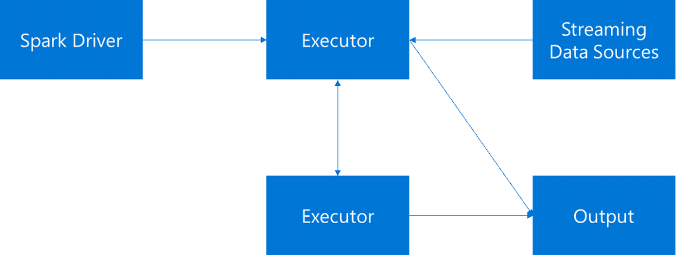
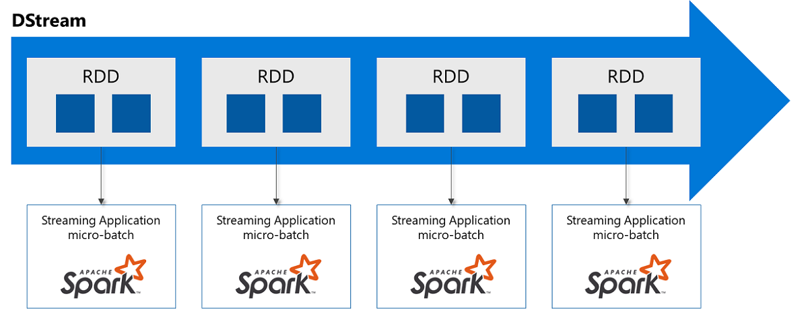
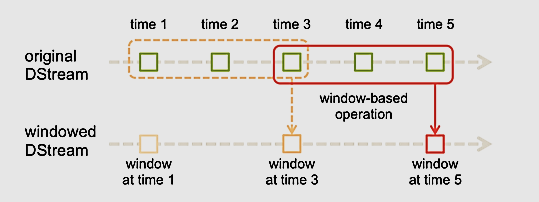
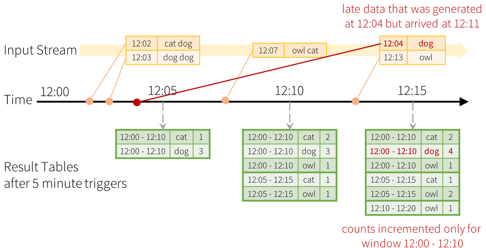
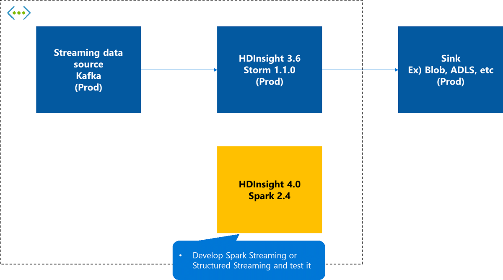
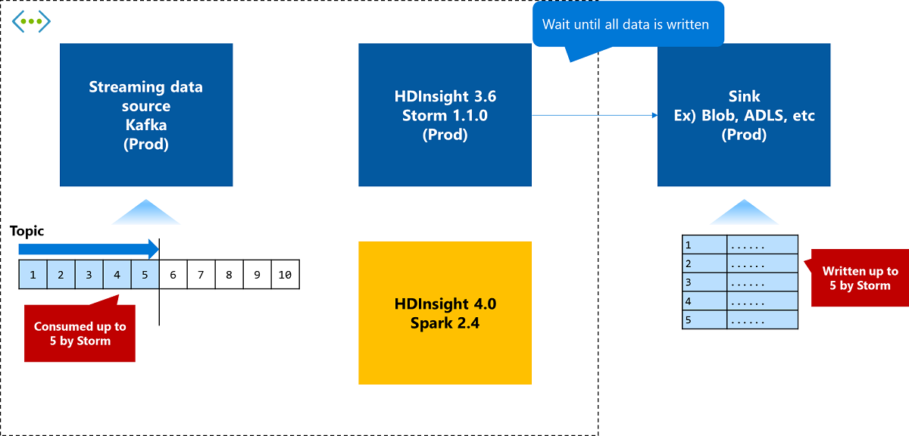
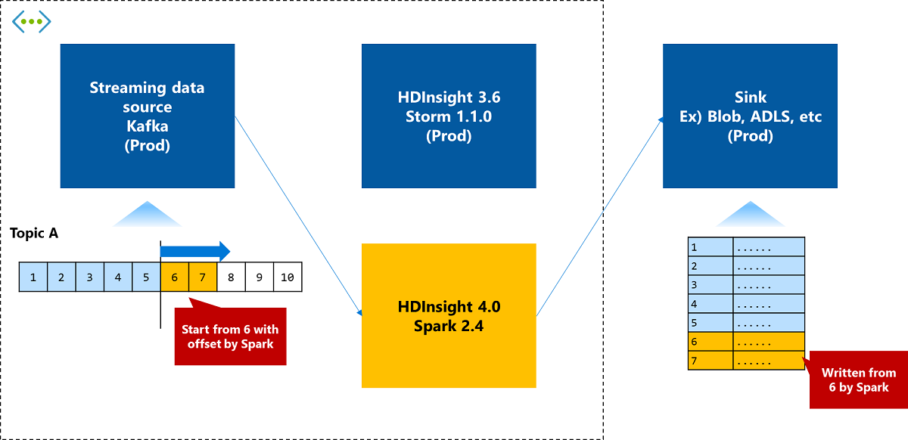
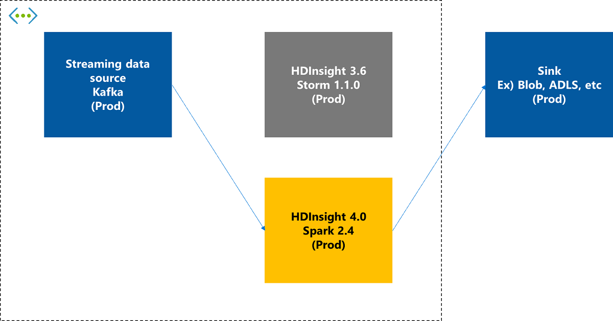

# Migrate Azure HDInsight 3.6 Apache Storm to HDInsight 4.0 Apache Spark

This document describes how to migrate Apache Storm workloads on HDInsight 3.6 to HDInsight 4.0. HDInsight 4.0 doesn't support the Apache Storm cluster type and you will need to migrate to another streaming data platform. Two suitable options are Apache Spark Streaming and Spark Structured Streaming. This document describes the differences between these platforms and also recommends a workflow for migrating Apache Storm workloads.

## Storm migration paths in HDInsight

HDInsight 4.0 supports Spark Streaming and Spark Structured Streaming as streaming processing platform. Other options include Azure Stream Analytics and other OSS with user management. This document provides a guide for migrating to Spark Streaming and Spark Structured Streaming.


## Comparison between Apache Storm and Spark Streaming, Spark Structured Streaming

Apache Storm can provide different levels of guaranteed message processing. For example, a basic Storm application can guarantee at-least-once processing, and [Trident](https://storm.apache.org/releases/current/Trident-API-Overview.html) can guarantee exactly once processing. Spark Streaming and Spark Structured Streaming guarantee that any input event is processed exactly once, even if a node failure occurs. Storm has a model that processes each single event, and you can also use the Micro Batch model with Trident. Spark Streaming and Spark Structured Streaming provide Micro-Batch processing model.

|  |Storm |Spark streaming | Spark structured streaming|
|---|---|---|---|
|**Event processing guarantee**|At least once <br> Exactly Once (Trident) |[Exactly Once](https://spark.apache.org/docs/latest/streaming-programming-guide.html)|[Exactly Once](https://spark.apache.org/docs/latest/structured-streaming-programming-guide.html)|
|**Processing Model**|Real-time <br> Micro Batch  (Trident) |Micro Batch |Micro Batch |
|**Event time support**|[Yes](https://storm.apache.org/releases/2.0.0/Windowing.html)|No|[Yes](https://spark.apache.org/docs/latest/structured-streaming-programming-guide.html)|
|**Languages**|Java, etc.|Scala, Java, Python|Python, R, Scala, Java, SQL|

### Spark streaming vs Spark structured streaming

Spark Structured Streaming is replacing Spark Streaming (DStreams). Going forward, Structured Streaming will receive enhancements and maintenance, while DStreams will be in maintenance mode only. Structured Streaming is currently not as feature-complete as DStreams for the sources and sinks that it supports out of the box, so evaluate your requirements to choose the appropriate Spark stream processing option.

## Streaming (Single event) processing vs Micro-Batch processing

Storm provides a model that processes each single event. This means that all incoming records will be processed as soon as they arrive. Spark Streaming applications must wait a fraction of a second to collect each micro-batch of events before sending that batch on for processing. In contrast, an event-driven application processes each event immediately. Spark Streaming latency is typically under a few seconds. The benefits of the micro-batch approach are more efficient data processing and simpler aggregate calculations.


## Storm architecture

Storm consists of the following three daemons.

|Daemon |Description |
|---|---|
|Nimbus|Similar to Hadoop JobTracker, it's responsible for distributing code around the cluster and assigning tasks to machines and monitoring for failures.|
|Zookeeper|Used for cluster coordination.|
|Supervisor|Listens for work assigned to its machine and starts and stops worker processes based on directives from Nimbus. Each worker process executes a subset of a topology. User’s application logic (Spouts and Bolt) run here.|


## Storm concept

Storm topologies are composed of multiple components that are arranged in a directed acyclic graph (DAG). Data flows between the components in the graph. Each component consumes one or more data streams, and can optionally emit one or more streams.

|Component |Description |
|---|---|
|Spout|Brings data into a topology. They emit one or more streams into the topology.|
|Bolt|Consumes streams emitted from spouts or other bolts. Bolts might optionally emit streams into the topology. Bolts are also responsible for writing data to external services or storage, such as HDFS, Kafka, or HBase.|


## Spark Streaming / Spark Structured Streaming

* When Spark Streaming is launched, the driver launches the task in Executor.
* Executor receives a stream from a streaming data source.
* When the Executor receives data streams, it splits the stream into blocks and keeps them in memory.
* Blocks of data are replicated to other Executors.
* The processed data is then stored in the target data store.



## Spark Streaming – Dstream

As each batch interval elapses, a new RDD is produced that contains all the data from that interval. The continuous sets of RDDs are collected into a DStream. For example, if the batch interval is one second long, your DStream emits a batch every second containing one RDD that contains all the data ingested during that second. When processing the DStream, the temperature event appears in one of these batches. A Spark Streaming application processes the batches that contain the events and ultimately acts on the data stored in each RDD.



## Data transformations on Spark Streaming


The following functions are available for processing Dstream. See [Overview of Apache Spark Streaming](../spark/apache-spark-streaming-overview.md) for details.

**Transformations on Dstreams**
* map(func)
* flatMap(func)
* filter(func)
* repartition(numPartitions)
* union(otherStream)
* count()
* reduce(func)
* countByValue()
* reduceByKey(func, [numTasks])
* join(otherStream, [numTasks])
* cogroup(otherStream, [numTasks])
* transform(func)
* updateStateByKey(func)
* etc



**Window Functions**
* window(windowLength, slideInterval)
* countByWindow(windowLength, slideInterval)
* reduceByWindow(func, windowLength, slideInterval)
* reduceByKeyAndWindow(func, windowLength, slideInterval, [numTasks])
* countByValueAndWindow(windowLength, slideInterval, [numTasks])

If the built-in operations don't meet the data transformation requirements, you can use UDF (User-Defined Functions).

## Spark Structured Streaming

Spark Structured Streaming represents a stream of data as a table that is unbounded in depth, that is, the table continues to grow as new data arrives. This input table is continuously processed by a long-running query, and the results sent to an output table.

In Structured Streaming, data arrives at the system and is immediately ingested into an input table. You write queries (using the DataFrame and Dataset APIs) that perform operations against this input table. The query output yields another table, the results table. The results table contains the results of your query, from which you draw data for an external datastore, such a relational database. The timing of when data is processed from the input table is controlled by the trigger interval. By default, the trigger interval is zero, so Structured Streaming tries to process the data as soon as it arrives. In practice, this means that as soon as Structured Streaming is done processing the run of the previous query, it starts another processing run against any newly received data. You can configure the trigger to run at an interval, so that the streaming data is processed in time-based batches.


## Spark structured streaming

You can write the basic operations of Spark Structured Streaming code as follows. See [Overview of Apache Spark Structured Streaming](../spark/apache-spark-structured-streaming-overview.md) for more details.

```spark
case class DeviceData(device: String, deviceType: String, signal: Double, time: DateTime)
val df: DataFrame = ... // streaming DataFrame with IOT device data with schema { device: string, deviceType: string, signal: double, time: string }
val ds: Dataset[DeviceData] = df.as[DeviceData] // streaming Dataset with IOT device data
// Select the devices which have signal more than 10
df.select("device").where("signal > 10")
// using untyped APIs
ds.filter(_.signal > 10).map(_.device)  // using typed APIs
// Running count of the number of updates for each device type
df.groupBy("deviceType").count() // using untyped API
// Running average signal for each device type
import org.apache.spark.sql.expressions.scalalang.typed
ds.groupByKey(_.deviceType).agg(typed.avg(_.signal)) // using typed API
```

SQL commands:

```spark
df.createOrReplaceTempView("updates")
spark.sql("select count(*) from updates") // returns another streaming DF
```

Window operation:

```spark
val windowedCounts = words.groupBy(
 window($"timestamp", "10 minutes", "5 minutes"),
 $"word“
 ).count()
```



If the built-in operations don't meet the data transformation requirements, you can use UDF (User-Defined Functions).

## General migration flow

Presumed current environment:

* Kafka is used as the streaming data source,
* Kafka and Storm are deployed on the same virtual network,
* The data processed by Storm is written to data sink, such as Azure storage, ADLS, and so on.


1. Deploy new HDInsight 4.0 Spark cluster, deploy code, and test it.

    Deploy a new HDInsight 4.0 Spark cluster in the same VNet and deploy your Spark Streaming or Spark Structured Streaming application on it and test it thoroughly.

    

1. Stop consuming on the current Storm cluster.

    In the existing Storm, stop consuming data from the streaming data source and wait it for the data to finish writing to the target sink.

    

1. Start consuming on the new Spark cluster.

    Start streaming data from a newly deployed HDInsight 4.0 Spark cluster. At this time, the process is taken over by consuming from the latest Kafka offset.

    

1. Remove the old cluster as needed.

    Once the switch is complete and working properly, remove the old HDInsight 3.6 Storm cluster as needed.

    

## Next steps

For more information about Storm, Spark Streaming, and Spark Structured Streaming, see the following documents:

* [Spark Streaming Programming Guide](https://spark.apache.org/docs/latest/streaming-programming-guide.html)
* [Overview of Apache Spark Streaming](../spark/apache-spark-streaming-overview.md)
* [Structured Streaming Programming Guide](https://spark.apache.org/docs/latest/structured-streaming-programming-guide.html)
* [Overview of Apache Spark Structured Streaming](../spark/apache-spark-structured-streaming-overview.md)
* [What is Apache Storm on Azure HDInsight?](./apache-storm-overview.md)
* [Azure HDInsight release notes](../hdinsight-version-release.md)
