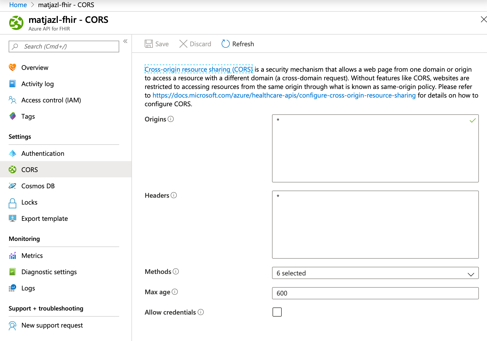

# Configure Cross-Origin Resource Sharing

Azure API for FHIR supports [Cross Origin Resource Sharing (CORS)](https://wikipedia.org/wiki/Cross-Origin_Resource_Sharing) that allows you to configure settings so that application from one domain (Origin) can access resource  with a different domain (a cross-domain request).

CORS is mostly used in single page app that needs to call RESTful API call to another domain.

To configure CORS setting in Azure API for FHIR, navigate to CORS setting in Service setting. 

Here you can specify following settings:

**Origins (Access-Control-Allow-Origin):** List of domains that can call the Azure API for FHIR. Each domain (Origin) must be entered in separate line. You can enter '*' to allow calls from any domain (not recommended as it represents security risk).

**Headers (Access-Control-Allow-Headers):** We can specify a list of headers that origin request will contain. WE can set it to '*' to allow all headers. 

**Methods (Access-Control-Allow-Methods):** We can select allowed methods (PUT, GET, POST,...) that are allowed in API call. We can also **Select all** methods, which equal to '*'.

**Max Age (Access-Control-Max-Age):** Value in seconds to cache preflight request results for **Access-Control-Allow-Methods** and **Access-Control-Allow-Headers**. 

**Allow Credentials (Access-Control-Allow-Credentials):** CORS requests normally don’t include cookies to prevent [Cross-Site Request Forgery (CSRF)](https://en.wikipedia.org/wiki/Cross-site_request_forgery) attacks. When checked, the request can be made with/will include credentials such as Cookies

You cannot specify different settings for different domain Origins. All the settings (Headers, Methods, Max age and Allow credentials) apply to all Origins specified in Origins setting.
