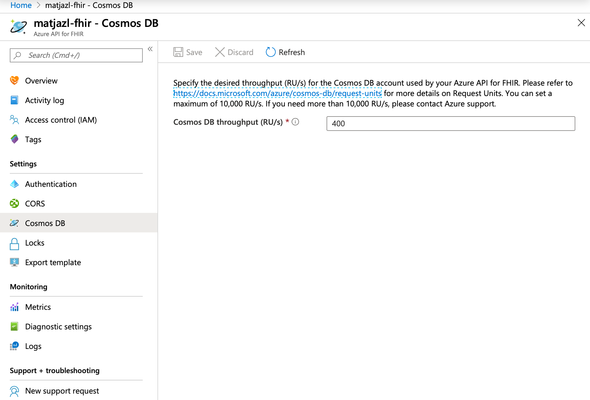

# Configure Cosmos DB settings 

Azure API for FHIR uses Cosmos DB as its underlying database to store FHIR data. When you provision new Azure API for FHIR service you have an option to specify number of RU (Requests Units) for Cosmos DB, that the service will use.

<<<<<<< HEAD
To learn more about what Cosmos DB RUs, read [Request Units in Azure Cosmos DB](https://docs.microsoft.com/en-us/azure/cosmos-db/request-units)
=======
To learn more about what Cosmos DB RUs, please read [Request Units in Azure Cosmos DB](https://docs.microsoft.com/azure/cosmos-db/request-units)
>>>>>>> 906fd68eaee158cfd7740f7627f7e04ad1e12a3f

To change this setting in the Azure portal, you can navigate to your Azure API for FHIR and open the Cosmos DB blade, then change the throughput to the desired value depending on your performance needs. You can change the value up to a maximum of 10,000 RU/s.* If you need a higher value, contact Azure support.

***Note:** Higher value means higher Cosmos DB throughput and higher cost of the service.

