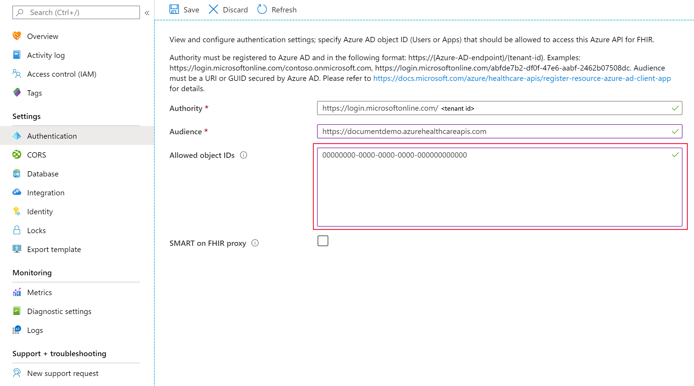

# Configure Local RBAC for FHIR 

This article explains how to configure the Azure API for FHIR to use an external, secondary Azure Active Directory tenant for managing data plane access. Use this mode only if it is not possible for you to use the Azure Active Directory tenant associated with your subscription.

> [!NOTE]
> If your FHIR service data plane is configured to use your primary Azure Active Directory tenant associated with your subscription, [use Azure RBAC to assign data plane roles](configure-azure-rbac.md).

## Configure local RBAC

You can configure the Azure API for FHIR to use an external or secondary Azure Active Directory tenant in the **Authentication** blade:

.

In the authority box, enter a valid Azure Active Directory tenant. Once the tenant has been validated, the **Allowed object IDs** box should be activated and you can enter a list of identity object IDs. These IDs can be the identity object IDs of:

1. An Azure Active Directory user.
1. An Azure Active Directory service principal.
1. An Azure Active directory security group.

You can read the article on how to [find identity object IDs](find-identity-object-ids.md) for more details.

After entering the required object IDs, click **Save** and wait for changes to be saved before trying to access the data plane using the assigned users, service principals, or groups.

## Next steps

In this article, you learned how to assign FHIR data plane access using an external (secondary) Azure Active Directory tenant. Next learn about additional settings for the Azure API for FHIR:
 
>[!div class="nextstepaction"]
>[Additional settings Azure API for FHIR](azure-api-for-fhir-additional-settings.md)

