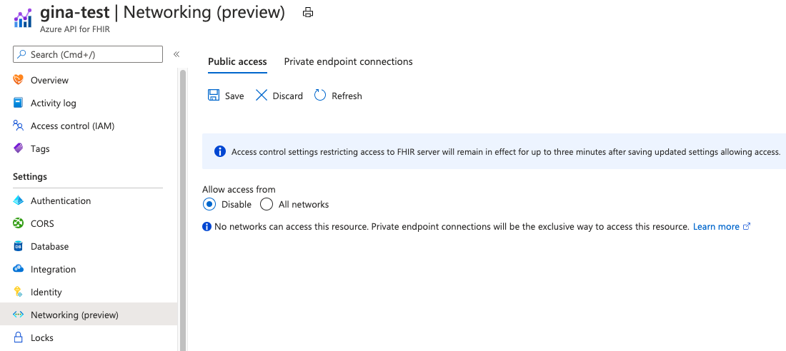
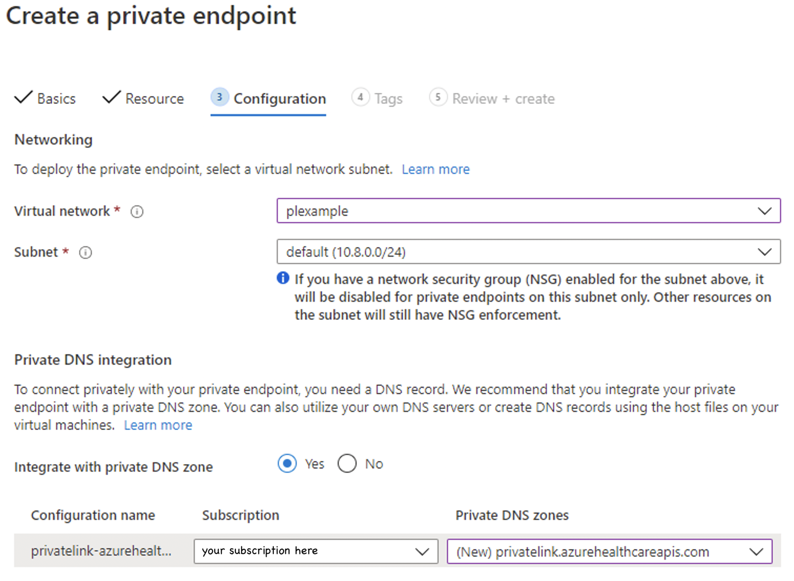
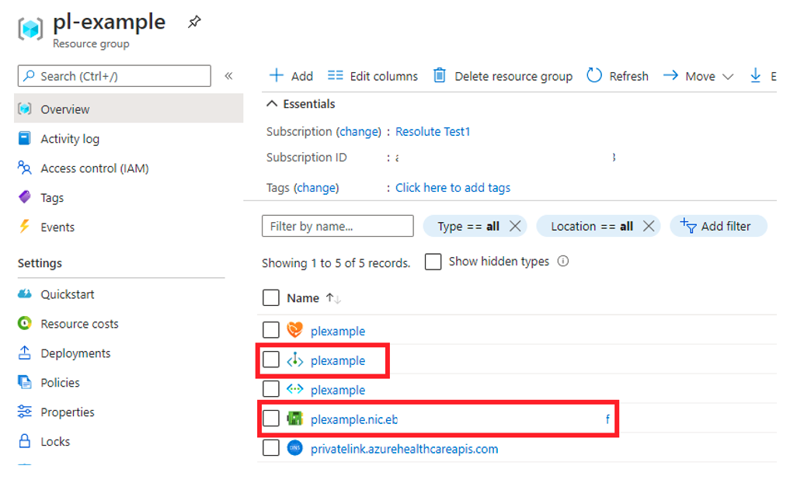
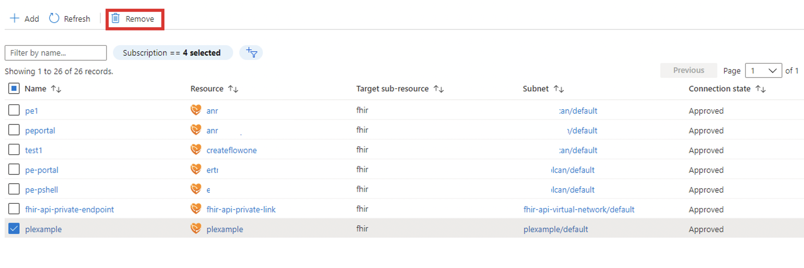

# Configure private link

> [!IMPORTANT]
> This capability is in public preview, is provided without a service level agreement, and is not recommended for production workloads. Certain features might not be supported or might have constrained capabilities. For more information, see [Supplemental Terms of Use for Microsoft Azure Previews](https://azure.microsoft.com/support/legal/preview-supplemental-terms/).

Private link enables you to access Azure API for FHIR over a private endpoint, a network interface that connects you privately and securely using a private IP address from your virtual network. With private link, you can access our services securely from your Vnet as a first party service without having to go through a public DNS. This article walks you through how to create, test, and manage your private endpoint for Azure API for FHIR.

## Pre-requisites

Before creating a private endpoint, there are some Azure resources that you will need to create first:

1. Resource Group – The Azure resource group that will contain the virtual network and private endpoint.
2. Azure API for FHIR – The FHIR resource you would like to put behind a private endpoint.
3. Virtual Network – The VNet to which your client services and Private Endpoint will be connected.

For more information, check out the [Private Link Documentation](https://docs.microsoft.com/azure/private-link/).

## Disabling Public Network Access

Creating a private endpoint for your FHIR resource does not automatically disable public traffic to it. In order to do that you will have to update your FHIR resource to set a new “Public access” property from “Enabled” to “Disabled”. Be careful when disabling public network access as all requests to your FHIR service that are not coming from a properly configured private endpoint will be denied. Only traffic from your private endpoints will be allowed.

## Creating a Private Endpoint

To create a private endpoint, a developer with RBAC permissions on the FHIR resource can use Portal, [Powershell](https://docs.microsoft.com/azure/private-link/create-private-endpoint-powershell), or [CLI](https://docs.microsoft.com/azure/private-link/create-private-endpoint-cli). This article walks you through the steps on using Portal. It is recommended to use Portal as it automates the creation and configuration of the Private DNS Zone. You can reference the [Private Link Quick Start Guides](https://docs.microsoft.com/azure/private-link/create-private-endpoint-portal) for more details.

There are two ways to create a private endpoint. Auto Approval flow allows a user that has RBAC permissions on the FHIR resource to create a private endpoint without a need for approval. Manual Approval flow allows a user without permissions on the FHIR resource to request a private endpoint to be approved by owners of the FHIR resource.

1. Auto approval

Make sure the region for the new private endpoint is the same as the region for your Virtual Network. The region for your FHIR resource can be different.

For Resource Type, search and select "Microsoft.HealthcareApis/services". For Resource, select the FHIR resource. For target sub-resource, select "fhir".

If you do not have an existing Private DNS Zone set up, select "(New)privatelink.azurehealthcareapis.com". If you already have your Private DNS Zone configured, you can select it from the list. It must be in the format of "privatelink.azurehealthcareapis.com".

After the deployment is complete, you can go back to "Private endpoint connections" tab, on which you will see "Approved" as the connection state.

2. Manual Approval

For manual approval, select the second option under Resource, "Connect to an Azure resource by resource ID or alias". For Target sub resource, enter "fhir" as in Auto Approval.

After the deployment is complete, you can go back to "Private endpoint connections" tab, on which you can Approve, Reject, or Remove your connection.

## Testing Private Endpoint

To make sure that your FHIR server is not receiving public traffic after disabling public network access, try hitting the /metadata endpoint for your server from your computer. You should receive a 403 Forbidden. Note that it can take up to 5 minutes after updating the public network access flag before public traffic is blocked.

To make sure your private endpoint can send traffic to your server:

1. Create a VM that is connected to the virtual network and subnet your private endpoint is configured on. To ensure your traffic from the VM is only using the private network, you can disable outbound internet traffic via NSG rule.
2. RDP into the VM.
3. Try hitting your FHIR server’s /metadata endpoint from the VM, you should receive the capability statement as a response.

## Managing Private Endpoint

### View

Private Endpoints and the associated NIC are visible in the portal from the resource group they were created in.

### Delete

Private endpoints can only be deleted from the portal via the Overview blade (as below) or via the Delete option under Networking (preview)'s "Private endpoint connections" tab. Clicking the delete button will delete the private endpoint and the associated NIC. If you delete all private endpoints to the FHIR resource and the public network access is disabled, no requests will be able to make it to your FHIR server. All private endpoints must be deleted from the FHIR resource before the FHIR resource can be deleted or moved.

