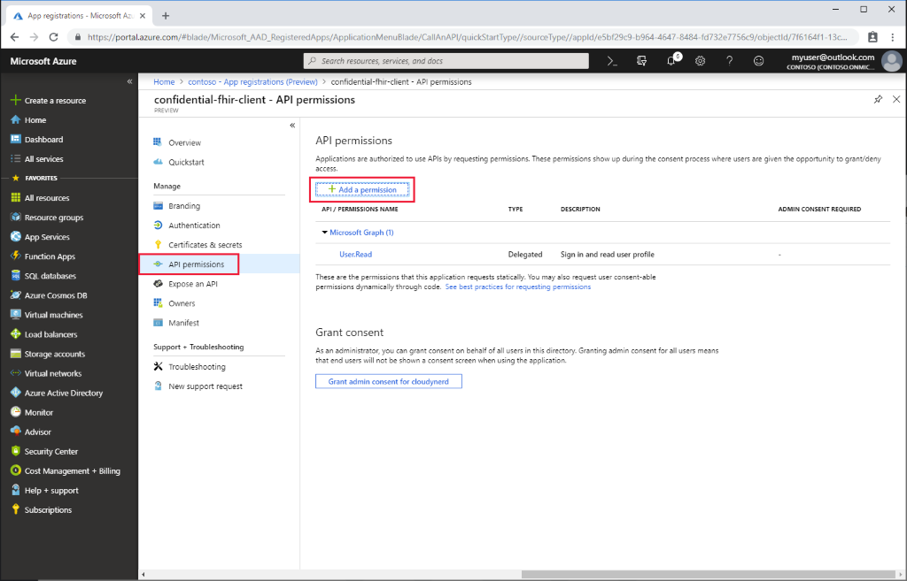

# Register a confidential client application in Azure Active Directory

In this How-to guide, you'll learn how to register a confidential client application in Azure Active Directory. A client application registration is an Azure Active Directory representation of an application that can be used to authenticate on behalf of a user and request access to [resource applications](register-resource-aad-client-app.md). A confidential client application is an application that can be trusted to hold a secret and present that secret when requesting access tokens. Examples of confidential applications are server-side applications.

To register a new confidential application in the portal, follow the steps below.

## Open the Azure portal's Active Directory section

Azure Active Directory applications can be registered and edited in the "App registrations" view of the Azure AD section of the Azure portal:

Click the "+ New registration".

## Register a new application

Give the application a display name and fill in the Reply URL. These details can be changed later, but if you know the reply URL of your application, enter it now. 

## API Permissions

Next add API Permissions:
 

Select your [FHIR API Resource Application Registration](register-resource-aad-client-app.md):

And select scopes (permissions) that the confidential application should be able to ask for on behalf of a user:

## Application Secret

Last step is to create an application secret (client secret):

You will be prompted for a description and duration of the secret. Once generated, it will be displayed in the portal only once. Make a note of it and store it securely.