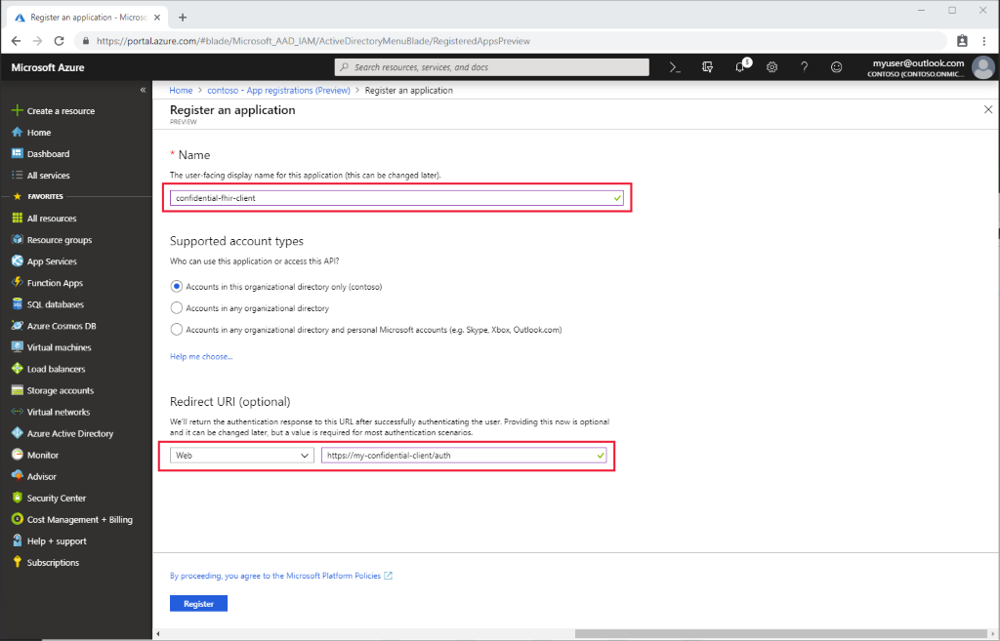
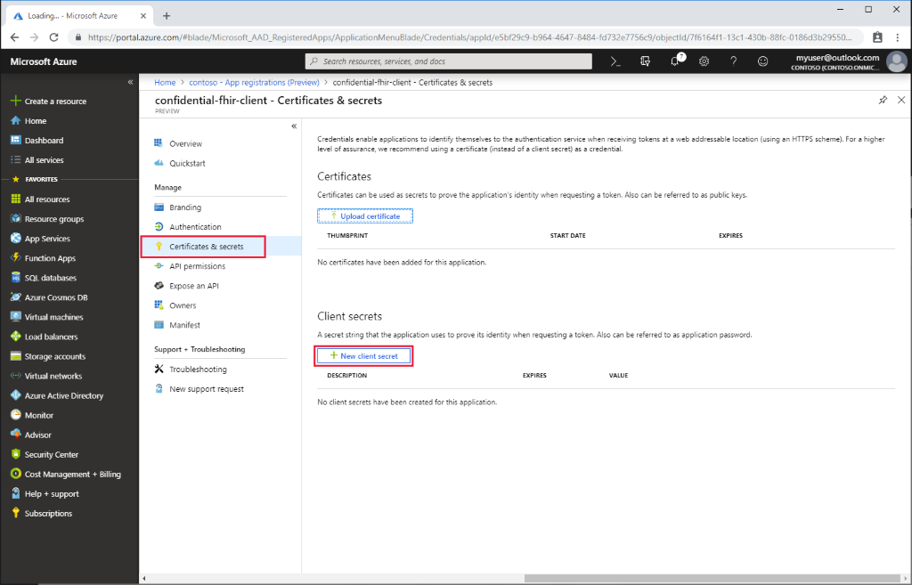

# Register a confidential client application in Azure Active Directory

In this tutorial, you'll learn how to register a confidential client application in Azure Active Directory. 

A client application registration is an Azure Active Directory representation of an application that can be used to authenticate on behalf of a user and request access to [resource applications](register-resource-azure-ad-client-app.md). A confidential client application is an application that can be trusted to hold a secret and present that secret when requesting access tokens. Examples of confidential applications are server-side applications.

To register a new confidential application in the portal, follow the steps below.

## Register a new application

1. In the [Azure portal](https://portal.azure.com), navigate to **Azure Active Directory**.

1. In the **Azure Active Directory** blade, select **App registrations** for the left-hand pane:

    

1. Select **New registration** at the top.

1. Give the application a display name.

1. Provide a reply URL. These details can be changed later, but if you know the reply URL of your application, enter it now.

    
1. Select **Register**.

## API permissions

Now that you have registered your application, you'll need to select which API permissions this application should be able to request on behalf of users:

1. Select **API permissions** from the left-hand pane:

    

2. Click **Add a permission**.

    If you are using the Azure API for FHIR, you will add a permission to the Azure Healthcare APIs by searching for **Azure Healthcare APIs** under **APIs my organization uses** (image below). 

    If you are referencing a different Resource Application, select your [FHIR API Resource Application Registration](register-resource-azure-ad-client-app.md) that you created previously under **My APIs**.

    

4. Select scopes (permissions) that the confidential application should be able to ask for on behalf of a user:

    

## Application secret

1. Select **certificates & secrets** from the left-hand pane.
1. Under Client secrets select **New client secret**. 

    

2. Provide a description and duration of the secret (either 1 year, 2 years or never).

3. Once generated, it will be displayed in the portal only once. Make a note of it and store it securely.

## Next steps

In this article, you've learned how to register a confidential client application in Azure Active Directory. You are now ready to deploy the [Azure API for FHIR](fhir-paas-powershell-quickstart.md).

Once you have deployed the Azure API for FHIR, you can review additional available settings.
 
>[!div class="nextstepaction"]
>[Deploy Azure API for FHIR](fhir-paas-powershell-quickstart.md)