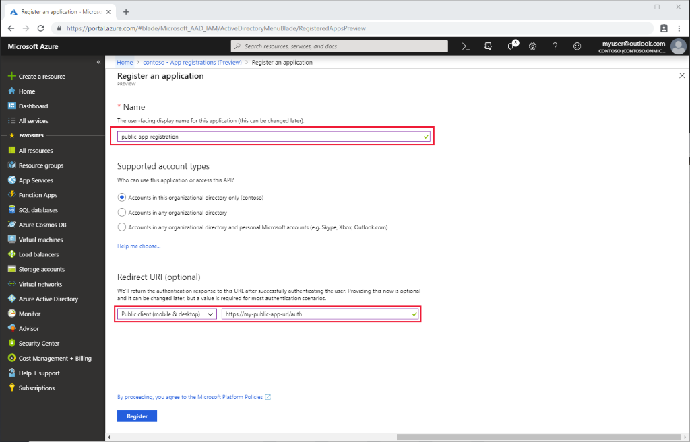

# Register a public client application in Azure Active Directory

In this article, you'll learn how to register a public application in Azure Active Directory. Client application registrations are Azure Active Directory representations of applications that can authenticate and ask for API permissions on behalf of a user. Public clients are applications such as mobile applications and single page javascript applications that can't keep secrets confidential. The procedure is similar to [registering a confidential client](register-confidential-azure-ad-client-app.md), but since public clients can't be trusted to hold an application secret, there's no need to add one.

## App registrations in Azure portal

1. In the [Azure portal](https://portal.azure.com), on the left navigation panel, click **Azure Active Directory**.

2. In the **Azure Active Directory** blade, click **App registrations (Preview)**:

    

3. Click the **New registration**.

## Application registration overview

1. Give the application with a display name.

2. Provide a reply URL. The reply URL is where authentication codes will be returned to the client application. You can add more reply URLs and edit existing ones later.

    

## API permissions

Similarly to the [confidential client application](register-confidential-azure-ad-client-app.md), you'll need to select which API permissions this application should be able to request on behalf of users:

1. Open the **API permissions** and select your [FHIR API Resource Application Registration](register-resource-azure-ad-client-app.md):

    

2. Select the scopes that you would like the application to be able to request.

## Next steps

In this article, you've learned how to register a public client application in Azure Active Directory. Next, deploy an FHIR API in Azure.
 
>[!div class="nextstepaction"]
>[Deploy Open Source FHIR server](fhir-oss-powershell-quickstart.md)
