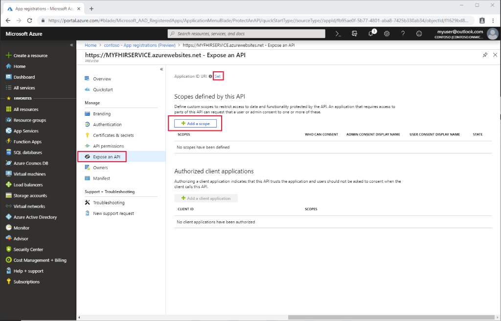

# Register a resource application in Azure Active Directory

In this article, you'll learn how to register a resource (or API) application in Azure Active Directory. A resource application is an Azure Active Directory representation of the FHIR server API itself and client applications can request access to the resource when authenticating. The resource application is also known as the *audience* in OAuth parlance.

## Open app registrations in Azure portal's Active Directory section

1. In the [Azure portal](https://portal.azure.com), on the left navigation panel, click **Azure Active Directory**.

2. In the **Azure Active Directory** blade click **App registrations (Preview)**:

    

3. Click the **New registration**.

## Add a new application registration

1. Fill in the details for the new application. There are no specific requirements for the display name, but setting it to the URI of the FHIR server makes it easy to find:

    

## Set identifier URI and define scopes

A resource application has an identifier URI (Application ID URI), which clients can use when requesting access to the resource. This value will populate the `aud` claim of the access token. It is recommended that you set this URI to be the URI of your FHIR server. For SMART on FHIR apps, it is assumed that the *audience* is the URI of the FHIR server.

1. Click **Expose an API**

2. Click **Set** next to *Application ID URI*.

3. Click **Add a scope** and add any scopes that you would like to define for you API. Azure AD does not currently allow slashes (`/`) in scope names. We recommend using `$` instead. A scope like `patient/*.read` would be `patient$*.read`.

    

## Define application roles

The Microsoft Healthcare APIs and the OSS FHIR Server for Azure use [Azure Active Directory application roles](https://docs.microsoft.com/en-us/azure/architecture/multitenant-identity/app-roles) for role-based access control. To define which roles should be available for your FHIR Server API, open the resource application's [manifest](https://docs.microsoft.com/en-us/azure/active-directory/active-directory-application-manifest/):

1. Click **Manifest**:

    

2. In the `appRoles` property, add the roles you would like users or applications to have:

    ```json
    "appRoles": [
      {
        "allowedMemberTypes": [
          "User",
          "Application"
        ],
        "description": "FHIR Server Administrators",
        "displayName": "admin",
        "id": "1b4f816e-5eaf-48b9-8613-7923830595ad",
        "isEnabled": true,
        "value": "admin"
      },
      {
        "allowedMemberTypes": [
          "User"
        ],
        "description": "Users who can read",
        "displayName": "reader",
        "id": "c20e145e-5459-4a6c-a074-b942bbd4cfe1",
        "isEnabled": true,
        "value": "reader"
      }
    ],
    ```