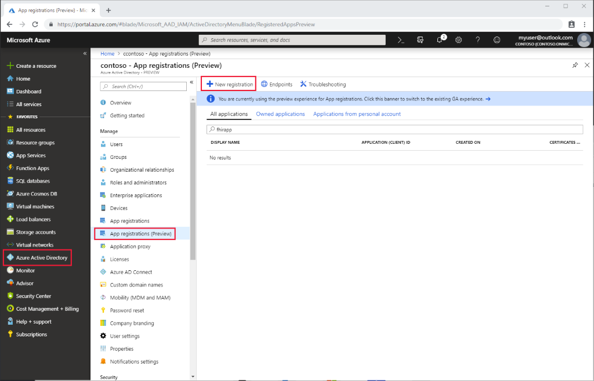
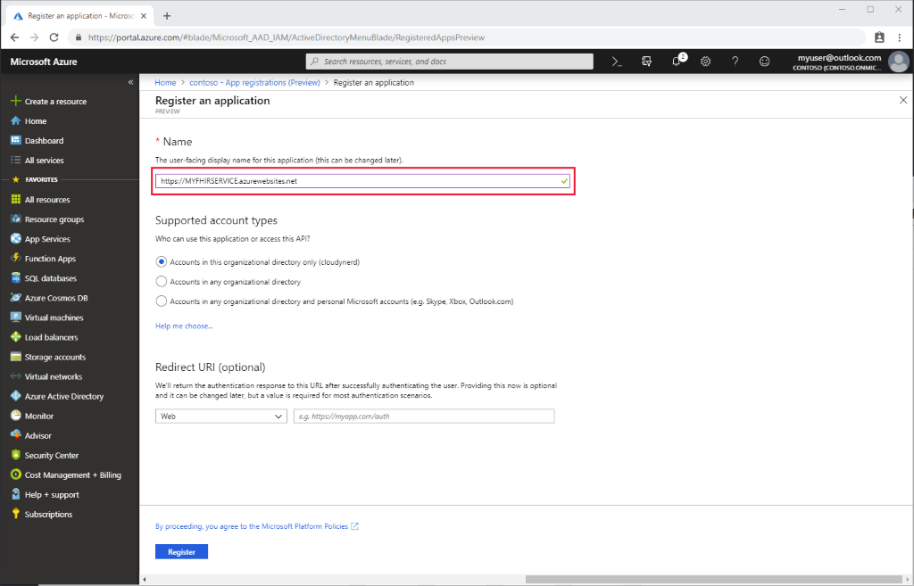
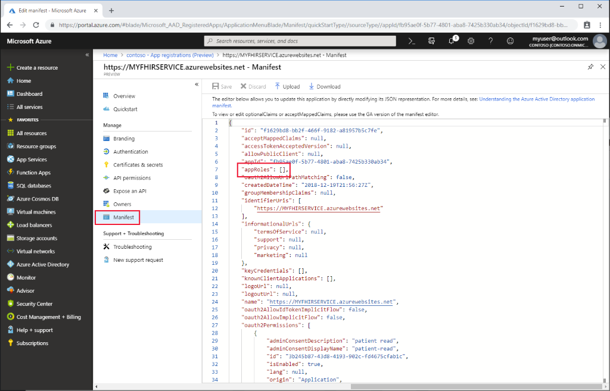

# Register a resource/API application in Azure Active Directory

In this How-to guide, you'll learn how to register a "resource" (or API) application in Azure Active Directory. A resource application is an Azure Active Directory representation of the FHIR server API itself and client applications can request access to the resource when authenticating. The resource application is also known as the "Audience" in OAuth parlance.

## Open the Azure portal's Active Directory section

Azure Active Directory applications can be registered and edited in the "App registrations" view of the Azure AD section of the Azure portal:



Click the "+ New registration".

## Add a new application registration



There are no specific requirements for the display name, but setting it to the URI of the FHIR server makes it easy to find.

## Set Identifier URI and Define Scopes

A resource application has an identifier URI (Application ID URI), which clients can use when requesting access to the resource. This value will populate the `aud` claim of the access token. It is recommended that you set this URI to be the URI of your FHIR server. For SMART on FHIR apps, it is assumed that the Audience is the URI of the FHIR server.


After setting the Identifier URI, define all the scopes that you would like to expose on this API. Azure AD does not currently allow slashes (`/`) in scope names. We recommend using `$` instead. A scope like `patient/*.read` would be `patient$*.read`.

## Define Application Roles

The Microsoft Healthcare APIs and the OSS FHIR Server for Azure use [Azure Active Directory application roles](https://docs.microsoft.com/en-us/azure/architecture/multitenant-identity/app-roles) for role-based access control. To define which roles should be available for your FHIR Server API, open the resource application's [manifest](https://docs.microsoft.com/en-us/azure/active-directory/active-directory-application-manifest/):



In the `appRoles` property, add the roles you would like users or applications to have:

```json
"appRoles": [
  {
    "allowedMemberTypes": [
      "User",
      "Application"
    ],
    "description": "FHIR Server Administrators",
    "displayName": "admin",
    "id": "1b4f816e-5eaf-48b9-8613-7923830595ad",
    "isEnabled": true,
    "value": "admin"
  },
  {
    "allowedMemberTypes": [
      "User"
    ],
    "description": "Users who can read",
    "displayName": "reader",
    "id": "c20e145e-5459-4a6c-a074-b942bbd4cfe1",
    "isEnabled": true,
    "value": "reader"
  }
],
```
