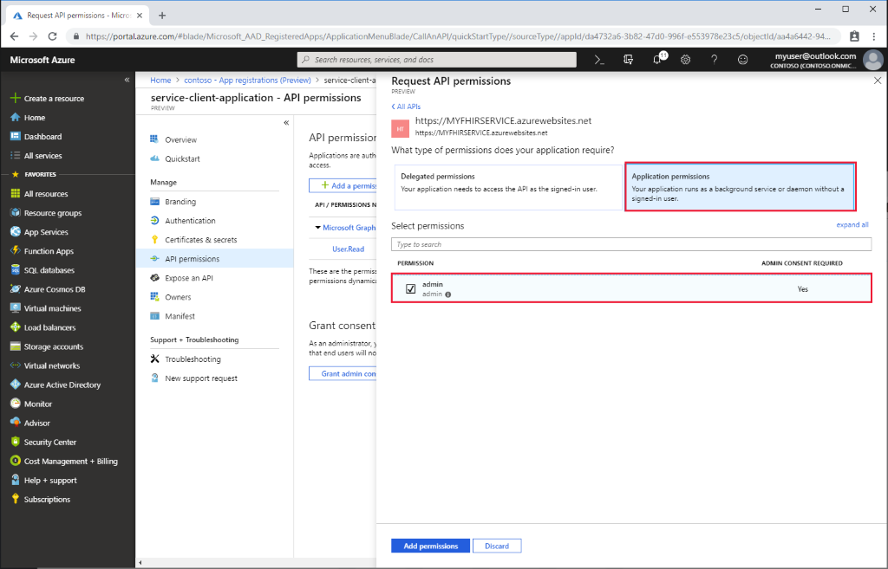
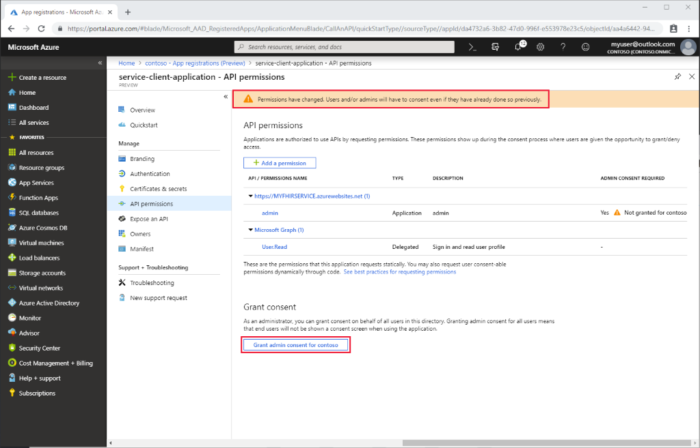
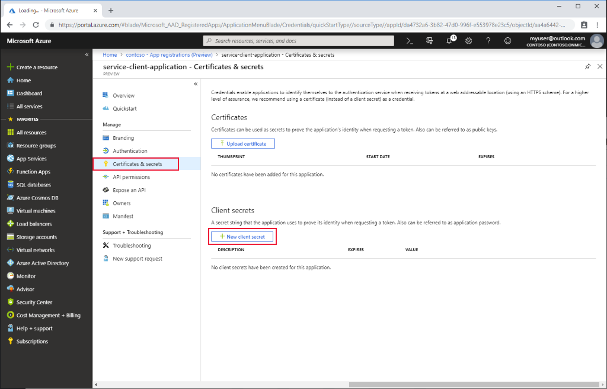

# Register a service client application in Azure Active Directory

In this article, you'll learn how to register a service client application in Azure Active Directory. Client application registrations are Azure Active Directory representations of applications that can be used to authenticate and obtain tokens. A service client is intended to be used by an application to obtain an access token without interactive authentication of a user. It will have certain application permissions and use an application secret (password) when obtaining access tokens.

Follow the steps below to create a new service client.

## App registrations in Azure portal

1. In the [Azure portal](https://portal.azure.com), on the left navigation panel, click **Azure Active Directory**.

2. In the **Azure Active Directory** blade click **App registrations (Preview)**:

    

3. Click **New registration**.

## Service client application details

* The service client needs a display name and you can also provide a reply URL but it will typically not be used.

    

## API permissions

You will need to grant the service client application roles. 

1. Open the **API permissions** and select your [FHIR API Resource Application Registration](register-resource-aad-client-app.md):

    

2. Select the application roles you from the ones that are defined on the resource application:

    

3. Grant consent to the application. If you don't have the permissions required, check with your Azure Active Directory administrator:

    

## Application secret

The service client needs a secret (password), which you will used when obtaining tokens.

1. Click **Certificates &amp; secrets**

2. Click **New client secret**

    

3. Provide a duration of the secret.

4. Once it has been generated, it will only be displayed once in the portal. Make a note of it and store in a securely.

## Next steps

In this article, you've learned how to register a service client application in Azure Active Directory. Next, deploy a FHIR API in Azure.
 
>[!div class="nextstepaction"]
>[Deploy Open Source FHIR server](fhir-oss-powershell-quickstart.md)