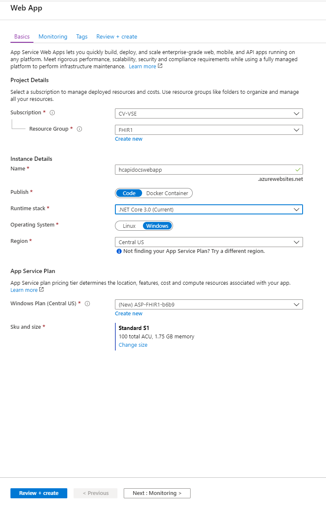

# Write Azure web application to read FHIR data
Now that you are able to connect to your FHIR server and POST data, you are ready to write a web application that will read FHIR data. In this final step of the tutorial, we will walk through writing and accessing the web application.

## Create web application
In Azure, select **Create a resource** and select **Web App**. 



Once the web application is available, **Go to resource**. Select **App Service Editor (Preview)** under Development Tools on the right and then select **Go**. Selecting Go will open up the App Service Editor. Right click in the grey space under *Explore* and create a new file called **index**.

Below is the code that you can input into **index**. You will need to update the following items:
* **clientId** - Update with your client application ID. This ID will be the same ID you pulled when retrieving your token
* **authority** - Update with your Azure AD tenant ID
* **FHIRendpoint** - Update the FHIRendpoint to have your FHIR service name


``` HTML

<!DOCTYPE html>
<html>

<head>
    <title>FHIR Patient browser sample app</title>
    <script src="https://secure.aadcdn.microsoftonline-p.com/lib/1.0.0/js/msal.js"></script>
</head>

<body>
    <div class="leftContainer">
        <p id="WelcomeMessage">Welcome to the FHIR Patient browsing sample Application</p>
        <button id="SignIn" onclick="signIn()">Sign In</button>
    </div>

    <div id="patientTable">
    </div>

    <script>
        var msalConfig = {
            auth: {
                clientId: '<CLIENT-ID>',
                authority: "https://login.microsoftonline.com/<AZURE-AD-TENANT-ID>"
            },
            cache: {
                cacheLocation: "localStorage",
                storeAuthStateInCookie: true
            }
        }

        var FHIRConfig = {
            FHIRendpoint: "https://<FHIR-SERVER-NAME>.azurehealthcareapis.com"
        }
        var requestObj = {
            scopes: ["https://azurehealthcareapis.com/user_impersonation"]
        }

        function authRedirectCallBack(error, response) {
            if (error) {
                console.log(error);
            } else {
                if (response.tokenType === "access_token") {
                    callFHIRServer(FHIRConfig.FHIRendpoint + '/Patient', 'GET', null, response.accessToken, FHIRCallback);
                }
            }
        }

        var myMSALObj = new Msal.UserAgentApplication(msalConfig);
        myMSALObj.handleRedirectCallback(authRedirectCallBack);

        function signIn() {
            myMSALObj.loginPopup(requestObj).then(function (loginResponse) {
                showWelcomeMessage();
                acquireTokenPopupAndCallFHIRServer();
            }).catch(function (error) {
                console.log(error);
            })
        }

        function showWelcomeMessage() {
            var divWelcome = document.getElementById('WelcomeMessage');
            divWelcome.innerHTML = "Welcome " + myMSALObj.getAccount().userName + " to FHIR Patient Browsing App";
            var loginbutton = document.getElementById('SignIn');
            loginbutton.innerHTML = 'Sign Out';
            loginbutton.setAttribute('onclick', 'signOut()')
        }

        function signOut() {
            myMSALObj.logout();
        }

        function acquireTokenPopupAndCallFHIRServer() {
            myMSALObj.acquireTokenSilent(requestObj).then(function (tokenResponse) {
                callFHIRServer(FHIRConfig.FHIRendpoint + '/Patient', 'GET', null, tokenResponse.accessToken, FHIRCallback);
            }).catch(function (error) {
                console.log(error);
                if (requiresInteraction(error.errorCode)) {
                    myMSALObj.acquireTokenPopup(requestObj).then(function (tokenResponse) {
                        callFHIRServer(FHIRConfig.FHIRendpoint + '/Patient', 'GET', null, tokenResponse.accessToken, FHIRCallback);
                    }).catch(function (error) {
                        console.log(error);
                    })
                }
            });
        }

        function callFHIRServer(theUrl, method, message, accessToken, callBack) {
            var xmlHttp = new XMLHttpRequest();
            xmlHttp.onreadystatechange = function () {
                if (this.readyState == 4 && this.status == 200)
                    callBack(JSON.parse(this.responseText));
            }
            xmlHttp.open(method, theUrl, true);
            xmlHttp.setRequestHeader("Content-Type", "application/json;charset=UTF-8");
            xmlHttp.setRequestHeader('Authorization', 'Bearer ' + accessToken);
            xmlHttp.send(message);
        }

        function FHIRCallback(data) {
            patientListHtml = '<ol>';
            data.entry.forEach(function(e) {
                patientListHtml += '<li>' + e.resource.name[0].family + ', ' + e.resource.name[0].given + ' (' + e.resource.id + ')';
            });
            patientListHtml += '</ol>';
            document.getElementById("patientTable").innerHTML = patientListHtml;
        }
    </script>
</body>

</html>
```

From here, you can go back to your web application resource and open the URL found on the Overview page. Log in to see the patient James Tiberious Kirk that you previously created.

## Next Steps
You have successfully deployed the Azure API for FHIR, registered a public client application, tested access, and created a small web application. Check out the Azure API for FHIR supported features as a next step.

>[!div class="nextstepaction"]
>[Supported Features](fhir-features-supported.md)


