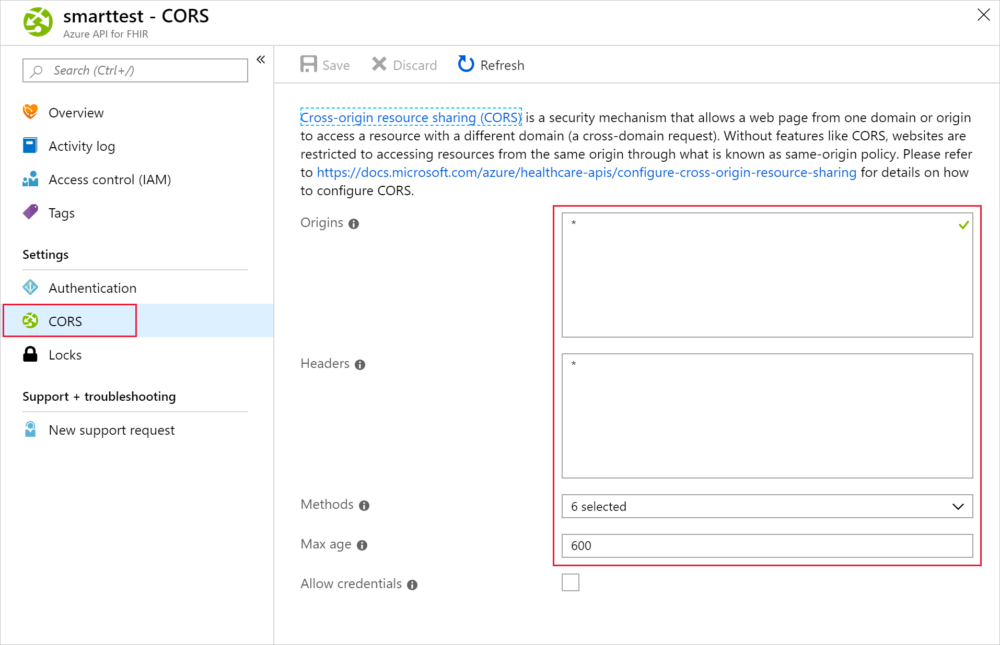
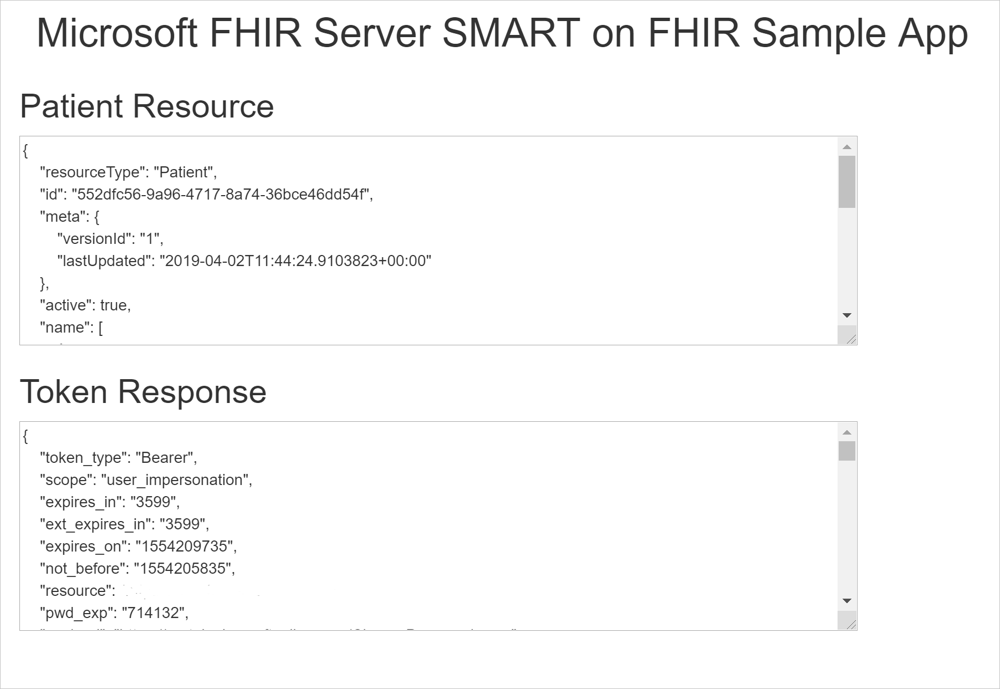

# Tutorial: Azure Active Directory SMART on FHIR Proxy

[SMART on FHIR](http://docs.smarthealthit.org/) is a set of open specifications to integrate third party applications with FHIR servers and electronic medical records systems that have FHIR interfaces. One of the main purposes of the specifications is to describe how an application should discover authentication endpoints for a FHIR server and initiate an authentication sequence. Authentication is based on OAuth2, but since SMART on FHIR used parameter naming conventions that are not immediately compatible with Azure Active Directory, the Azure API for FHIR has a built in Azure Active Directory SMART on FHIR proxy that enables a subset of the SMART on FHIR launch sequences, specifically the EHR launch.

This tutorial describes how to use the proxy to enable SMART on FHIR applications with the Azure API for FHIR.

## Prerequisites

- An instance of the Azure API for FHIR
- [.NET Core 2.2](https://dotnet.microsoft.com/download/dotnet-core/2.2)

## Configure Azure AD registrations

SMART on FHIR requires that the `Audience` has an identifier URI equal to the URI of the FHIR service. The standard configuration of the Azure API for FHIR uses an `Audience` of `https://azurehealthcareapis.com`. Suppose that the URI for your Azure API for FHIR is `https://MYFHIRAPI.azurehealthcareapis.com` you need to configure a [resource application registration](register-resource-azure-ad-client-app.md) with that identifier URI.

After setting up a resource application, you also need a client application registration. Most SMART on FHIR applications are single page javascript applications and therefore you should follow the instructions for configuring a [public Azure Active Directory client application](register-public-azure-ad-client-app.md).

After completing these steps, you should have:

1. A resource application with identifier URI `https://MYFHIRAPI.azurehealthcareapis.com`, where `MYFHIRAPI` is the name of your Azure API for FHIR instance.
1. A public client application registration. Make a note of the application id for this client application.

## Enable SMART on FHIR proxy

The SMART on FHIR proxy can be enabled in the **Authentication** settings for your Azure API for FHIR instance:


Change the **Audience** to match the URI of your FHIR API and check the **SMART on FHIR proxy** checkbox.

## Enable cross origin resource sharing (CORS)

Since most SMART on FHIR applications are single page javascript apps, you will need to [enable CORS](configure-cross-origin-resource-sharing) for the Azure API for FHIR:



## Configure reply URL

The SMART on FHIR proxy acts as an intermediary between the SMART on FHIR app and Azure Active Directory. Consequently, the authentication reply (the authentication code) must go to the SMART on FHIR proxy instead of the app itself. The proxy will forward it on to the app. Because of this two step relay of the authentication code, you will need to set the reply URL (callback) for your Azure AD client application to a URL that is a combination of the SMART on FHIR proxy reply URL and the reply URL of the SMART on FHIR app. The combined reply URL takes the form:

```
https://MYFHIRAPI.azurehealthcareapis.com/AadSmartOnFhirProxy/callback/aHR0cHM6Ly9sb2NhbGhvc3Q6NTAwMS9zYW1wbGVhcHAvaW5kZXguaHRtbA
```

where `aHR0cHM6Ly9sb2NhbGhvc3Q6NTAwMS9zYW1wbGVhcHAvaW5kZXguaHRtbA` is a URL safe base64 encoded version of the SMART on FHIR apps reply URL. For the SMART app launcher, when running locally, the reply URL of the app is `https://localhost:5001/sampleapp/index.html`, you can generate the combined reply URL with a script like:

```PowerShell
$replyUrl = "https://localhost:5001/sampleapp/index.html"
$fhirServerUrl = "https://MYFHIRAPI.azurewebsites.net"
$bytes = [System.Text.Encoding]::UTF8.GetBytes($ReplyUrl)
$encodedText = [Convert]::ToBase64String($bytes)
$encodedText = $encodedText.TrimEnd('=');
$encodedText = $encodedText.Replace('/','_');
$encodedText = $encodedText.Replace('+','-');

$newReplyUrl = $FhirServerUrl.TrimEnd('/') + "/AadSmartOnFhirProxy/callback/" + $encodedText
```

Add this reply URL to the Azure Active Directory public client application that you created earlier:


## Get test patient

To test the Azure API for FHIR and the SMART on FHIR proxy, you'll need to have at least one patient in the database. If you have not interacted with the API yet and you don't have data in the database, follow the [FHIR API Postman tutorial](access-fhir-postman-tutorial.md) to load a patient. Make a note of an `id` of a specific patient.

## Download SMART launch application

The open source [FHIR server for Azure repository](https://github.com/Microsoft/fhir-server) includes a simple SMART on FHIR app launcher and a sample SMART on FHIR app. In this tutorial, use can run this SMART on FHIR launcher locally to test the setup.

You can clone the Github repository and navigate to the application with:

```PowerShell
git clone https://github.com/Microsoft/fhir-server
cd samples/apps/SmartLauncher
```

The application needs a few configuration settings, which you can set in `appsettings.json`:

```json
{
    "FhirServerUrl": "https://MYFHIRAPI.azurehealthcareapis.com",
    "ClientId": "APP-ID",
    "DefaultSmartAppUrl": "/sampleapp/launch.html"
}
```

You can also (recommended) use the `dotnet user-secrets` feature:

```PowerShell
dotnet user-secrets set FhirServerUrl https://MYFHIRAPI.azurehealthcareapis.com
dotnet user-secrets set ClientId <APP-ID>
```

Run the application with:

```
dotnet run
```

## Test the SMART on FHIR proxy

After starting the SMART on FHIR app launcher, you can navigate point your browser to `https://localhost:5001`, where you should see the following screen:


When you enter **Patient**, **Encounter**, or **Practitioner** information, you will notice that the **Launch context** is updated. When using the Azure API for FHIR, the launch context is simply a JSON document containing information about patient, practioner, etc. This launch context is base64 encoded and passed to the SMART on FHIR app as the `launch` query parameter. According to SMART on FHIR specification, this variable is opaque to the SMART on FHIR app and simply passed on to the identity provider. The Azure API for FHIR SMART on FHIR proxy uses this information to populate fields in the token response. These fields *can* be used by the SMART on FHIR app to control which patient it requests data for and how it renders the application on the screen. SMART on FHIR proxy supports the following fields:

* `patient`
* `encounter`
* `practitioner`
* `need_patient_banner`
* `smart_style_url`

These fields are meant to provide guidance to the app, but they don't convey any security information and can be ignored by a given SMART on FHIR application.

You will notice that the SMART on FHIR app launcher updates the **Launch URL** at the bottom of the page. Hit **Launch** to start the sample app and you should see something like:



Inspect the token response to see how the launch context fields are passed on to the app.

## Next steps

In this tutorial, you've configured the Azure Active Directory SMART on FHIR proxy. To explore the use of SMART on FHIR applications with the Azure API for FHIR and the open source FHIR server for Azure, explore the FHIR server samples repository on GitHub.

>[!div class="nextstepaction"]
>[FHIR server samples](https://github.com/Microsoft/fhir-server-samples)