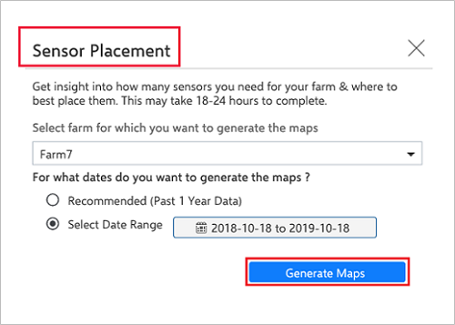
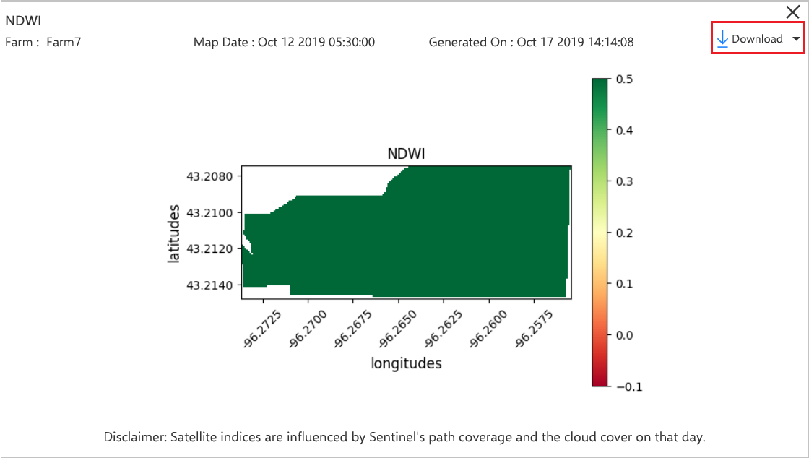
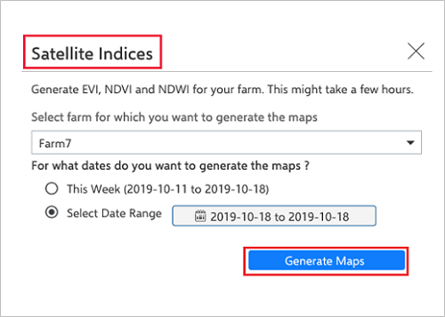
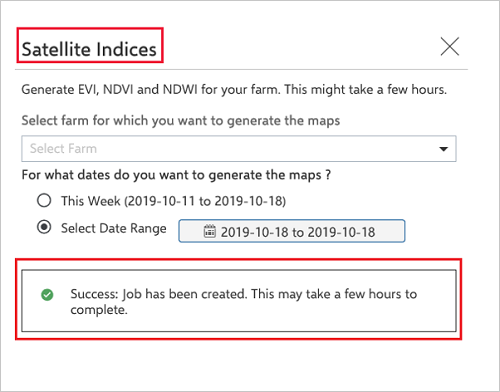
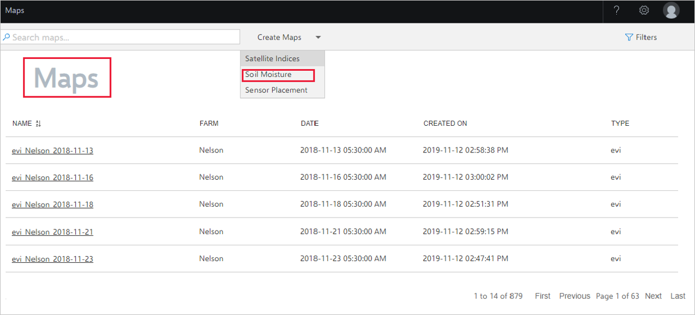
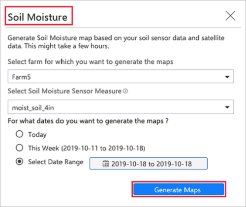
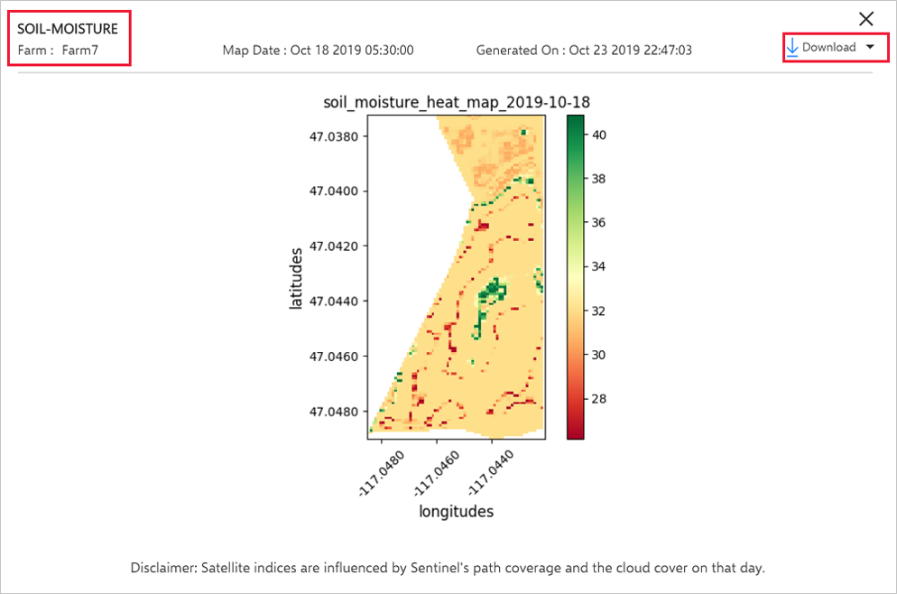

# Generate maps

Using Azure FarmBeats you can generate the following maps by using satellite imagery and sensor data inputs:

1. **Sensor Placement Map** – gets recommendations on how many sensors to use and where to place them in a farm.
2.	**Satellite indices Map** – gets vegetation index and water index for a farm.
3.	**Soil Moisture Map** – gets soil moisture distribution by fusing satellite data and sensor data.

## Sensor placement maps

  FarmBeats sensor placement map assists you with the placement of soil moisture sensors. The map output consists a list of coordinates for sensor deployment. The inputs from these sensors are used along with satellite imagery to generate the Soil Moisture Heatmap.  

  This map is derived by segmenting the canopy as seen over multiple dates throughout the year, even bare soil and buildings are part of the canopy. You can remove sensors that are not required on the location. This map is for guidance and you can alter the position and numbers slightly based on your custom knowledge (adding sensors will not regress soil moisture heat map results but there is possibility of deterioration in heat map accuracy if sensor number is reduced).  

## Before you begin  

  The following conditions must be met successfully to generate a sensor placement map:

1. Farm size must be more than one acre
2. The number of cloud-free Sentinel scenes must be more than six for the selected date range.  
3. At least six cloud-free Sentinel Scenes must have NDVI>=0.3

    > [!NOTE]
    > Sentinel allows only two concurrent threads per user. As a result, jobs will get queued and might take longer to complete.

### Dependencies on sentinel  

  See the following for information on Sentinel dependencies:

1. We depend on Sentinel performance for downloading satellite images. Check Sentinel performance status and maintenance activities [here](https://scihub.copernicus.eu/twiki/do/view/SciHubNews/WebHome)
2. Sentinel allows only two concurrent [downloads threads](https://sentinels.copernicus.eu/web/sentinel/sentinel-data-access/typologies-and-services) per user

3. Precision map generation will be affected by [Sentinel coverage and re-visit frequency]( https://sentinel.esa.int/web/sentinel/user-guides/sentinel-2-msi/revisit-coverage)

## Create sensor placement map  

> [!NOTE]
> You can initiate Sensor Placement from the **Maps** page or from the  **Generate Precision Maps** drop-down menu from the **Farm Details** page.

1. On the home page, go to **Maps** from the left navigation menu.
2. Click **Create Maps** and select **Sensor Placement** from drop-down menu.

  

3. Select **Sensor Placement**.
  The sensor placement window displays.

  

4. Select a farm from the **Farm** drop-down menu.  
   To search and select your farm, you can either scroll in the drop-down list or type the name of the farm in the text box.
5. If you want to generate a map for the past one year, select **Recommended** option.
6. If you want to generate a map for a custom date range, click **Select Date Range**, and provide the start and end date for which you want to generate the sensor placement map.
7. Click **Generate Maps**.
  A Confirmation message displays with the details about job created.

    - For information on job status, see the section **View Jobs**. If the job status shows *Failed*, a detailed error message is displayed on a tooltip at the *Failed* status. In this case, repeat the steps listed above and try again.

    - If the issue persists, see the [Troubleshoot](troubleshoot-project-farmbeats.md) section or contact [Azure FarmBeats forum for support](https://aka.ms/FarmBeatsMSDN) with relevant logs.

### View and download sensor placement map

1. On the home page, go to **Maps** from the left navigation menu.

  

2. Click **Filter** from the left-navigation of the window.
  The filter window displays from where you can search for maps.

  

3. Select **Type**, **Date** and **Name** from the drop-down menu and then **Apply** to search for the map you want to view.
  The date format *type_farmname_YYYY-MM-DD* is the date on which the job was created.
4. Scroll through the list of maps available using the navigation bars at the end of the page.
5. Click the map you want to view, a pop-up window displays the preview for the selected map.
6. Click **Download** drop-down menu to download the GeoJSON file of sensor coordinates.

  

## Satellite Indices

>[!NOTE]
> You can initiate Satellite Indices from the **Maps** page or from the  **Generate Precision Maps** drop-down menu from **Farm Details** page.

FarmBeats provides you with the ability to generate Normalized Difference Vegetation Index (NDVI), Enhanced Vegetation Index (EVI) and Normalized Difference Water Index (NDWI) maps for their farms. These indices help determine how the crop is currently growing or has grown over the past and the representative water levels were in the ground.

> [!NOTE]
> Sentinel Image must be present for the days on which the map is being generated.

## Create satellite indices map

1. On the home page, go to **Maps** from the left navigation menu.
2. Click **Create Maps** and select **Satellite Indices** from drop-down menu.

  

3. Select **Satellite Indices**.
  The Satellite Indices window displays.

  

4. Select a farm from the drop-down menu.  
   To search and select your farm, you can either scroll in the drop-down list or type the name of the farm.   
5. If you want to generate a map for the past one week select **This Week** option.
6. If you want to generate a map for custom date range, click **Select Date Range**, and provide the start and end date for which you want to generate the satellite indices map.
7. Click **Generate Maps**.
    A confirmation message displays with details about the  job created.

  

    - For information on job status, see the section **View Jobs**. If the job status shows *Failed*, a detailed error message is displayed on a tooltip at the *Failed* status. In this case, repeat the steps listed above and try again.

    - If the issue persists, see the [Troubleshoot](troubleshoot-project-farmbeats.md) section or contact [Azure FarmBeats forum for support](https://aka.ms/FarmBeatsMSDN) with relevant logs.

### View and download map

1. On the home page, go to **Maps** from the left navigation menu.

  

2. Click **Filter** from the left-navigation of the window, the filter window displays from where you can search for maps.

  

3. Select **Type**, **Date** and **Name** from the drop-down menu and then **Apply** to search for the map you want to view.
  The date format *type_farmname_YYYY-MM-DD* is the date on which the job was created.

4. Scroll through the list of maps available using the navigation bars at the end of the page.
5. For each combination of **Farm Name** and **Date**, the following three maps are available:
  - NDVI
  - EVI
  - NDWI
6. Click the map you want to view, a pop-up window displays the preview for the selected map.
7. Click **Download** drop-down menu to select the download format and the map is downloaded and stored in your local folder on your computer.

    

## Get soil moisture Heatmap

  Soil moisture is the water that is held in the spaces between soil particles. The Soil Moisture heatmap helps you understand the soil moisture data at any depth, at high resolution within your farms. To generate an accurate and usable soil moisture heatmap, a uniform deployment of sensors is required, wherein all the sensors are from the same provider. Different providers will have differences in the way soil moisture is measured along with differences in calibration. The heatmap is generated for a particular depth using the sensors deployed at that depth.

## Before you begin  

  Here are the prerequisites to generate a Soil Moisture Heatmap:

  1. At least three soil moisture sensors must be deployed. Microsoft recommends that you do not try to create a Soil Moisture Map before sensors are deployed and associated with the farm.  
  2. At least one cloud free Sentinel Scene must be available in the last 120 days from the day for which the Soil Moisture Map is requested.
  3. At least half of the sensors deployed on the farm must be online and have data streaming to the Data hub.
  4. Heatmap should be generated using sensor measures from the same provider.

## Create soil moisture heatmap

1. On the home page, go to **Maps** from the left navigation menu to view the Maps page.
2. Click **Create Maps** and select **Soil Moisture** from drop-down menu.

  

3. Select **Soil Moisture**. The Soil Moisture window displays

  

4. Select a farm from the **Farm** drop-down menu.  
   To search and select your farm, you can either scroll from the drop-down list or type the name of the farm in the Select Farm drop-down menu.
5. In the **Select Soil Moisture Sensor Measure** drop-down menu, select the soil moisture sensor measure(depth) for which you want to generate the map.
To find the sensor measure, go to **Sensors**, click any soil moisture sensor, under ‘Sensor Properties’ section use the value listed against ‘Measure Name’
6. If you want to generate for **Today** or **This Week**, select one of the options.
7.If you want to generate for a custom date range, click **Select Date Range**, and provide the start and end date for which you want to generate the soil moisture map.
8. Click **Generate Maps**.
  A Confirmation message displays with the details about job created.

  

 - For information on job status, see the section **View Jobs**. If the job status shows *Failed*, a detailed error message is displayed on a tooltip at the *Failed* status. In this case, repeat the steps listed above and try again.

 - If the issue persists, see the [Troubleshoot](troubleshoot-project-farmbeats.md) section or contact [Azure FarmBeats forum for support](https://aka.ms/FarmBeatsMSDN) with relevant logs.

### View and download map

1. On the home page, go to **Maps** from the left navigation menu.
  

2.  Click **Filter** from the left-navigation of the window, the filter window displays from where you can search for maps.

  

3.  Select **Type**, **Date** and **Name** from the drop down menu and then **Apply** to search for the map you want to view. The date format *type_farmname_YYYY-MM-DD* is the date on which the job was created.
4. Click the **Sort** icon next to the table headers to sort according to Farm, Date, Created On, Job ID and Job Type.
5. Scroll through the list of maps available using the navigation buttons at the end of the page.
6. Click the map you want to view, a pop-up window displays the preview for the selected map.
7. Click **Download** drop-down menu to select the download format and the map is downloaded and stored in the local folder of your computer.

  
