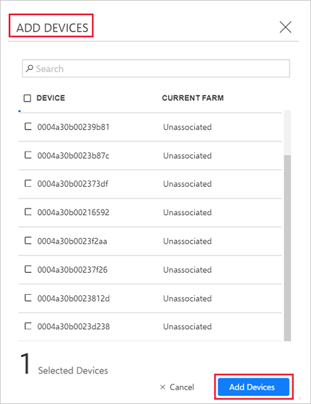

# Generate soil moisture map

  This article describes the process of generating a soil moisture heatmap for your farm through the Azure FarmBeats accelerator. In this article, you will learn how to:

1. [Create Farms](manage-farms.md#create-farms)
2. [Assign devices to Farms](get-sensor-data-from-sensor-partner.md#assign-devices)
3. [Generate Soil Moisture Heatmap](generate-maps.md#get-soil-moisture-heatmap)

## Before you begin

  Ensure the following prerequisites:  

1. An azure subscription
2. An instance of Azure FarmBeats running
3. Minimum 3 soil moisture sensors are available for the farm

## Create a farm

A farm is a geographical area of interest for which you want to create a soil moisture heatmap. You can create a Farm either using the [Farms API](http://aka.ms/FarmBeatsDatahubSwagger). Or you can [Create a Farm](manage-farms.md#create-farms) from the accelerator UI

## Deploy sensors

You should now physically deploy soil moisture sensors on the farm. You can purchase soil moisture sensors from our approved partners Davis or Teralytic and have them installed in your farm. You should coordinate with your sensor provider to do the physical setup on your farm.

## Get soil moisture sensor data from partner into Azure FarmBeats

Once the sensors start streaming data into the partner data dashboard, you will have to enable the data into Azure FarmBeats. This can be done from the partner application.

For example, if you have purchased Davis sensors, you will log into your weather link account, and provide the required credentials to enable the data streaming into Azure FarmBeats.

To get the required credentials, follow the instructions from [Get sensor data](get-sensor-data-from-sensor-partner.md#get-sensor-data-from-sensor-partners)

Once you enter your credentials and click **Submit** on the partner application, you can have the data flowing into Azure FarmBeats

### Assign soil moisture sensors to the farm

Once you have linked your sensor account into Azure FarmBeats, you need to assign the soil moisture sensors to the farm of interest.

1.	In the Home page, click on Farms from the menu, the Farms list page is displayed.
2.	Click **MyFarm** and click **Add Devices**.
3.	The **Add Devices** window displays. Select the device(s) that are linked to the soil moisture sensors for MyFarm.

  

4. Click **Add Devices**.     

## Generate soil moisture Heatmap

  This step is to create a job or a long running operation that will generate the soil moisture heatmap for MyFarm.

  1.	On the homepage, go to **Farms** from the left navigation menu to view the farms page.
  2.	Click **MyFarm**
  3.	In the **Farm Details** page, click **Generate Precision Map**.
  4.	From the drop-down menu, select **Soil Moisture**.
  5.	In the **Soil Moisture** window, select This Week.
  6.	In the **Select Soil Moisture** **Sensor Measure** drop-down, enter the soil moisture sensor measure(depth) for, which you want to generate the map.

  To find the sensor measure, go to Sensors, click any soil moisture sensor, under ‘Sensor Properties’ section use the value listed against ‘Measure Name’

  

7.	Click **Generate Maps**.
  A message confirmation displays about job creation, to generate the satellite indices map.
  For more information, refer the section Job Status in Jobs.
8.	The job should get completed in 3-4 hours

### Download the soil moisture Heatmap

1.	In the Jobs page, check the Job Status for the Job that was created in the previous section.
2.	Once it changes to Succeeded, go to **Maps** from the menu to view the maps page.
3.	Search the map you want to view by searching with the format *<soil-moisture_MyFarm_YYYY-MM-DD>* where YYYY-MM-DD is the date on which the job was created.
4.	Click the link in the **Name** column, a pop-up window displays with the preview of the map
5.	Click **Download** drop-down menu to select the download format.
  The map is downloaded and stored to the local folder of your computer.

  

## Next steps

For more information about sensor placement, [see sensor placement](generate-maps.md#sensor-placement-maps) and about ingest historical telemetry data, see [ingest historical telemetry data](ingest-historical-telemetry-data.md).
