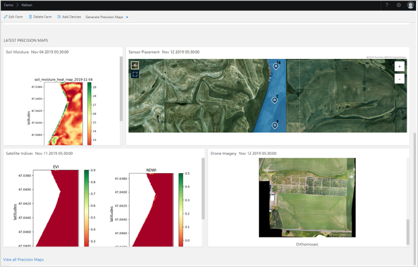
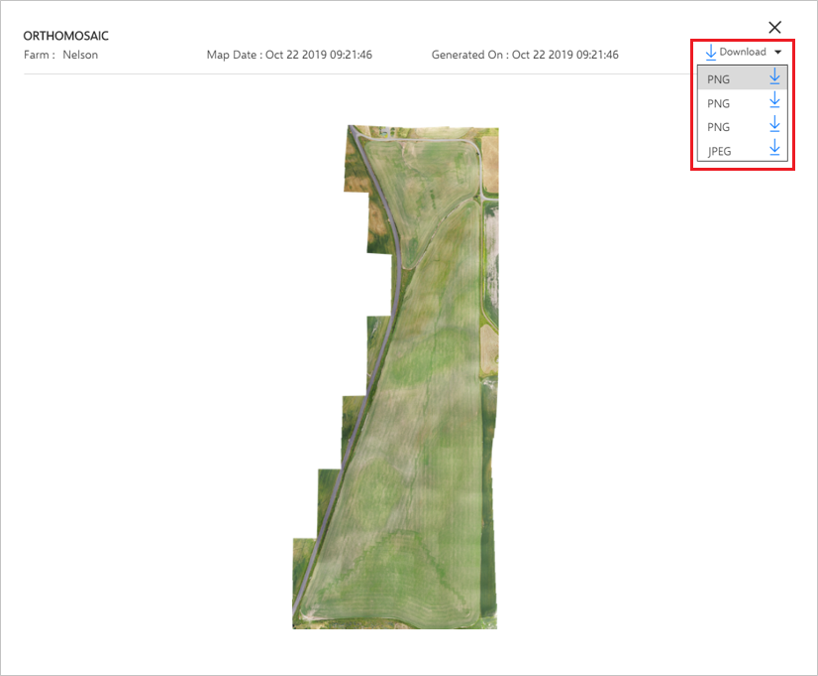

# Get drone imagery from drone partners

This article describes how you can bring in orthomosaic data from your drone imagery partners onto Azure FarmBeats Data hub. Currently the following imagery partners are supported:  

  

Integrating drone imagery data with Azure FarmBeats helps you get orthomosaic data from the drone flights you conduct on your farm into the Data hub. The data once available can be visualized through the FarmBeats Accelerator and can potentially be used for data fusion and AI/ML model building.

## Before you begin

  - Make sure you have deployed Azure FarmBeats. To deploy, visit [Deploy FarmBeats](prepare-for-deployment.md).
  - Ensure you have the farm (for which you want drone imagery) defined in your FarmBeats system.

## Enable drone imagery integration with FarmBeats   

You need to provide the following information to your device provider to enable the integration with FarmBeats:  
 - API Endpoint  
 - Tenant ID  
 - Client ID  
 - Client Secret  

Use the following steps:

1. Download this [script](https://aka.ms/farmbeatspartnerscript) and extract it in on your local drive. You will find two files inside this ZIP file.  
2. Sign in to [Azure portal](https://portal.azure.com/) and open Cloud Shell (This option is available on the top-right bar of the portal).   

    

3. Ensure the environment is set to **PowerShell**

    

4. Upload the two files that you downloaded (from step 1 above) in your Cloud Shell.  

    

5. Go to the directory where the files were uploaded (By default it gets uploaded to the home directory - </home/username/>  
6. Run the following script:

```
    powershell

    PS> ./generateCredentials.ps1

```

7. Follow the onscreen instructions to capture the values of </API Endpoint/>, </Tenant ID/>, </Client ID/>, </Client Secret/> and </EventHub Connection String/>.

    Once you enter the required credentials into the partner’s drone software system, you will be able to import all farms from the FarmBeats system and use the Farm details to do your flight path planning and drone image collection.

    After the raw images are processed by the drone providers’ software, the drone software system uploads the stitched orthomosaic & other processed images into the Data hub.

## View drone imagery

Once the data is sent to the FarmBeats data hub, you should be able to query the Scene Store using the FarmBeats Data hub APIs

Alternatively, you should be able to view the latest drone image in the **Farm Details** page. To view, follow the steps:  

1. Select the farm to which your imagery has been uploaded to. The **Farm** details page displays.
2. Scroll down to the latest **Precision Maps** section.
3. You should be able to view the image in the **Drone Imagery** section.

  

## Download drone imagery

If you select the drone Imagery section, a Popup opens, which show a high resolution image of the drone orthomosaic. Select **Download** to download the different files associated with this particular scene.



## View all drone maps

All the files and images uploaded by the drone provider are present in the Maps section. Select the **Maps** section, filter by **Farm** and choose the appropriate files to view and download:

  

## Next steps

Know how to use the FarmBeats data hub [PIs](references-for-farmbeats.md#rest-api) to get your drone imagery.
