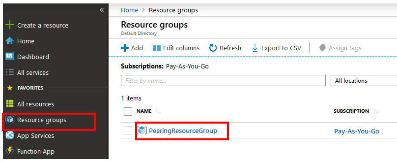
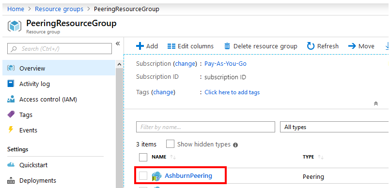
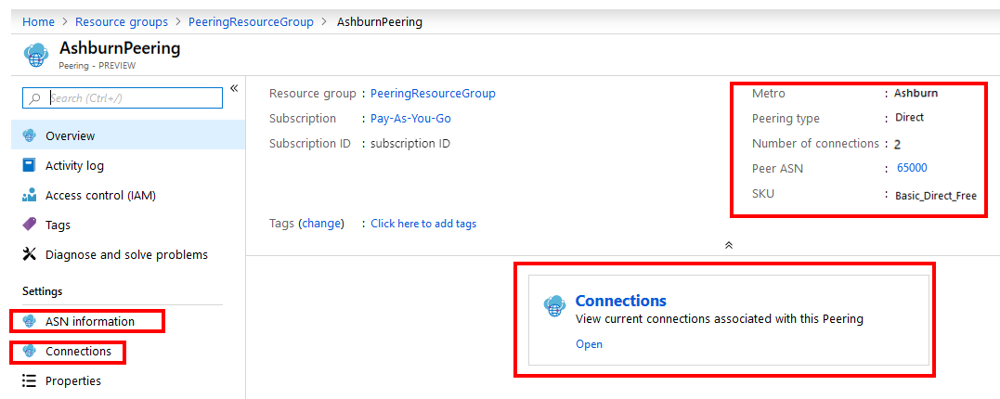
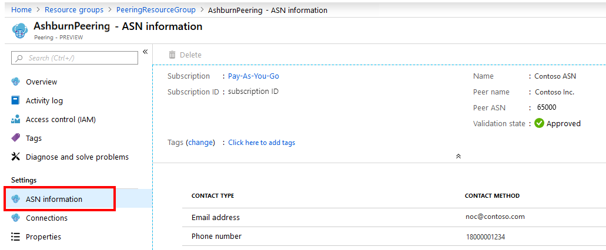
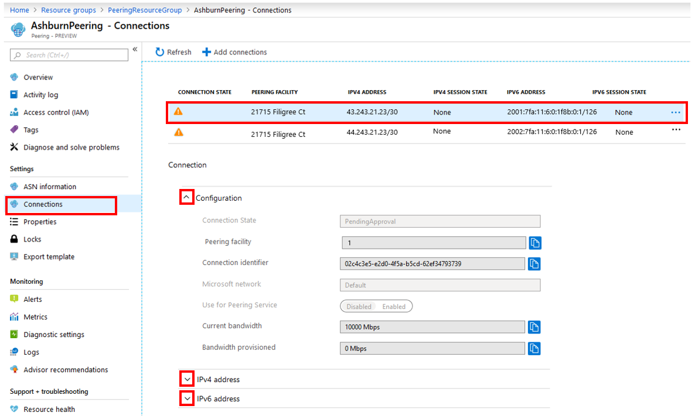

1. Go to **Resource groups** and click on the resource group you selected while creating Peering resource. You may use the *Filter* field if you have too many resource groups.

    > [!div class="mx-imgBorder"]
    > 

1. Click on the Peering resource you created.

    > [!div class="mx-imgBorder"]
    > 

1. The **Overview** page shows high-level information. Observe the info highlighted below.

    > [!div class="mx-imgBorder"]
    > 

1. On the left, click on **ASN information** to view information submitted while creating PeerAsn

    > [!div class="mx-imgBorder"]
    > 

1. On the left, click on **Connections**. Observe on the top a summary of peering connections between your ASN and Microsoft, across different facilities within the metro. You may also arrive at the connections summary from **Overview** page, by clicking on **Connections** in the center pane as highlighted above.

    > [!div class="mx-imgBorder"]
    > 

    * **Connection State** corresponds to the state of the peering connection set up. The states displayed in this field follow the state diagram shown in [Direct Peering walkthrough](../workflows-direct.md)
    * **IPv4 Session State** and **IPv6 Session State** correspond to the IPv4 and IPv6 BGP session states respectively.  
    * When you select a row on the top, the ***Connection*** section on the bottom shows details for each connection. You can click on arrow marks to expand the sub-sections ***Configuration***, ***IPv4 address*** and ***IPv6 address***
