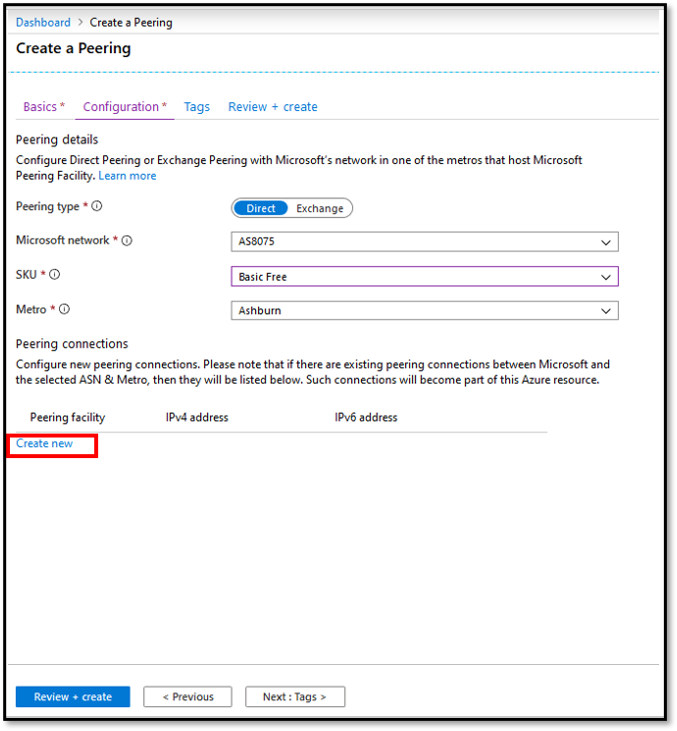
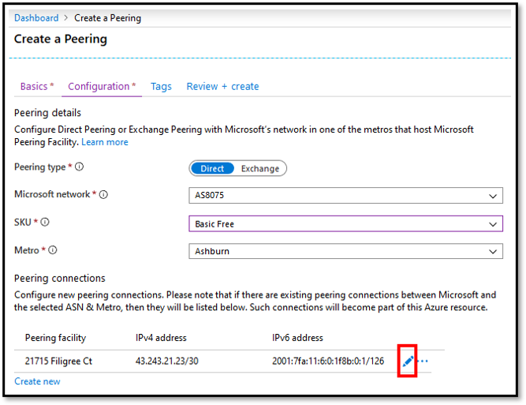
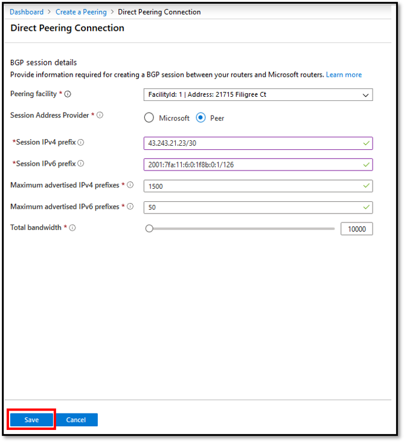
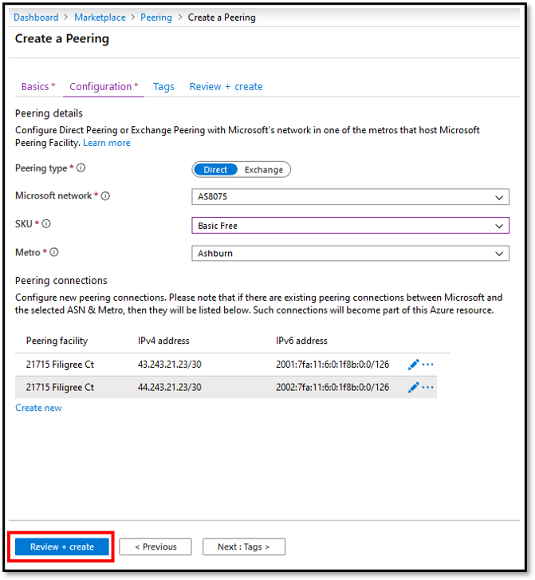
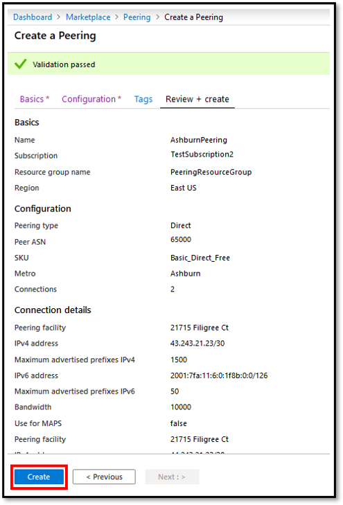
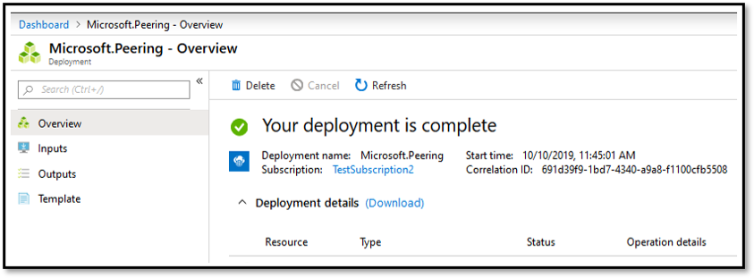

1. On the **Create a Peering** page, under **Configuration** tab, fill out the fields as shown below.

    > [!div class="mx-imgBorder"]
    > 

    * For **Peering type**, select *Direct*.
    * For **Microsoft network**, choose *AS8075*. Please do not create peering with ASN 8069. It is reserved for special applications and only used by [Microsoft Peering](mailto:peering@microsoft.com).
    * Select **SKU** as *Basic Free*. Please do not select *Premium Free* since it is reserved for special applications.
    * Choose the **Metro** location for where you want to setup peering.

        > [!NOTE]
        > If you already have peering connections with Microsoft in the selected **Metro** location, and you are using Azure Portal for the first time to setup peering in that location, then your existing peering connections will be listed in the **Peering connections** section as shown below. Microsoft will automatically convert these peering connections to Azure resource so that you can manage them all along with the new connections, in one place. See [Convert a legacy Direct Peering to Azure Resource using Portal](../internet-peering-howto-legacydirect-arm-portal.md) for more info.
        >

    * Under **Peering connections**, click **Create new** to add a line for each new connection you want to setup. Then, click the edit button for a line, highlighted below, to configure/modify connection settings.

        > [!div class="mx-imgBorder"]
        > 

    * To delete a line, click on **...** button > **Delete**.

        > [!div class="mx-imgBorder"]
        > 

    * You are required to provide all the settings for a connection as shown below.

         > [!div class="mx-imgBorder"]
         > 

        1. Select the **Peering facility** where the connection needs to be setup.
        1. **Session Address Provider** is used to determine who provides the subnet needed to setup BGP session between your network and Microsoft. If you are able to provide subnet, then choose *Peer*. Else choose **Microsoft** and [Microsoft Peering](mailto:peering@microsoft.com) will contact you. Note that choosing so, would take longer for Microsoft to process the Peering request. In some cases Microsoft may not be able to provide subnets which will result in request denial.
        1. If you chose **Session Address Provider** as *Peer*, then enter IPv4 and IPv6 address along with prefix mask in the fields **Session IPv4 Prefix** and **Session IPv6 Prefix** respectively.
        1. Enter the number of IPv4 and IPv6 prefixes you will advertize in the fields **Maximum advertised IPv4 addresses** and **Maximum advertised IPv6 addresses** respectively.
        1. Adjust the **Total Bandwidth** slider to reflect the bandwidth for the connection.
        1. Click **OK** to save your connection settings.

    * Repeat above step to add more connections at any facility where Microsoft is colocated with your network, within the **Metro** selected previously.
    * After adding all the required connections, click on **Review + create**.

        > [!div class="mx-imgBorder"]
        > 

    * Observe that Azure Portal runs basic validation of the information you entered. This is displayed in a ribbon on the top, as *Running final validation...*.

        > [!div class="mx-imgBorder"]
        > 

    * After it turns to *Validation Passed*, verify your information and submit the request by clicking **Create**. If you need to modify your request, click on **Previous** and repeat the steps above.

        > [!div class="mx-imgBorder"]
        > 

    * Once you submit the request, wait for it to complete deployment. If deployment fails, please contact [Microsoft Peering](mailto:peering@microsoft.com). A successful deployment will appear as below.

        > [!div class="mx-imgBorder"]
        > 
