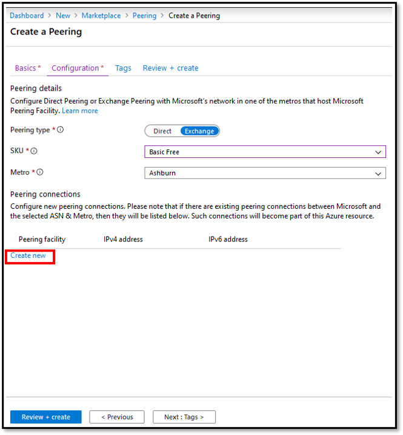
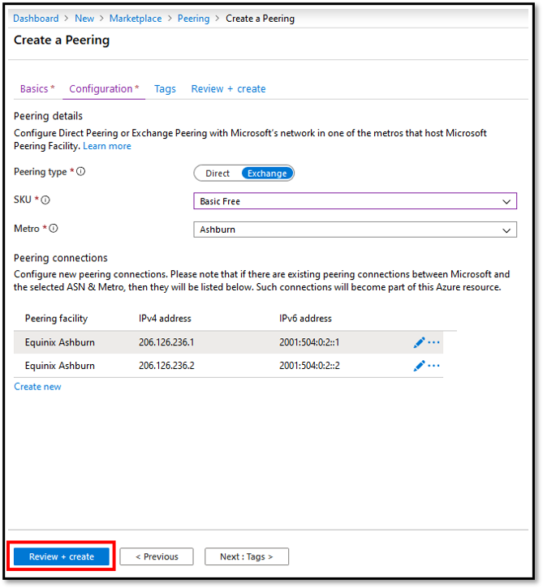
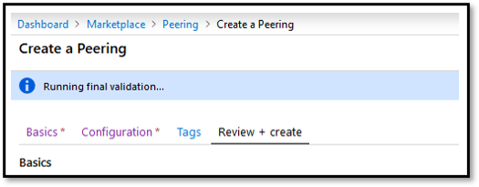
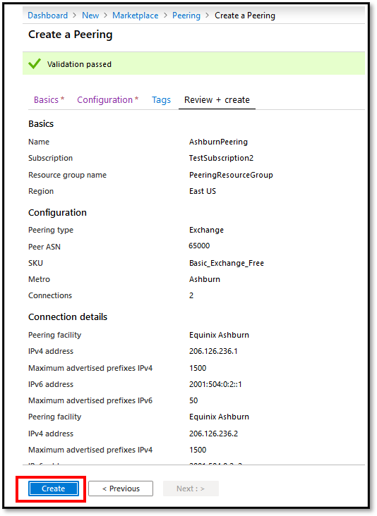

1. On the **Create a Peering** page, under **Configuration** tab, fill out the fields as shown below.

    > [!div class="mx-imgBorder"]
    > 

    * For **Peering type**, select *Exchange*.
    * Select **SKU** as *Basic Free*.
    * Choose the **Metro** location for where you want to convert peering to Azure resource. If you have peering connections with Microsoft in the selected **Metro** location that are not converted to Azure resource, then such connections will be listed in the **Peering connections** section as shown below. You can now convert these peering connections to Azure resource.

        > [!div class="mx-imgBorder"]
        > 

        > [!NOTE]
        > You cannot modify settings for legacy peering connections. If you want to add additional peering connections with Microsoft in the selected **Metro** location you may do so by clicking **Create new** button. See [Create or modify an Exchange Peering using Portal](../internet-peering-howto-exchangepeering-arm-portal.md) for more info.
        >

    * Click on **Review + create**. Observe that Azure portal runs basic validation of the information you entered. This is displayed in a ribbon on the top, as *Running final validation...*.

        > [!div class="mx-imgBorder"]
        > 

    * After it turns to *Validation Passed*, verify your information and submit the request by clicking **Create**. If you need to modify your request, click on **Previous** and repeat the steps above.

        > [!div class="mx-imgBorder"]
        > 

    * Once you submit the request, wait for it to complete deployment. If deployment fails, please contact [Microsoft Peering](mailto:peering@microsoft.com). A successful deployment will appear as below.

        > [!div class="mx-imgBorder"]
        > 
