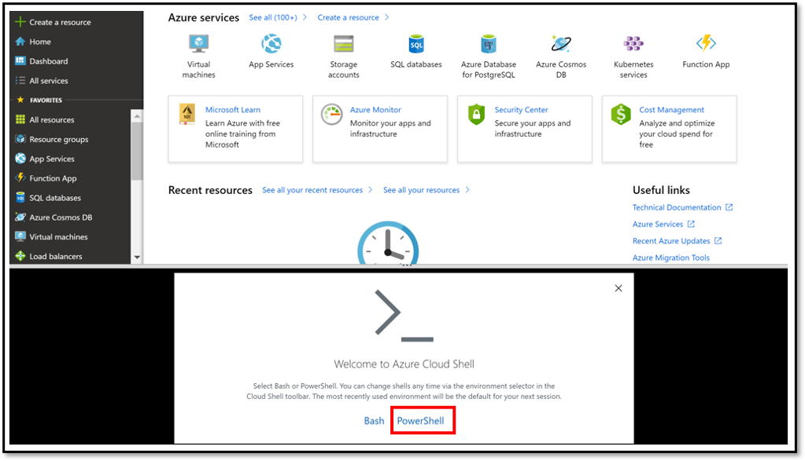
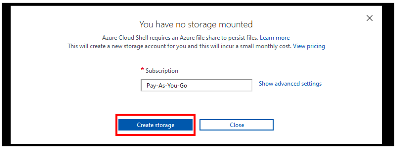
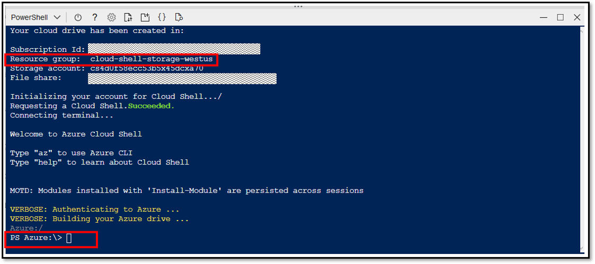
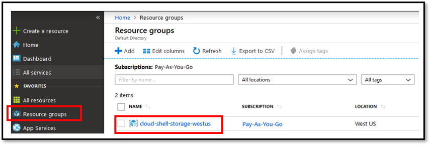
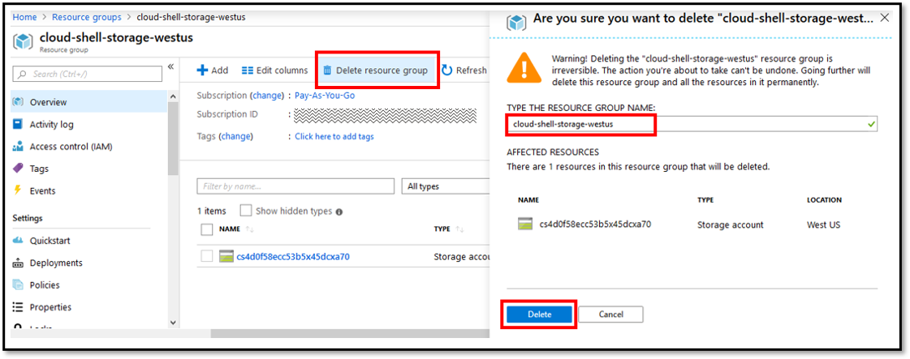

Peering setup using Azure Portal is currently under Preview. Therefore, you need to register Peering feature flag and Peering resource provider for your subscription.

1. Click on the icon for *Cloud Shell* on the top right corner of your portal.

    > [!div class="mx-imgBorder"]
    > 

1. Click **PowerShell**

    > [!div class="mx-imgBorder"]
    > 

1. Click **Create Storage** as it is required to run PowerShell commands in browser

    > [!div class="mx-imgBorder"]
    > 

    > [!NOTE]
    > Please note that this operation creates a storage account. You may delete it after executing the registration. To do so, note the **Resource group** name in the next step since you will need it later.

1. Once PowerShell is initialized, it will look like below.

    > [!div class="mx-imgBorder"]
    > 

1. Now, run the following commands to register Peering feature flag. You can enable it for the specific type of Peering you plan to setup. Or optionally enable it for both Direct Peering and Exchange Peering.

    To enable Peering feature flag for Direct Peering use below.

     ```powershell
    Register-AzProviderFeature -FeatureName AllowDirectPeering -ProviderNamespace Microsoft.Peering
    ```

    To enable Peering feature flag for Exchange Peering use below.

     ```powershell
    Register-AzProviderFeature -FeatureName AllowExchangePeering -ProviderNamespace Microsoft.Peering
    ```

    To check registration status, use below.

     ```powershell
    Get-AzProviderFeature -FeatureName AllowDirectPeering -ProviderNamespace Microsoft.Peering
    ```

    Below is an example response:

    ```powershell
    FeatureName          ProviderName      RegistrationState
    -----------          ------------      -----------------
    AllowDirectPeering   Microsoft.Peering Registered
    ```

    > [!IMPORTANT]
    > Please wait for *RegistrationState* to turn "Registered" before proceeding. It may take 5 to 30 minutes after you execute the command.

1. Run the following commands to register Peering resource provider.

    ```powershell
    Register-AzResourceProvider -ProviderNamespace Microsoft.Peering
    ```

    You can check the registration status using the commands below:
    ```powershell
    Get-AzResourceProvider -ProviderNamespace Microsoft.Peering
    ```

    > [!IMPORTANT]
    > Please wait for *RegistrationState* to turn "Registered" before proceeding. It may take 5 to 30 minutes after you execute the command.

1. Click **X** once you are done executing the commands above.

    > [!div class="mx-imgBorder"]
    > 

#### Optional:

To delete the storage account created in a step above, follow the steps below.

1. Click **Resource groups** and then click on the resource group name noted above.

    > [!div class="mx-imgBorder"]
    > 

1. Deleting the resource group will delete the storage account.

    > [!div class="mx-imgBorder"]
    > 

