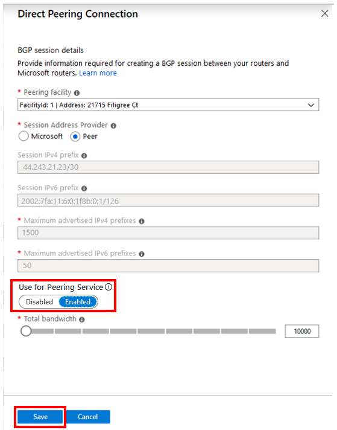
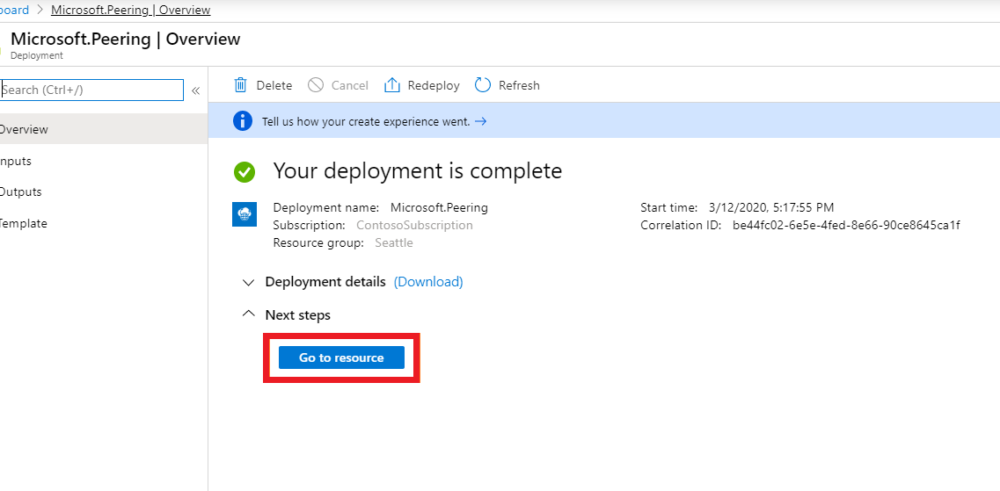

1. Click on a peering connection you want to enable for Peering Service and then, click on the **...** > **Edit connection** button.
    > [!div class="mx-imgBorder"]
    > 
1. Under the section ***Use for Peering Service***, click on **Enabled** and **Save**.
    > [!div class="mx-imgBorder"]
    > 
1. In the Overview screen, you will see the deployment details. Once your deployment is complete, click on **Go to resource**.
    > [!div class="mx-imgBorder"]
    > 
1. You will then see under Settings **Registered Prefixes**. Click on **Add Registered Prefix**.
    > [!div class="mx-imgBorder"]
    > 
1. Register a prefix by selecting a **Name** and a **Prefix** and click **Save**.
    > [!div class="mx-imgBorder"]
    >   

1. Once a prefix is created, you will see it in the list of Registered Prefixes. Click on the **Name** of the prefix to see more details.
    > [!div class="mx-imgBorder"]
    > 