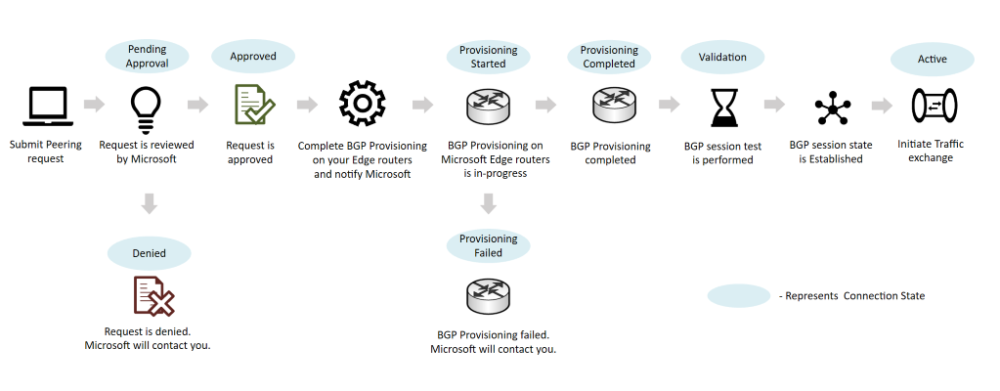

# Exchange Peering walkthrough

This section explains the steps you need to follow to setup and manage an Exchange Peering.

## Create an Exchange Peering
> [!div class="mx-imgBorder"]
> 

The following steps must be followed in order to provision an Exchange Peering:
1. Please review Microsoft [Peering policy](https://peering.azurewebsites.net/peering) to understand requirements for Exchange Peering.
1. Find Microsoft peering location and peering facility id in [Peeringdb](https://www.peeringdb.com/net/694)
1. Request Exchange Peering for a peering location using the instructions in [Create and modify an Exchange Peering using PowerShell](howto-exchangepeering-arm.md) article for more details.
1. After you submit a Peering request, Microsoft will review the request and contact you if required.
1. Once approved, connection state changes to Approved
1. Configure BGP session at your end and notify Microsoft
1. We will provision BGP session with DENY ALL policy and validate end-to-end.
1. If successful, you will receive a notification that peering connection state is Active.
1. Traffic will then be allowed through the new peering.

Please note that connection states are not to be confused with standard [BGP](https://en.wikipedia.org/wiki/Border_Gateway_Protocol) session states.

## Convert a legacy Exchange Peering to Azure resource
The following steps must be followed in order to convert a legacy Exchange Peering to Azure resource:
1. Follow the instructions in [Convert a legacy Exchange Peering to Azure resource](howto-legacyexchange-arm.md)
1. After you submit the conversion request, Microsoft will review the request and contact you if required.
1. Once approved, you will see your Exchange Peering with connection state as Active.

## Deprovision Exchange Peering
Please contact [Microsoft Peering](mailto:peering@microsoft.com) to deprovision Exchange Peering.

When an Exchange Peering is set for deprovision, you will see the connection state as **PendingRemove**

> [!NOTE]
> If you run the PowerShell cmdlet to delete the Exchange Peering when the connection state is ProvisioningStarted or ProvisioningCompleted the operation will fail.

## Next steps

* Learn about [Prerequisites to setup peering with Microsoft](prerequisites.md).
