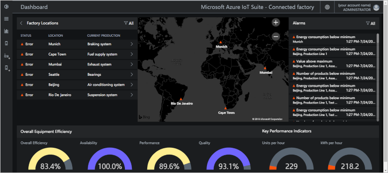

# What are Azure IoT solution accelerators?

A cloud-based IoT solution typically uses custom code and cloud services to manage device connectivity, data processing and analytics, and presentation.

The IoT solution accelerators are complete, ready-to-deploy IoT solutions that implement common IoT scenarios. The scenarios include remote monitoring, connected factory, predictive maintenance, and device simulation. When you deploy a solution accelerator, the deployment includes all the required cloud-based services along with any required application code.

The solution accelerators are starting points for your own IoT solutions. The source code for all the solution accelerators is open source and is available in GitHub. You're encouraged to download and customize the solution accelerators to meet your requirements.

You can also use the solution accelerators as learning tools before building a custom IoT solution from scratch. The solution accelerators implement proven practices for cloud-based IoT solutions for you to follow.

The application code in each solution accelerator includes a web app that lets you manage the solution accelerator.

## Supported IoT scenarios

Currently, there are four solution accelerators available for you to deploy:

### Remote Monitoring

Use the [Remote Monitoring solution accelerator](iot-accelerators-remote-monitoring-sample-walkthrough.md) to collect telemetry from remote devices and to control them. Example devices include cooling systems installed on your customers' premises or valves installed in remote pump stations.

You can use the remote monitoring dashboard to view the telemetry from your connected devices, provision new devices, or upgrade the firmware on your connected devices:

### Connected Factory

Use the [Connected Factory solution accelerator](iot-accelerators-connected-factory-features.md) to collect telemetry from industrial assets with an [OPC Unified Architecture](https://opcfoundation.org/about/opc-technologies/opc-ua/) interface and to control them. Industrial assets might include assembly and test stations on a factory production line.

You can use the connected factory dashboard to monitor and manage your industrial devices:

### Predictive Maintenance

Use the [Predictive Maintenance solution accelerator](iot-accelerators-predictive-walkthrough.md) to predict when a remote device is expected to fail so you can carry out maintenance before the device fails. This solution accelerator uses machine learning algorithms to predict failures from device telemetry. Example devices might be airplane engines or elevators.

You can use the predictive maintenance dashboard to view predictive maintenance analytics:

### Device Simulation

Use the [Device Simulation solution accelerator](iot-accelerators-device-simulation-overview.md) to run simulated devices that generate realistic telemetry. You can use this solution accelerator to test the behavior of the other solution accelerators or to test your own custom IoT solutions.

You can use the device simulation web app to configure and run simulations:

## Design principles

All the solution accelerators follow the same design principles and goals. They're designed to be:

* **Scalable**, letting you connect and manage millions of connected devices.
* **Extensible**, enabling you to customize them to meet your requirements.
* **Comprehensible**, enabling you to understand how they work and how they're implemented.
* **Modular**, letting you swap out services for alternatives.
* **Secure**, combining Azure security with built-in connectivity and device security features.

## Architectures and languages

The original solution accelerators were written using .NET using a model-view-controller (MVC) architecture. Microsoft is updating the solution accelerators to a new microservices architecture. The following table shows the current status of the solution accelerators with links to the GitHub repositories:

| Solution accelerator   | Architecture  | Languages     |
| ---------------------- | ------------- | ------------- |
| Remote Monitoring      | Microservices | [Java](https://github.com/Azure/azure-iot-pcs-remote-monitoring-java) and [.NET](https://github.com/Azure/azure-iot-pcs-remote-monitoring-dotnet) |
| Predictive Maintenance | MVC           | [.NET](https://github.com/Azure/azure-iot-predictive-maintenance)          |
| Connected Factory      | MVC           | [.NET](https://github.com/Azure/azure-iot-connected-factory)          |
| Device Simulation      | Microservices | [.NET](https://github.com/Azure/device-simulation-dotnet)          |

To learn more about the microservices architecture, see [Introduction to the Azure IoT reference architecture](https://docs.microsoft.com/en-us/azure/architecture/reference-architectures/iot/).

## Deployment options

You can deploy the solution accelerators from the [Microsoft Azure IoT Solution Accelerators](https://www.azureiotsolutions.com/Accelerators#) site or using the command line.

You can deploy the Remote Monitoring solution accelerator in the following configurations:

* **Standard:** Expanded infrastructure deployment for developing a production deployment. The Azure Container Service deploys the microservices to several Azure virtual machines. Kubernetes orchestrates the Docker containers that host the individual microservices.
* **Basic:** Reduced cost version for a demonstration or to test a deployment. All the microservices deploy to a single Azure virtual machine.
* **Local:** Local machine deployment for testing and development. This approach deploys the microservices to a local Docker container and connects to IoT Hub, Azure Cosmos DB, and Azure storage services in the cloud.

The cost of running a solution accelerator is the combined [cost of running the underlying Azure services](https://azure.microsoft.com/pricing). You see details of the Azure services used when you choose your deployment options.

## Next steps

To try out one of the IoT solution accelerators, check out the quickstarts:

* [Try a remote monitoring solution](quickstart-remote-monitoring-deploy.md)
* [Try a connected factory solution](quickstart-connected-factory-deploy.md)
* [Try a predictive maintenance solution](quickstart-predictive-maintenance-deploy.md)
* [Try a device simulation solution](quickstart-device-simulation-deploy.md)
