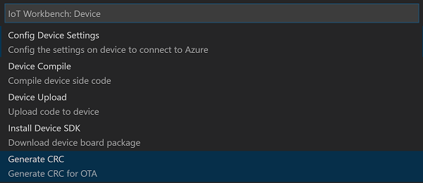
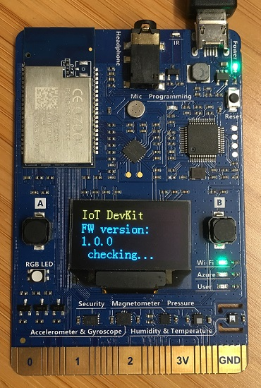

# Tutorial: Update firmware through automatic device management

In this tutorial, you use the Remote Monitoring solution accelerator to implement a firmware update on an MXChip IoT DevKit device connected to your solution.

Contoso needs to update multiple IoT DevKit devices with a new firmware version you do not want to individually update the firmware on each device. To instead update the firmware on all of your connected MXChip devices at once, you can use automatic device management in Remote Monitoring, a feature of IoT Hub, to ensure that any MXChips that come into scope will have the latest firmware version as soon as it is online.

In this tutorial, you:

>[!div class="checklist"]
> * Create a device group
> * Prepare and host the firmware
> * Create a device configuration
> * Import a configuration
> * Deploy the configuration to your devices
> * Monitor the deployment

If you don't have an Azure subscription, create a [free account](https://azure.microsoft.com/free/?WT.mc_id=A261C142F) before you begin.

[!INCLUDE [iot-accelerators-tutorial-prereqs](../../includes/iot-accelerators-tutorial-prereqs.md)]

You will also need to have connected at least one MXChip IoT DevKit device to your Remote Monitoring solution accelerator. If you have not done this yet, you should follow the instructions to [connect a MXChip IoT DevKit to Remote Monitoring](iot-accelerators-arduino-iot-devkit-az3166-devkit-remote-monitoringV2.md).

## Create a device group
To apply an automatic device configuration to your MXChip, your device will need to be part of a device group. Add your MXChip to a new device group called **MXChips**. If you are unfamiliar with creating device groups in Remote Monitoring, you can follow instructions on how to [organize your devices](iot-accelerators-remote-monitoring-manage#organize-your-devices).     

## Prepare and host the firmware
The firmware update example is also part of the [Azure IoT Workbench](https://marketplace.visualstudio.com/items?itemName=vsciot-vscode.vscode-iot-workbench) extension. Before continuing, make sure the [bootloader](https://microsoft.github.io/azure-iot-developer-kit/docs/firmware-upgrading/) on your IoT DevKit and the [IoT DevKit SDK](https://microsoft.github.io/azure-iot-developer-kit/versions/) are both updated to [v1.4.0](https://github.com/Microsoft/devkit-sdk/releases/tag/1.4.0) or higher. The SDK can be updated through the **Arduino: Board Manager** in the command palette.

### Open Firmware OTA sample in VS Code

1. Make sure your IoT DevKit is **not connected** to your computer. Start VS Code first, and then connect the DevKit to your computer.

2. Click `F1` to open the command palette, type and select **IoT Workbench: Examples**. Then select **IoT DevKit** as the board.

3. Find **Firmware OTA** and click **Open Sample**. It opens a new VS Code window with project folder in it.

   

### Build the new firmware
The initial version of the device firmware will show 1.0.0. The new firmware should have a higher version number.

1. Open the FirmwareOTA.ino file and change the `currentFirmwareVersion` from 1.0.0 to 1.0.1.
   

2. Open the command palette and select **IoT Workbench: Device**, then select **Device Compile** to compile the code.

   

3. VS Code will then compile the code and generate the **.bin** file. Take the file and put it into the **.build** folder.
   

### Generate the CRC value and firmware file size

1. Open the command palette and select **IoT Workbench: Device**. Then select **Generate CRC**.

   

2. VS Code will then generate and print the CRC value, full firmware filename, and the file size in the output window. Save these values for later use.

   

### Upload the firmware to the cloud
1. Create a Azure Storage Account.

   Follow this [tutorial](https://docs.microsoft.com/azure/storage/common/storage-quickstart-create-account) to create a new Storage Account, or skip this step if you want to use a existing one.

2. Navigate to your new storage account in the Azure portal, scroll to the Blob Service section, then select **Blobs**. Create a public container for storing firmware files.

   

3. Upload firmware file to the blob container.

   You can use the [Azure Portal](https://docs.microsoft.com/azure/storage/blobs/storage-quickstart-blobs-portal), [Storage Explorer](https://docs.microsoft.com/azure/storage/blobs/storage-quickstart-blobs-storage-explorer) or [CLI](https://docs.microsoft.com/azure/storage/blobs/storage-quickstart-blobs-cli) to complete this step.

4. After the firmware file is uploaded, save the URL for use later.

### Build and upload the original firmware to the MXChip

1. Back in VS Code, set the `currentFirmwareVersion` back to 1.0.0.

   

2. Open the command palette and select **IoT Workbench: Device**, then select **Device Upload**.

   

3. VS Code will then start verifying and uploading the code to your IoT DevKit.

   

4. After the code has been uploaded, you will see the DevKit reboot. Once the reboot is complete, the screen of IoT DevKit should show version 1.0.0, and that it is checking for the new firmware.

   

## Create a device configuration
Automatic device management works by targeting a set of devices based on their properties, defining a desired configuration, and letting IoT Hub update devices whenever they come into scope. Typically, confgurations are defined by a developer and then managed by an operator.

1. In the Azure Portal, navigate to the IoT Hub that is part of your Remote Monitoring solution and has the MXChip connected to it. Select **IoT device configuration** and then select **Add Configuration**.

2. On the **Create Configuration > Name and Label** page enter then name **firmware-update**. Add the following labels to describe your configuration further:

    |Name|Value|
    |---|---|
    |Version|1.0.1|
    |Device|MXChip|

    Click **Next**.

3. On the **Create Configuration > Specify Settings** page enter **properties.desired.firmware** for the Device Twin Path. This is the path to the JSON section within the twin desired properties that will be set. Next, specify the JSON content to be inserted into that section:

    * "fwVersion" : [firmware version](#build-the-new-firmware) (string).
    * "fwPackageURI" : [URL of the firmware](#upload-the-firmware-to-the-cloud) (string).
    * "fwPackageCheckValue" : [CRC value of the firmware](#generate-the-crc-value-and-firmware-file-size) (string).
    * "fwSize" : [file size of the firmware](#generate-the-crc-value-and-firmware-file-size) (int).

    The final configuration content should look like this:
    

    Click **Next**.
 
4. On the **Create Configuration > Specify Metrics** page, add in the following Custom Metrics into your configuration and then click **Next**. These custom metrics will allow you to understand a summary count of the state of your MXChip devices during the update process.
    |Metric Name|Metric Criteria|
    |---|---|
    |Current|`SELECT deviceId FROM devices WHERE properties.reported.firmware.fwUpdateStatus='Current' AND properties.reported.firmware.type='IoTDevKit'`|
    |Downloading|`SELECT deviceId FROM devices WHERE properties.reported.firmware.fwUpdateStatus='Downloading' AND properties.reported.firmware.type='IoTDevKit'`|
    |Verifying|`SELECT deviceId FROM devices WHERE properties.reported.firmware.fwUpdateStatus='Verifying' AND properties.reported.firmware.type='IoTDevKit'`|
    |Applying|`SELECT deviceId FROM devices WHERE properties.reported.firmware.fwUpdateStatus='Applying' AND properties.reported.firmware.type='IoTDevKit'`|
    |Error|`SELECT deviceId FROM devices WHERE properties.reported.firmware.fwUpdateStatus='Error' AND properties.reported.firmware.type='IoTDevKit`|

    

5. On the **Create Configuration > Target Devices** page enter 10 as the Priority and then click **Next**. Note that this priority value will be overriden by the value that is set in Remote Monitoring when actually deploying the configuration.

6. On the **Create Configuration > Review Configuration** page review the summary of the configuration and then click **Submit**.

7. On the main **IoT device configuration** page you should now see **firmware-update** listed as a configuraton.

8. Click the **firmware-update** configuration and then click **Download configuration file**. Save the file as **firmware-update.json** to a suitable location on your local machine. You will need this file in the next section of this tutorial.

    

## Import a configuration
In this section you import the device configuration as a pacakage into the Remote Monitoring solution accelerator.

1. In the Remote Monitoring web UI, navigate to the **Packages** page and click **+ New Package**.
    

2. On the New Package panel, choose **Device configuration** as the package type and **Firmware - MXChip** as the configuration type. Click **Browse** to find the **firmware-update.json** file on your local machine, and then click **Upload**.
    

3. The list of packages will now include the **firmware-update** package. You will also see the labels that are part of the configuration file in the summary section.

## Deploy the configuration to your devices
In this section, you create and execute a deployment that applies the configuration to your MXChip device(s).

1. In the Remote Monitoring web UI, navigate to the **Deployments** page and click **+ New deployment**:

    

2. In the **New deployment** panel, create a deployment with the following settings:

    |Option|Value|
    |---|---|
    |Name|Deploy firmware update|
    |Package type|Device Configuration|
    |Configuration type|Firmware - MXChip|
    |Package|firmware-update.json|
    |Device Group|MXChips|
    |Priority|10|

    

    Click **Apply**. You will see a new deployment in the **Deployments** page which shows the following metrics:

    * **Targeted** shows the number of devices in the device group.
    * **Applied** shows the number of devices whose desired properties in the *device twins* were updated with the configuration content.
    * **Succeeded** shows the number of MXChips in the deployment reporting success from the reported properties of the MXChip device twin.
    * **Failed** shows the number of Edge devices in the deployment reporting failure from the reported properties of the MXChip device twin.

## Monitor the deployment
After a few minutes, the MXChip will retrieve the new firmware information from Azure IoT Hub and start downloading onto the device.

The download may take a couple of minutes (depending on the speed of your network). After the firmware has finished downloading, it will verify the file size and CRC value to check whether it is the same information that you set in the configuration file. The screen on the MXChip will display "passed" if there is a match.

 

If the check has been successful, the device will reboot. You will see a countdown from 5 - 0 before this happens.

 

After the reboot, the underlying bootloader in the IoT DevKit will upgrade the firmware to the new version, which may take several seconds. During this stage you will see the RGB LED show RED and the screen will be black.

 

When this is finished, your MXChip will now be running the new firmware with version 1.0.1.

 

You can also click on the deployment within the **Deployments** page in Remote Monitoring to see the status of your device as it updates. Here you will find the status per device in your device group and the custom metrics which you defined in your configuration. 

## Next steps
This tutorial showed you how to update the firmware of your MXChip device through automatic device management in Remote Monitoring. To learn more about working with device configurations in the Remote Monitoring solution, see the following how-to-guide:

To learn more about automatic device managment, see [Configure and monitor IoT devices at scale using the Azure portal](https://docs.microsoft.com/azure/iot-hub/iot-hub-auto-device-config)