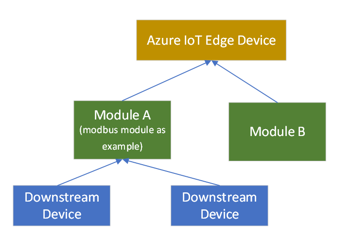
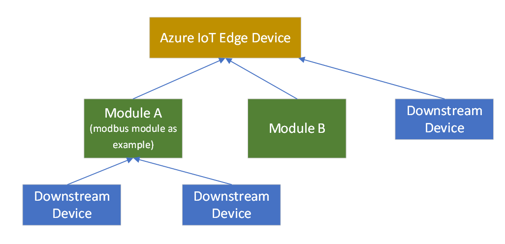
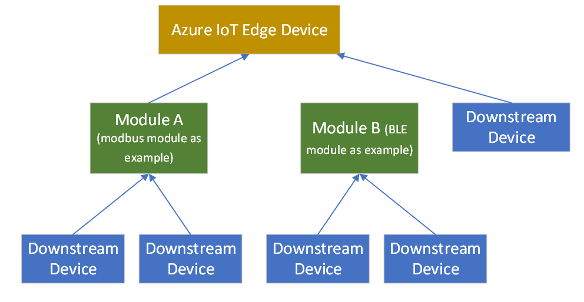
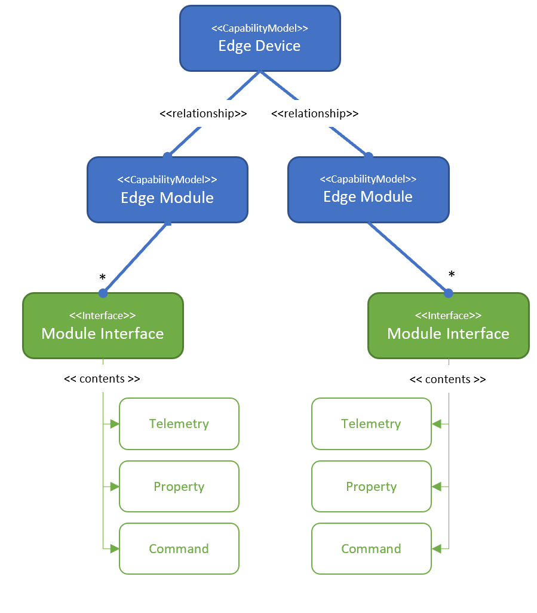

# Connect Azure IoT Edge devices to an Azure IoT Central application

IoT Edge is made up of three components:

* **IoT Edge modules** are containers that run Azure services, partner services, or your own code. Modules are deployed to IoT Edge devices, and run locally on those devices.
* The **IoT Edge runtime** runs on each IoT Edge device, and manages the modules deployed to each device.
* A **cloud-based interface** enables you to remotely monitor and manage IoT Edge devices. IoT Central is the cloud interface.

An **Azure IoT Edge** device can be a gateway device, with downstream devices connecting into the IoT Edge device. This article shares more information about downstream device connectivity patterns.

A **device template** defines the capabilities of your device and IoT Edge modules. Capabilities include telemetry the module sends, module properties, and the commands a module responds to.

## Downstream device relationships with a gateway and modules

Downstream devices can connect to an IoT Edge gateway device through the `$edgeHub` module. This IoT Edge device becomes a transparent gateway in this scenario.

Downstream devices can also connect to an IoT Edge gateway device through a custom module. In the following scenario, downstream devices connect through a Modbus custom module.

The following diagram shows connection to an IoT Edge gateway device through both types of modules (custom and `$edgeHub`).  

Finally, downstream devices can connect to an IoT Edge gateway device through multiple custom modules. The following diagram shows downstream devices connecting through a Modbus custom module, a BLE custom module, and the `$edgeHub` module. 

## Deployment manifests and device templates

In IoT Edge, you can deploy and manage business logic in the form of modules. IoT Edge modules are the smallest unit of computation managed by IoT Edge, and can contain Azure services (such as Azure Stream Analytics), or your own solution-specific code. To understand how modules are developed, deployed, and maintained, see [IoT Edge modules](../../iot-edge/iot-edge-modules.md).

At a high level, a deployment manifest is a list of module twins that are configured with their desired properties. A deployment manifest tells an IoT Edge device (or a group of devices) which modules to install, and how to configure them. Deployment manifests include the desired properties for each module twin. IoT Edge devices report back the reported properties for each module.

Use Visual Studio Code to create a deployment manifest. To learn more, see [Azure IoT Edge for Visual Studio Code](https://marketplace.visualstudio.com/items?itemName=vsciot-vscode.azure-iot-edge).

In Azure IoT Central, you can import a deployment manifest to create a device template. The following flowchart shows a deployment manifest life cycle in IoT Central.

IoT Plug and Play models an IoT Edge device as follows:

* Every IoT Edge device template has a device capability model.
* For every custom module listed in the deployment manifest, a module capability model is generated.
* A relationship is established between each module capability model and a device capability model.
* A module capability model implements module interfaces.
* Each module interface contains telemetry, properties, and commands.

## IoT Edge gateway devices

If you selected an IoT Edge device to be a gateway device, you can add downstream relationships to device capability models for devices you want to connect to the gateway device.

## Next steps

Now that you know what IoT Central application templates are, get started by [creating an IoT Central Application](quick-deploy-iot-central.md).