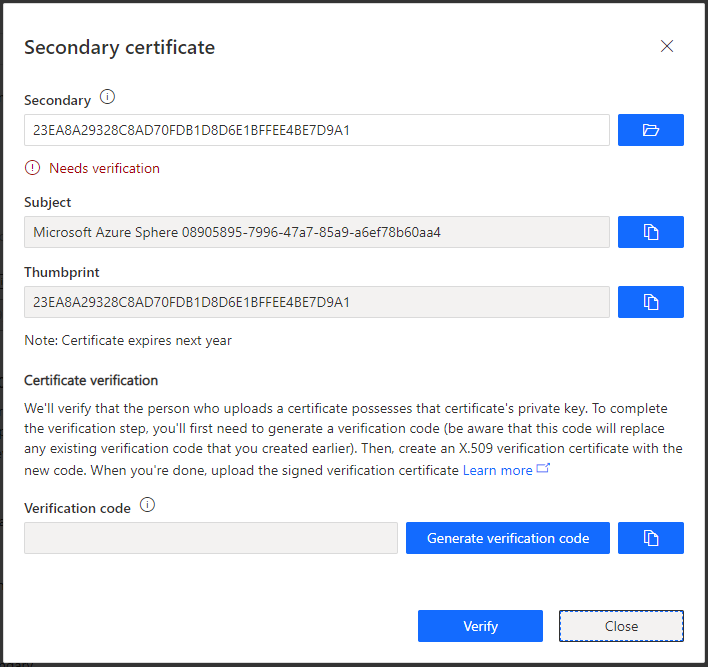
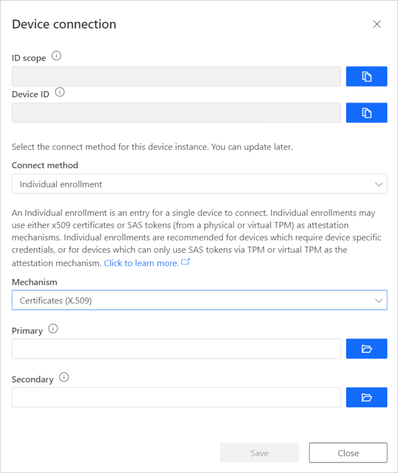

# How to connect devices with X.509 certificates using Node.js device SDK for IoT Central Application

In this article, learn how to connect devices with both group and individual enrollments using X.509 certificates

## Prerequisites

- Review of [Get connected to Azure IoT Central](concepts-get-connected.md).
- Completion of [Create and connect a client application to your Azure IoT Central application (Node.js)](./tutorial-connect-device-nodejs.md).
- [Node.js v4.0+](https://nodejs.org).
- [Git](https://git-scm.com/download/).
- [OpenSSL](https://www.openssl.org/).


## Prepare the environment 

1. Complete the steps in the [Create and connect a client application to your Azure IoT Central application (Node.js)](./tutorial-connect-device-nodejs.md).before you proceed.

2. Make sure you have [Node.js v4.0 or above](https://nodejs.org) installed on your machine.

3. Make sure [Git](https://git-scm.com/download/) is installed on your machine and is added to the environment variables accessible to the command window. 

4. Make sure [OpenSSL](https://www.openssl.org/) is installed on your machine and is added to the environment variables accessible to the command window. This library can either be built and installed from source or downloaded and installed from a [third party](https://wiki.openssl.org/index.php/Binaries) such as [this](https://sourceforge.net/projects/openssl/). 


## Connect devices using X.509 certificate for group enrollment entry

In this section, you will use a self-signed X.509 certificate to connect devices for enrollment groups which are used to enroll multiple related devices.

1. Open a command prompt. Clone the GitHub repo for the code samples:
    
    ```cmd/sh
    git clone https://github.com/Azure/azure-iot-sdk-node.git
    ```

2. Navigate to the certificate generator script and build the project. 

    ```cmd/sh
    cd azure-iot-sdk-node/provisioning/tools
    npm install
    ```

3. Create a X.509 certificate by running the script using your own _certificate-name_. The certificate's common name becomes the Registration ID so be sure to only use lower-case alphanumerics and hyphens.

    ```cmd/sh
    node create_test_cert.js device {certificate-name}
    ```


4. Now open your IoT Central application and navigate to **Administration**  in the left pane and click on **Device connection**. 

2. Click **Enrollment Groups**, and create a new enrollment group with Attestation type as **Certificates (X.509)** in the list.


3. Open the enrollment group you created and click **Manage Primary**. 

4. Select **file** option and upload the _certificate-name_cert.pem_ file, which you created above.


    


5. To complete the verification, copy the verification code, create an X.509 verification certificate with that code in command prompt.

    ```cmd/sh
    cd azure-iot-sdk-node/provisioning/tools
    node create_test_cert.js verification --ca {certificate-name}_cert.pem --key {certificate-name}_key.pem --nonce  {verification-code}
    ```

6. Upload the signed verification certificate _verification_cert.pem_ to complete the verification.

    


## Connect a device using X.509 certificate for individual enrollment entry

In this section you, will use a self-signed X.509 certificate to connect a device for individual enrollments which is used to enroll a single device.

To create a a self-signed X.509 certificate, follow the steps mentioned in the above section.

To connect a device, navigate to your IoT central application build page and open the app.

1. Click **Devices**, and select the device. 

2. Click **Connect**, and select connect method as **Individual Enrollment**

3. Select **Certificates (X.509)** as mechanism.

    

4. Under the Primary, choose file to select the certificate file *certificate-name_cert.pem* created in the previous steps.

5. Repeat the above steps for Secondary and click **Save**


## Simulate the device

The [Azure IoT Hub Node.js Device SDK](https://github.com/Azure/azure-iot-sdk-node) provides an easy way to simulate a device.

1. In the Azure IoT Central application, Click **Devices**, and select the device and click **Connect**. Note down the *ID Scope*

2. Copy your _certificate_ and _key_ to the sample folder.

    ```cmd/sh
    copy .\{certificate-name}_cert.pem ..\device\samples\{certificate-name}_cert.pem
    copy .\{certificate-name}_key.pem ..\device\samples\{certificate-name}_key.pem
    ```

3. Navigate to the device test script and build the project. 

    ```cmd/sh
    cd ..\device\samples
    npm install
    ```

4. Edit the **register\_x509.js** file. Save the file after making the following changes.
    - Replace `provisioning host` with **global.azure-devices-provisioning.net**.
    - Replace `id scope` with the **_ID Scope_** noted in **Step 1** above. 
    - Replace `registration id` with the **_Registration ID_** noted in the previous section.
    - Replace `cert filename` and `key filename` with the files you copied in **Step 2** above. 

5. Execute the script and verify the device was provisioned successfully.

    ```cmd/sh
    node register_x509.js
    ```   


