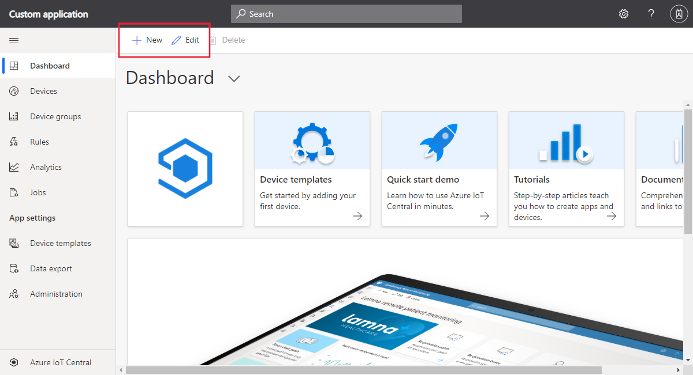
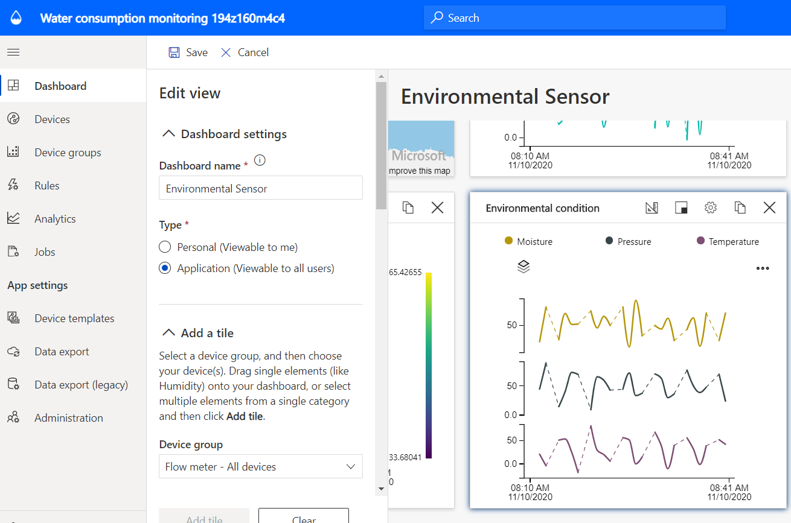

# Configure the application dashboard

The **Dashboard** is the page that loads when users who have access to the application navigate to the application's URL. If you created your application from one of the **Application Templates**, your application will have a pre-defined dashboard to start. If you created your application from the **Custom Application** application template, your dashboard will be blank to start.

> [!NOTE]
> Users can [create multiple dashboards](howto-create-personal-dashboards.md) in addition to the default application dashboard. These dashboards can be personal to the user only, or shared across all users of the application. 

## Add tiles

The following screenshot shows the dashboard in an application created from the **Custom Application** template. To customize the default dashboard for your application, select **Edit** at the top-left of the page.

> [!div class="mx-imgBorder"]
> 

Selecting **Edit** opens the dashboard library panel. The library contains the tiles and dashboard primitives you can use to customize the dashboard.

> [!div class="mx-imgBorder"]
> 

For example, you can add a **Telemetry** tile for the current temperature of the device. To do so:
1. Select a **Device Template**
1. Select a **Device Instance** for the device you want to see on a dashboard tile. Then you will see a list of the device's properties that can be used on the tile.
1. To create the tile on the dashboard, click on **Temperature** and drag it to the dashboard area. You can also click the checkbox next to **Temperature** and click **Combine**. The following screenshot shows selecting a Device Template and Device Instance then creating a Temperature Telemetry tile on the dashboard.
1. Select **Save** in the top left to save the tile to the dashboard.

> [!div class="mx-imgBorder"]
> 

Now when an operator views the default application dashboard, they see the new tile with the **Temperature** for the device. Each tile has a pre-selected graph, chart, etc. that will be displayed when the tile is created. However, users can choose to edit and change this visualization. 

> [!div class="mx-imgBorder"]
> 

## Edit tiles

To edit a tile on the dashboard, first click **Edit** at the top left of the page, which will open edit mode for the dashboard and all its tiles. 

> [!div class="mx-imgBorder"]
> 

Then click the **Gear** icon in the top-right corner of the tile you wish to edit. Here you can edit aspects of the tile including its title, its visualization, aggregation, etc.

> [!div class="mx-imgBorder"]
> 

You can also change the chart visualization by clicking the **Ruler** icon on the tile.

> [!div class="mx-imgBorder"]
> 

## Tile types

The following table summarizes the usage of tiles in Azure IoT Central:
 
| Tile | Dashboard | Description
| ----------- | ------- | ------- |
| Content | Application and device set dashboards |Markdown supported tiles are clickable tiles that display heading and description text. You can also use this tile as a link tile to enable a user to navigate to a URL related to your application.|
| Image | Application and device set dashboards |Image tiles display a custom image and can be clickable. Use an image tile to add graphics to a dashboard and optionally enable a user to navigate to a URL relevant to your application.|
| Label | Application dashboards |Label tiles display custom text on a dashboard. You can choose the size of the text. Use a label tile to add relevant information to the dashboard such descriptions, contact details, or help.|
| Map | Application and device set dashboards |Map tiles display the location and state of a device on a map. For example, you can display where a device is and whether its fan is switched on.|
| Line Chart | Application and device dashboards |Line chart tiles display a chart of aggregate measurement for a device for a time period. For example, you can display a line chart that shows the average temperature and pressure of a device for the last hour.|
| Bar Chart | Application and device dashboards |Bar chart tiles display a chart of aggregate measurements for a device for a time period. For example, you can display a bar chart that shows the average temperature and pressure of a device for the last hour.|
| Pie Chart | Application and device set dashboards |Pie chart tiles display a chart of aggregate measurements for a device for a time period.|
| Heat Map | Application and device set dashboards |Heat Map tiles display information about the device set, represented as colors.|
| Event History | Application and device dashboards |Event History tiles display the events for a device over a time period. For example, you can use it to show all the temperature changes for a device during the last hour.|
| State History | Application and device dashboards |State history tiles display the measurement values for a time period. For example, you can use it to show the temperature values for a device during the last hour.|
| KPI | Application and device dashboards | KPI tiles display an aggregate telemetry or event measurement for a time period. For example, you can use it to show the maximum temperature reached for a device during the last hour.|
| Last Known Value | Application and device dashboards |Last known value tiles display the latest value for a telemetry or state measurement. For example, you can use this tile to display the most recent measurements of temperature, pressure and humidity for a device.|

## Next steps

Now that you've learned how to configure your Azure IoT Central default application dashboard, you can [Learn how to create a personal dashboard](howto-create-personal-dashboards.md).
