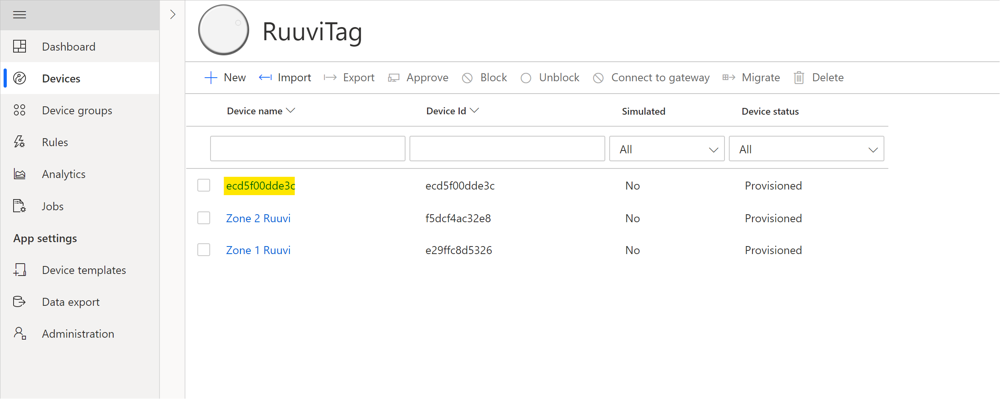

# Connect a RuuviTag sensor to your Azure IoT Central application

This article describes how, as a solution builder, you can connect a RuuviTag sensor to your Microsoft Azure IoT Central application.

### What is a Ruuvi tag?

RuuviTag is an advanced open-source sensor beacon platform designed to fulfill the needs of business customers, developers, makers, students, and can even be used in your home and as part of your personal endeavors. The device is set up to work as soon as you take it out of its box and is ready to be deployed to where you need it. It is a Bluetooth LE beacon with an environment sensor and accelerometer built in. 

RuuviTag communicates over BLE (Bluetooth Low Energy) and therefore requires a gateway device to talk to Azure IoT Central. Please make sure you have a gateway device, like Rigado Cascade 500, setup to be able to connect a RuuviTag to IoT Central. 

Please follow the [instructions here](.\howto-connect-rigado-cascade-500-pnp.md) if you'd like to setup a Rigado Cascade 500 gateway device.

## Prerequisites
To connect RuuviTag sensors, you need the following:

* A RuuviTag sensor. For more information, please visit [RuuviTag](https://ruuvi.com/). 
* A Rigado Cascade 500 device or another BLE gateway. For more information, please visit [Rigado](https://www.rigado.com/).
* An Azure IoT Central application created from one of the preview application templates. For more information, see the [create a new application](https://docs.microsoft.com/azure/iot-central/quick-deploy-iot-central-pnp?toc=/azure/iot-central-pnp/toc.json&bc=/azure/iot-central-pnp/breadcrumb/toc.json).

## Add a RuuviTag device template

In order to onboard a RuuviTag sensor into your Azure IoT Central application instance, you will need to configure a corresponding device template within your application.

To add a RuuviTag device template: 

1. Navigate to the ***Device Templates*** tab in the left pane, select **+ New**: 

The page gives you an option to ***Create a custom template*** or ***Use a preconfigured device template***
1. Select the RuuviTag device template from the list of preconfigured device templates as shown below:

1. Select ***Next: Customize*** to continue to the next step. 
1. On the next screen, select ***Create*** to onboard the C500 device template into your IoT Central application.

## Connect a RuuviTag sensor

As mentioned above, in order to connect the RuuviTag with your IoT Central application, you will need to setup a gateway device. In the steps below, we will assume that you have setup a Rigado Cascade 500 gateway device.  

1. Power on your Rigado Cascade 500 device and connect it to your network connection (via Ethernet or wireless)
1. Pop the cover off of the RuuviTag and pull the plastic tab to secure the connection with the battery. 
1. Place the RuuviTag in close proximity to your Rigado Cascade 500 gateway that has previously been configured with your IoT Central application. 
1. In just a few seconds, your RuuviTag should appear in your list of devices within IoT Central.  

You can now use this RuuviTag within your IoT Central application.  

## Next Steps

Now that you've learned how to connect a RuuviTag to your Azure IoT Central application, the suggested next step is to learn how to [customize your IoT Central application](../retail/tutorial-in-store-analytics-customize-dashboard-pnp.md) to build an end to end solution. 