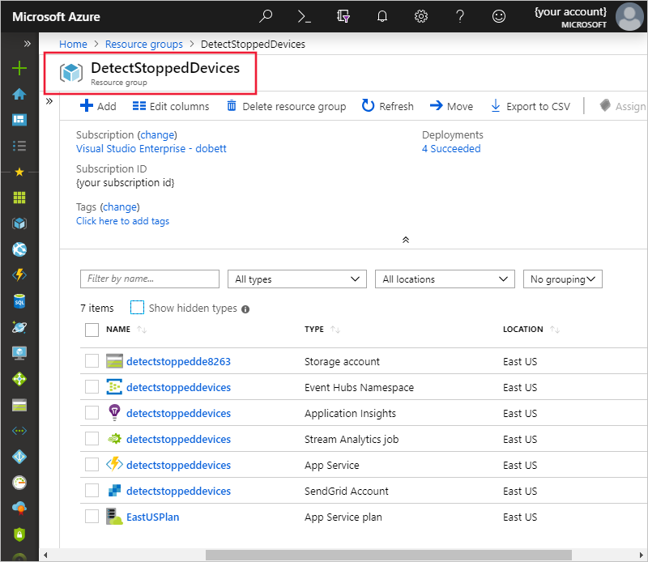
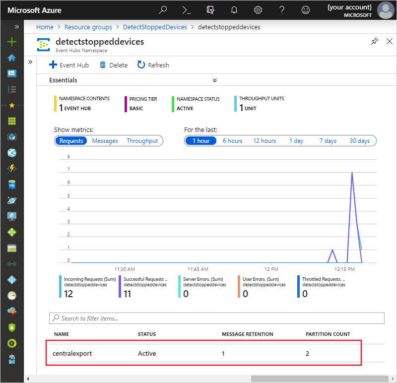
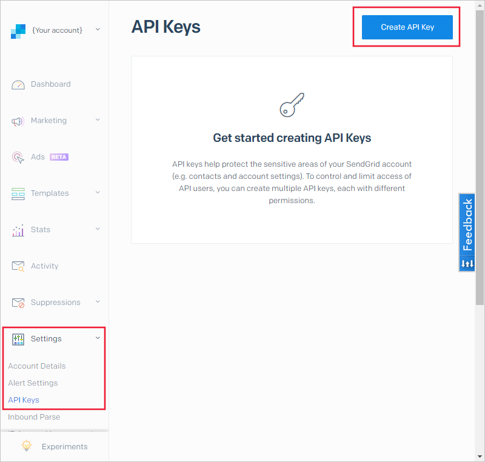
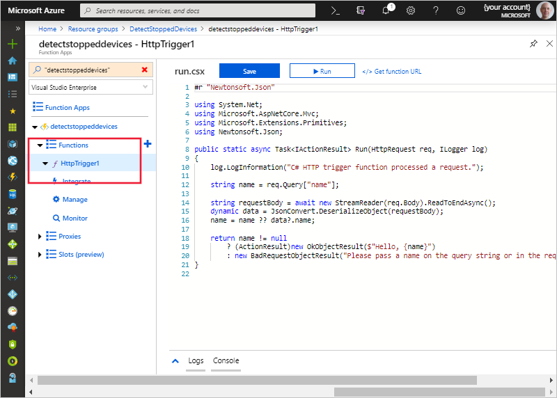
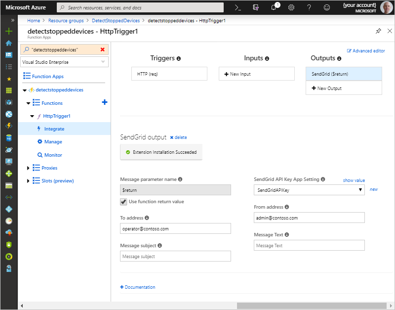
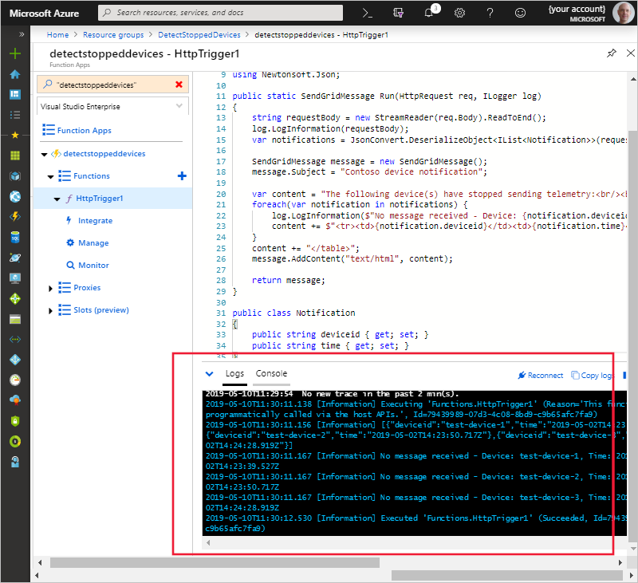
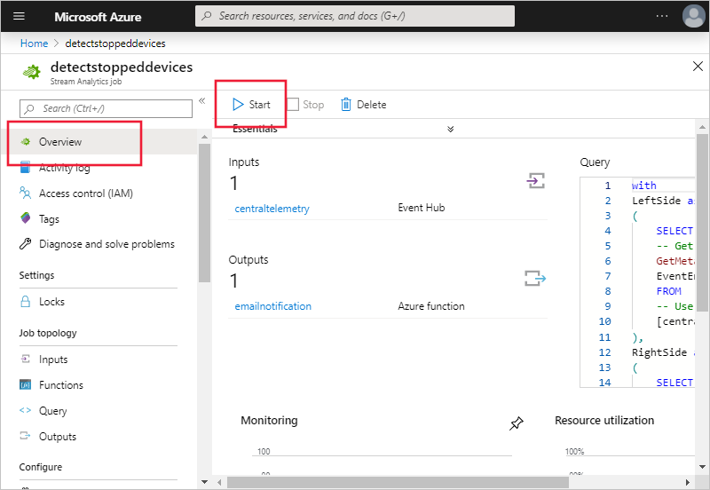

# Extend Azure IoT Central with custom rules using Stream Analytics, Azure Functions, and SendGrid


This how-to guide shows you, as a solution developer, how to extend your IoT Central application with custom rules and notifications. The example shows sending a notification to an operator when a device stops sending telemetry. The solution uses an [Azure Stream Analytics](https://docs.microsoft.com/azure/stream-analytics/) query to detect when a device has stopped sending telemetry. The Stream Analytics job uses [Azure Functions](https://docs.microsoft.com/azure/azure-functions/) to send notification emails using [SendGrid](https://sendgrid.com/docs/for-developers/partners/microsoft-azure/).

This how-to guide shows you how to extend IoT Central beyond what it can already do with the built-in rules and actions.

In this how-to guide, you learn how to:

* Stream telemetry from an IoT Central application using *continuous data export*.
* Create a Stream Analytics query that detects when a device has stopped sending data.
* Send an email notification using the Azure Functions and SendGrid services.

## Prerequisites

To complete the steps in this how-to guide, you need an active Azure subscription.

If you don't have an Azure subscription, create a [free account](https://azure.microsoft.com/free/?WT.mc_id=A261C142F) before you begin.

### IoT Central application

Create an IoT Central application on the [Azure IoT Central application manager](https://aka.ms/iotcentral) website with the following settings:

| Setting | Value |
| ------- | ----- |
| Payment plan | Pay-As-You-Go |
| Application template | In-store analytics – condition monitoring |
| Application name | Accept the default or choose your own name |
| URL | Accept the default or choose your own unique URL prefix |
| Directory | Your Azure Active Directory tenant |
| Azure subscription | Your Azure subscription |
| Region | Your nearest region |

The examples and screenshots in this article use the **United States** region. Choose a location close to you and make sure you create all your resources in the same region.

This application template includes two simulated thermostat devices that send telemetry.

### Resource group

Use the [Azure portal to create a resource group](https://portal.azure.com/#create/Microsoft.ResourceGroup) called **DetectStoppedDevices** to contain the other resources you create. Create your Azure resources in the same location as your IoT Central application.

### Event Hubs namespace

Use the [Azure portal to create an Event Hubs namespace](https://portal.azure.com/#create/Microsoft.EventHub) with the following settings:

| Setting | Value |
| ------- | ----- |
| Name    | Choose your namespace name |
| Pricing tier | Basic |
| Subscription | Your subscription |
| Resource group | DetectStoppedDevices |
| Location | East US |
| Throughput Units | 1 |

### Stream Analytics job

Use the [Azure portal to create a Stream Analytics job](https://portal.azure.com/#create/Microsoft.StreamAnalyticsJob)  with the following settings:

| Setting | Value |
| ------- | ----- |
| Name    | Choose your job name |
| Subscription | Your subscription |
| Resource group | DetectStoppedDevices |
| Location | East US |
| Hosting environment | Cloud |
| Streaming units | 3 |

### Function app

Use the [Azure portal to create a function app](https://portal.azure.com/#create/Microsoft.FunctionApp) with the following settings:

| Setting | Value |
| ------- | ----- |
| App name    | Choose your function app name |
| Subscription | Your subscription |
| Resource group | DetectStoppedDevices |
| OS | Windows |
| Hosting Plan | Consumption Plan |
| Location | East US |
| Runtime Stack | .NET |
| Storage | Create new |

### SendGrid account

Use the [Azure portal to create a SendGrid account](https://portal.azure.com/#create/Sendgrid.sendgrid) with the following settings:

| Setting | Value |
| ------- | ----- |
| Name    | Choose your SendGrid account name |
| Password | Create a password |
| Subscription | Your subscription |
| Resource group | DetectStoppedDevices |
| Pricing tier | F1 Free |
| Contact information | Fill out required information |

When you've created all the required resources, your **DetectStoppedDevices** resource group looks like the following screenshot:



## Create an event hub

You can configure an IoT Central application to continuously export telemetry to an event hub. In this section, you create an event hub to receive telemetry from your IoT Central application. The event hub delivers the telemetry to your Stream Analytics job for processing.

1. In the Azure portal, navigate to your Event Hubs namespace and select **+ Event Hub**.
1. Name your event hub **centralexport**, and select **Create**.

Your Event Hubs namespace looks like the following screenshot:



## Get SendGrid API key

Your function app needs a SendGrid API key to send email messages. To create a SendGrid API key:

1. In the Azure portal, navigate to your SendGrid account. Then choose **Manage** to access your SendGrid account.
1. In your SendGrid account, choose **Settings**, then **API Keys**. Choose **Create API Key**:

    

1. On the **Create API Key** page, create a key named **AzureFunctionAccess** with **Full Access** permissions.
1. Make a note of the API Key, you need it when you configure your function app.

## Define the function

This solution uses an Azure Functions app to send an email notification when the Stream Analytics job detects a stopped device. To create your function app:

1. In the Azure portal, navigate to the **App Service** instance in the **DetectStoppedDevices** resource group.
1. Select **+** to create a new function.
1. On the **CHOOSE A DEVELOPMENT ENVIRONMENT** page, choose **In-portal** and then select **Continue**.
1. On the **CREATE A FUNCTION** page, choose **Webhook + API** and then select **Create**.

The portal creates a default function called **HttpTrigger1**:



### Configure function bindings

To send emails with SendGrid, you need to configure the bindings for your function as follows:

1. Select **Integrate**, choose the output **HTTP ($return)**, and then select **delete**.
1. Choose **+ New Output**, then choose **SendGrid**, and then choose **Select**. Choose **Install** to install the SendGrid extension.
1. When the installation completes, select **Use function return value**. Add a valid **To address** to receive email notifications.  Add a valid **From address** to use as the email sender.
1. Select **new** next to **SendGrid API Key App Setting**. Enter **SendGridAPIKey** as the key, and the SendGrid API key you noted previously as the value. Then select **Create**.
1. Choose **Save** to save the SendGrid bindings for your function.

The integrate settings look like the following screenshot:



### Add the function code

To implement your function, add the C# code to parse the incoming HTTP request and send the emails as follows:

1. Choose the **HttpTrigger1** function in your function app and replace the C# code with the following code:

    ```csharp
    #r "Newtonsoft.Json"
    #r "..\bin\SendGrid.dll"

    using System;
    using SendGrid.Helpers.Mail;
    using Microsoft.Azure.WebJobs.Host;
    using Microsoft.AspNetCore.Mvc;
    using Microsoft.Extensions.Primitives;
    using Newtonsoft.Json;

    public static SendGridMessage Run(HttpRequest req, ILogger log)
    {
        string requestBody = new StreamReader(req.Body).ReadToEnd();
        log.LogInformation(requestBody);
        var notifications = JsonConvert.DeserializeObject<IList<Notification>>(requestBody);

        SendGridMessage message = new SendGridMessage();
        message.Subject = "Contoso device notification";

        var content = "The following device(s) have stopped sending telemetry:<br/><br/><table><tr><th>Device ID</th><th>Time</th></tr>";
        foreach(var notification in notifications) {
            log.LogInformation($"No message received - Device: {notification.deviceid}, Time: {notification.time}");
            content += $"<tr><td>{notification.deviceid}</td><td>{notification.time}</td></tr>";
        }
        content += "</table>";
        message.AddContent("text/html", content);

        return message;
    }

    public class Notification
    {
        public string deviceid { get; set; }
        public string time { get; set; }
    }
    ```

    You may see an error message until you save the new code.

1. Select **Save** to save the function.

### Test the function works

To test the function in the portal, first choose **Logs** at the bottom of the code editor. Then choose **Test** to the right of the code editor. Use the following JSON as the **Request body**:

```json
[{"deviceid":"test-device-1","time":"2019-05-02T14:23:39.527Z"},{"deviceid":"test-device-2","time":"2019-05-02T14:23:50.717Z"},{"deviceid":"test-device-3","time":"2019-05-02T14:24:28.919Z"}]
```

The function log messages appear in the **Logs** panel:



After a few minutes, the **To** email address receives an email with the following content:

```txt
The following device(s) have stopped sending telemetry:

Device ID	Time
test-device-1	2019-05-02T14:23:39.527Z
test-device-2	2019-05-02T14:23:50.717Z
test-device-3	2019-05-02T14:24:28.919Z
```

## Add Stream Analytics query

This solution uses a Stream Analytics query to detect when a device stops sending telemetry for more than 120 seconds. The query uses the telemetry from the event hub as its input. The job sends the  query results to the function app. In this section, you configure the Stream Analytics job:

1. In the Azure portal, navigate to your Stream Analytics job, under **Jobs topology** select **Inputs**, choose **+ Add stream input**, and then choose **Event Hub**.
1. Use the information in the following table to configure the input using the event hub you created previously, then choose **Save**:

    | Setting | Value |
    | ------- | ----- |
    | Input alias | centraltelemetry |
    | Subscription | Your subscription |
    | Event Hub namespace | Your Event Hub namespace |
    | Event Hub name | Use existing - **centralexport** |

1. Under **Jobs topology**, select **Outputs**, choose **+ Add**, and then choose **Azure function**.
1. Use the information in the following table to configure the output, then choose **Save**:

    | Setting | Value |
    | ------- | ----- |
    | Output alias | emailnotification |
    | Subscription | Your subscription |
    | Function app | Your function app |
    | Function  | HttpTrigger1 |

1. Under **Jobs topology**, select **Query** and replace the existing query with the following SQL:

    ```sql
    with
    LeftSide as
    (
        SELECT
        -- Get the device ID from the message metadata and create a column
        GetMetadataPropertyValue([centraltelemetry], '[EventHub].[IoTConnectionDeviceId]') as deviceid1, 
        EventEnqueuedUtcTime AS time1
        FROM
        -- Use the event enqueued time for time-based operations
        [centraltelemetry] TIMESTAMP BY EventEnqueuedUtcTime
    ),
    RightSide as
    (
        SELECT
        -- Get the device ID from the message metadata and create a column
        GetMetadataPropertyValue([centraltelemetry], '[EventHub].[IoTConnectionDeviceId]') as deviceid2, 
        EventEnqueuedUtcTime AS time2
        FROM
        -- Use the event enqueued time for time-based operations
        [centraltelemetry] TIMESTAMP BY EventEnqueuedUtcTime
    )

    SELECT
        LeftSide.deviceid1 as deviceid,
        LeftSide.time1 as time
    INTO
        [emailnotification]
    FROM
        LeftSide
        LEFT OUTER JOIN
        RightSide 
        ON
        LeftSide.deviceid1=RightSide.deviceid2 AND DATEDIFF(second,LeftSide,RightSide) BETWEEN 1 AND 120
        where
        -- Find records where a device didn't send a message 120 seconds
        RightSide.deviceid2 is NULL
    ```

1. Select **Save**.
1. To start the Stream Analytics job, choose **Overview**, then **Start**, then **Now**, and then **Start**:

    

## Configure export in IoT Central

On the [Azure IoT Central application manager](https://aka.ms/iotcentral) website, navigate to the IoT Central application you created from the Contoso template. In this section, you configure the application to stream the telemetry from its simulated devices to your event hub. To configure the export:

1. Navigate to the **Data Export** page, select **+ New**, and then **Azure Event Hubs**.
1. Use the following settings to configure the export, then select **Save**:

    | Setting | Value |
    | ------- | ----- |
    | Display Name | Export to Event Hubs |
    | Enabled | On |
    | Event Hubs namespace | Your Event Hubs namespace name |
    | Event hub | centralexport |
    | Measurements | On |
    | Devices | Off |
    | Device Templates | Off |


Wait until the export status is **Running** before you continue.

## Test

To test the solution, you can disable the continuous data export from IoT Central to simulated stopped devices:

1. In your IoT Central application, navigate to the **Data Export** page and select the **Export to Event Hubs** export configuration.
1. Set **Enabled** to **Off** and choose **Save**.
1. After at least two minutes, the **To** email address receives one or more emails that look like the following example content:

    ```txt
    The following device(s) have stopped sending telemetry:

    Device ID         Time
    Thermostat-Zone1  2019-11-01T12:45:14.686Z
    ```

## Tidy up

To tidy up after this how-to and avoid unnecessary costs, delete the **DetectStoppedDevices** resource group in the Azure portal.

You can delete the IoT Central application from the **Management** page within the application.

## Next steps

In this how-to guide, you learned how to:

* Stream telemetry from an IoT Central application using *continuous data export*.
* Create a Stream Analytics query that detects when a device has stopped sending data.
* Send an email notification using the Azure Functions and SendGrid services.

Now that you know how to create custom rules and notifications, the suggested next step is to learn how to [Extend Azure IoT Central with custom analytics](howto-create-custom-analytics.md).
